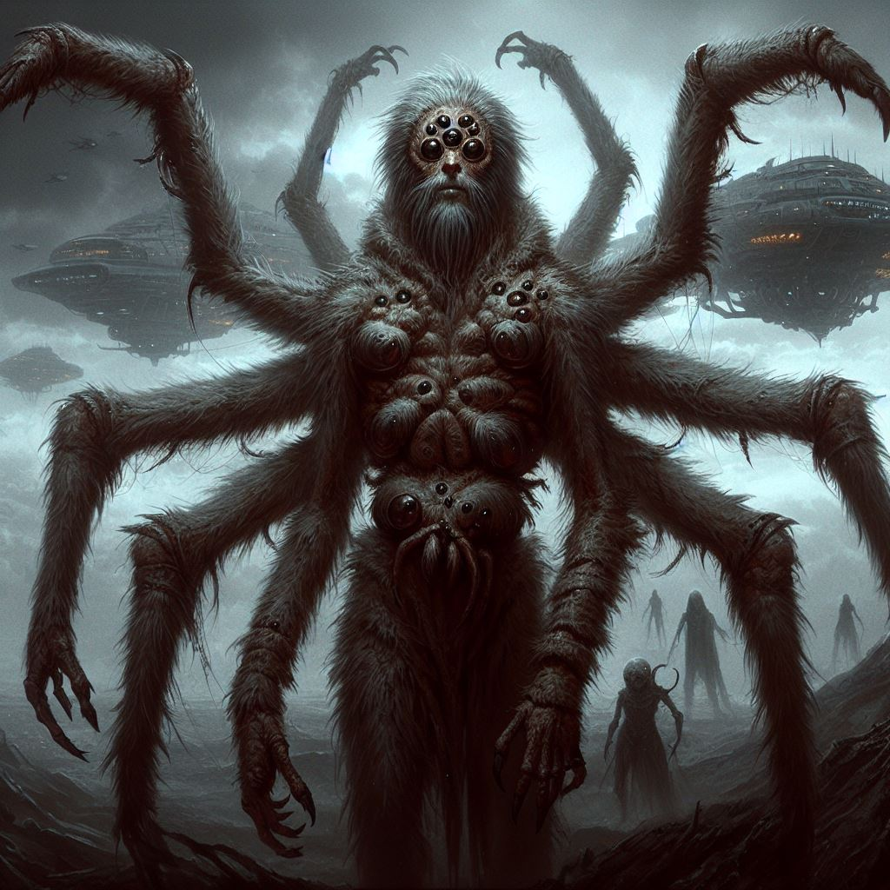
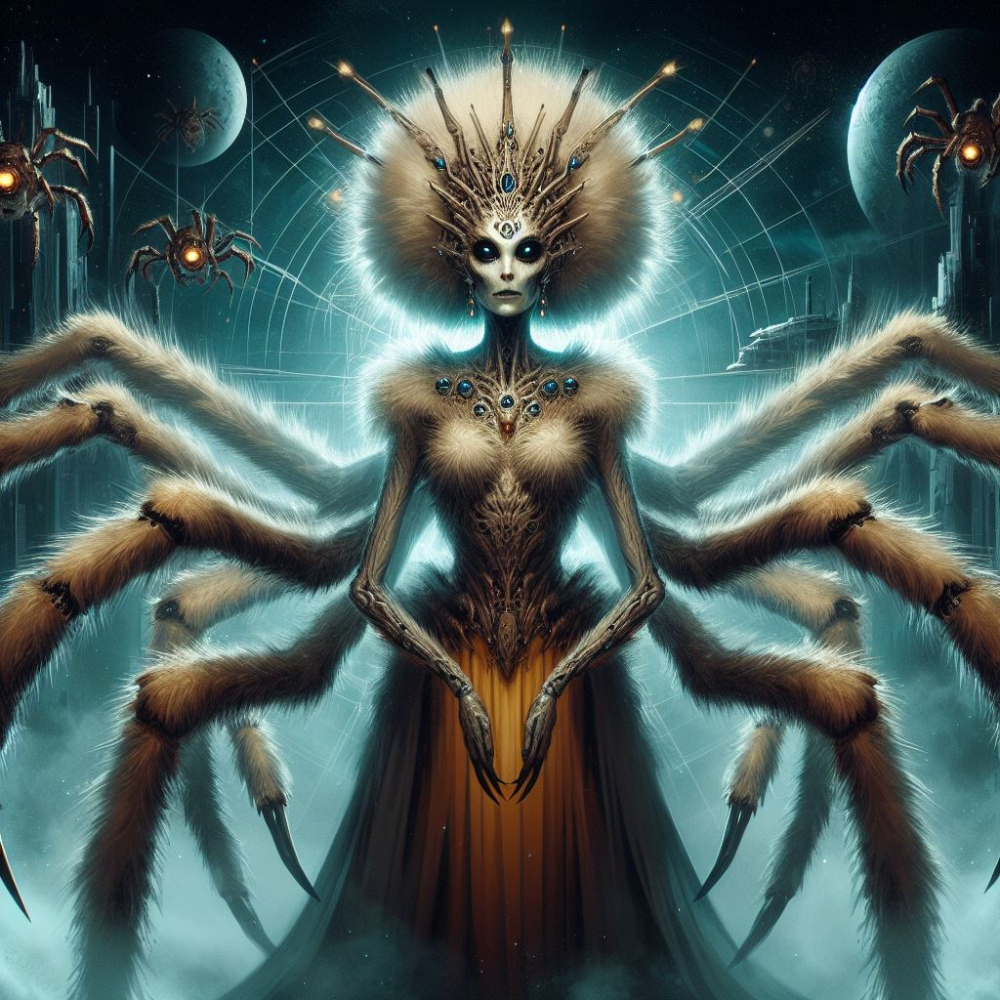
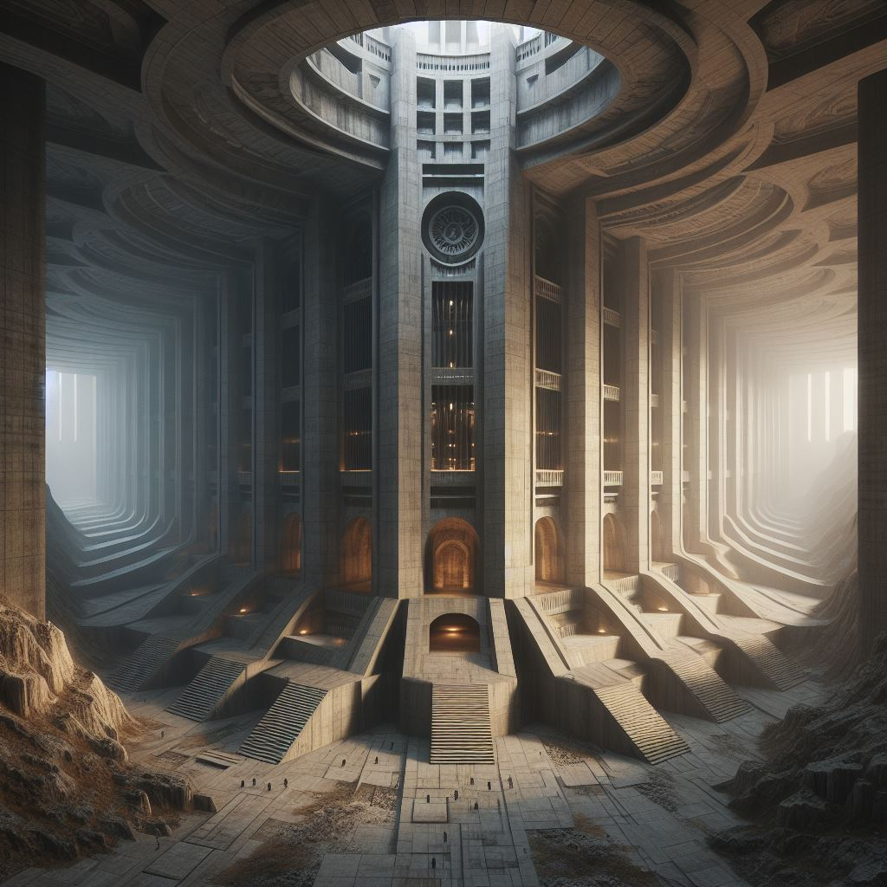

# Арахниды

!!! warning "Страница находится в разработке"
    - <a href="#">Редакторы вики</a> уже ведут работу над данной статьёй. 
    - При желании, вы можете подать заявку на редактора в нашем <a href="">Discord</a> и тоже принять участие в улучшении статьи.
    - Данный этап: **В активной разработке**

!!! ss220 inline end "Арахниды"
    
    ---
    ####Основная информация  
    <li>Родной мир - Ширра-1
    <li>Язык - Арати
    <li>Система	- Неизвестно
    <li>Средний рост - 210 см
    <li>Дыхание	 - Кислород
**Арахнид** (множ. Арахниды) — вид разумных гуманоидных существ, имеющие строение подобное паукообразным из-за условии эволюции на их родной планете Ширра-1.Имеют достаточно суровый нрав и хладнокровны в многих ситуациях.
Средний рост арахнида приблизительно равен 190 см для мужских особей и 230 см для женских.Имеют 8 конечностей, 2 из которых используется для передвижения, 6  для точных манипуляции или атак из-за прочного хитинового слоя и наростов приспособленных к прорезыванию плоти.  

!!! info "Содержание"
    [Арахнидам и читателям](#title1)  
    [Правила отыгрыша](#title2)   
    <li>[Язык и имена](#title3)  
    <li>[Язык](#title3.1)  
    <li>[Имена и фамилии](#title3.2)
    <li>[Поведенческие и психологические особенности расы](#title4)  
    <li>[Поведенческие особенности](#title4.1)  
    <li>[Психоанализ](#title4.2)  
    <li>[Физиологические особенности](#title5)  
    <li>[Основные органы](#title5.1)  
    <li>[Питание](#title5.2)  
    <li>[Размножение](#title5.3)  
    <li>[Социум](#title6)  
    <li>[Политика](#title6.1)  
    <li>[Религия](#title6.2)  
    <li>[Культура](#title6.3)  
    <li>[Внешние связи](#title7)  
    <li>[Отношения с расами](#title7.1)  
    <li>[Отношения с корпорациями](#title7.2)
    <li>[История](#title8) 
    <li>[Зарождение цивилизации](#title8.1)   
    <li>[Хронология самых значимых событий](#title8.2)  
    <li>[Участие в жизни галактики и НТ](#title8.3)  
# <a id="title1">Арахнидам и Читателям</a>
Приветствую, уважаемый член экипажа!  

В целях стимулирования межвидового сотрудничества и повышения эффективности на рабочем месте, NanoTrasen составила серию полезных   руководств по разным расам, с которыми Вам, скорее всего, придется работать!  
(ПРИМЕЧАНИЕ: Если вы являетесь представителем вида, к которому относится данное руководство, пожалуйста, передайте его ближайшему члену экипажа другого вида).
Конкретно данное руководство относится к виду, известному как Арахниды. (в единственном числе: Арахнид)

# <a id="title2">Правила отыгрыша</a>
* **Лаконичность и серьезность**  
Арахниды - раса которая практически все время существования воевала, на текущий момент их качества все так же сохранились, они всегда уравновешенны, редко шутят и смеются, максимум подкинув пару слов. 
* **Фотофобия (Светобоязнь)**  
Привычное для глаз арахнидов освещение слегка тускловато, яркий свет их постоянно раздражает и в нем они чувствуют себя некомфортно.
 
* **Низкая эмпатия** 
Арахниды осознают что они являются лишь одним из тысячи таких же работников, и так же относятся и к другим, проявляя низкую эмпатию. 
* **Смелость** 
Для обычной арахниды следовать Азж’ак Шаркул - долг, кодекс воина по которому он должен бороться до конца. **[Учитывайте П3.1]** 
* **Матриарх - ваше всё** 
Для вас мать-прародитель является великим символом, за который вы готовы отдать даже свою свободу. 
* **Тонкость натуры** 
Мужские особи арахнидов имеют тонкую натуру, по структуре мышления имеют более чувственное восприятие мира, в то время как самки более практичны и склонны к грубости и доминации.  
* **Деление полов**  
Арахниды строго разделяют обязанности между полами, как следствие в большинстве случаев арахниды мужского пола выполняют работу в инженерных, научных, медицинских и карго отделах, а арахниды женского пола служат в СБ, встречаются на командных должностях всех отделов и их часто можно увидеть как сотрудников элитных военных формировании и ДСО.В юридическом отделе служат оба пола.

# <a id="title3">Язык и имена</a> 
## <a id="title3.1">Язык</a> 
Арахниды обладают достаточно грубым языком, название которого “Арати” в котором большое кол-во шипящих звуков.Эволюция языка, включая имитацию звуков животных, которые больше не существуют, отражает глубокие исторические корни арахнидов и свидетельствует о том, как они взаимодействовали с окружающей средой на ранних этапах своего развития. Речевой аппарат арахнидов способен полностью выговаривать весь фонетический ряд языка используемого в ТСФ, что дает им большое преимущество в четкости речи.  
**Хашанн - Эра просвещения  
Шаарати - Общий мир  
Аро’Хат - Отступник  
Основное лекарство от феромонового шторма  - Харай** 
## <a id="title3.2">Имена и фамилии</a> 
Имена арахнидов имеют основанность на матчестве, по причине матриархата выстроенного в их обществе, имя должно быть созвучно с матчеством, пример имени:  
*[Шиики - имя][Харо - матчество] - Шиики’ Харо*
 

# <a id="title4">Поведенческие и психологические особенности расы</a> 
## <a id="title4.1">Поведенческие особенности</a> 
Часто издают шипящие звуки для выражения своего недовольства или удивления.  
Хладнокровны и суровы.  
Относятся к своей работе ответственно.  
Не любят излишне эмоциональных личностей.  
Им сложно находиться в сильно освещенном помещении.  
## <a id="title4.2">Психоанализ</a> 
!!! ss220 inline end "Арахниды"
    
Разум арахнидов обладает не только высоким уровнем интеллекта, но также выраженными чертами характера, которые делают их успешными в корпоративной среде Nanotrasen. Их хладнокровие и суровость являются неотъемлемой частью их личности, что делает их эффективными в стрессовых ситуациях.   
Они проявляют уникальную способность переносить травмирующие события без негативных последствий для своей психики, что делает их ценными членами команды в условиях повышенного напряжения.  
 
Отсутствие посттравматического стрессового расстройства (ПТСР) после ожесточенных боев подчеркивает их устойчивость и психологическую стойкость. Это преимущество позволяет арахнидам эффективно функционировать в условиях боевых действий, не поддаваясь негативным воздействиям на свое эмоциональное состояние.  

В силу своей готовности к стычкам и защиты себя, арахниды являются надежными союзниками в боевых сценариях. Однако, несмотря на свою боеспособность, они предпочитают избегать конфликтов, если не затрагиваются их семейные или личные ценности. Это свидетельствует о стратегическом и разумном подходе к управлению конфликтами и подчеркивает их способность к адекватному восприятию критики, что делает их ценными членами коллектива в корпоративной среде.  

Женские особи могут принимать на себя более активную роль в защите мужчин, так как их высокий уровень интеллекта и хладнокровие, о которых упоминалось ранее, может делать их более подходящими для таких задач, в тоже время мужчины обладают более слабой позицией в обществе.

# <a id="title5">Физиологические особенности</a> 
## <a id="title5.1">Основные органы</a> 
**Сердце** - 4 камерное, имеет общие черты с человеческим но имеет большие размеры, так же аорта заменена функциональным аналогом в виде 4 отдельных сосудов, что в купе с повышенной способности к восстановлению даёт большую выживаемость в схватках.  

**Кровь** - представлена в организме гемоцианином, являющимся функциональным аналогом гемоглобина, клетки крови создаются в хаотичных местах в сосудах, нет конкретных клеток гемопоэза.В отличие от гемоглобина, входящего в состав эритроцитов, молекулы гемоцианина растворены в гемолимфе. Благодаря этому мономеры гемоцианина могут объединяться в очень большие комплексы, что позволяет лучше проявляться его кооперативным свойствам и в целом лучше переносить кислород. Это особенно важно для организмов, живущих в условиях с малым содержанием кислорода.  

**Кожа** - защитный слой арахнидов представлен хитиновым покровом, который имеет повышенные качества защиты, за годы эволюции деградировали, и на текущий момент имеет лишь небольшую разницу от кожи человека.  

**Глаза** - Арахниды имеют отличное зрение, но из за особенностей их строения глаз и повышенного количества палочек на дне имеют повышенную светочувствительность.  

**Шелк-продуцирующие железы** - находятся во рту, практически всегда подконтрольны, при желании арахнид может начать плести шелк лишь начав выделять его из рта и формируя требуемую форму лапами.Паутина арахнидов представляет собой белок, обогащенный глицином, аланином и серином. Внутри паутинной железы она существует в жидкой форме. При выделении через многочисленные прядильные трубочки, открывающиеся на поверхности паутинных бородавок, происходит изменение структуры белка, вследствие чего он затвердевает в форме тонких микрометровых нитей. Внутри нитей есть жёсткие белковые кристаллы размером в несколько нанометров, соединенные между собой эластичными белковыми связками.  

**Пищеварение** - крайне быстрый метаболизм. Их желудок способен переварить большое количество пищи малыми порциями, но как и для унатхов, для арахнидов опасен шоколад. В их слюне все еще вырабатывается яд, и потому в случае необходимости, при борьбе с другими видами они активно используют собственные клыки. За счет выработки яда в неопасных для себя дозах они имеют некоторую стойкость к большому виду известных токсинов.  
Биологически они все ещё могут вливать в свою жертву или еду пищеварительный сок, но почти не пользуются этим. В остальном их ЖКТ ничем не отличается от человеческого.  
## <a id="title5.2">Питание</a> 
Питание арахнидов в основном преобладает мясо, организм способен усваивать в пищу растительность но она не имеет для них большой пищевой ценности.
## <a id="title5.3">Размножение</a> 
Трагичность размножения арахнидов олицетворяет жестокую реальность их существования. Половозрелый самец, плетя семянную паутину с субстратом, сталкивается с непредсказуемым сценарием: вызвать самку и, в зависимости от ее готовности, **остаться в живых или стать жертвой ее атаки**. Эта неопределенность вносит в процесс размножения элемент риска и драматизма.  

В случае успешного оплодотворения самки, начинается процесс ее беременности, который продолжается 12 недель. После этого периода она порождает потомство в впечатляющем количестве – от 120 до 140 особей. Рост молодых арахнидов происходит в течение 16 лет до полного взросления, что подчеркивает длительность и сложность этапа их развития.  

Интересным моментом становится то, что со временем арахниды разработали **способы "обхода" феромонных штормов**, что обеспечивает им возможность размножаться без жертвоприношения. Этот прогресс в развитии их поведенческих механизмов снижает потери во время размножения и создает более устойчивый процесс, способствуя сохранению популяции арахнидов.

# <a id="title6">Социум</a> 
## <a id="title6.1">Политика</a> 
!!! ss220 inline end "Сакаар'Киро"
    
Текущая политическая система на родной планете арахнидов представляет собой традиционную, консервативную автократическую систему, в которой высшую власть занимает матриарх Сакаар’Киро. Эта форма правления утверждает единовластие и преемственность власти, а также подчеркивает важность роли женской линии в лидерстве, власть разделена на регионы, что может свидетельствовать о децентрализации управления, при этом каждый регион может иметь свои особенности и подчиненные системы управления. Тем не менее, де-факто власть находится под полным контролем корпорации Nanotrasen.
## <a id="title6.2">Религия</a> 
Религии у арахнидов как таковой нет, идет культ поклонения матери, для них мать является прародителем всего.  
## <a id="title6.3">Культура</a> 
Культура арахнидов глубоко проникнута обожествлением матери-прародительницы, создавая уникальную динамику внутри их общества. Матерь-арахнид, помимо своей ключевой функции по рождению потомства, занимает центральное место в управлении и контроле определенного региона. Ее решения и указания являются неоспоримыми, и любые изменения в ее области обязательно согласовываются с ней, подчеркивая ее выдающуюся роль в формировании и принятии важных решений.
Мужские особи арахнидов, напротив, лишены значительного влияния в процессах принятия решений. В этой культуре женщины играют ключевую роль во всех аспектах общественной жизни. Они принимают на себя ответственность за множество социальных функций, включая организацию, управление ресурсами и решение конфликтов. Мужчины, вероятно, выполняют свои обязанности, связанные с военной службой и другими аспектами, но их вклад в социальные решения ограничен.
Такое глубокое обожествление матери-прародительницы формирует уникальную структуру власти и социальные роли в обществе арахнидов, отражая их специфические ценности и традиции.  

Архитектура
  

Архитектурные структуры, используемые для проживания арахнидов, представляют собой монументальные постройки, схожие с ангарными зданиями и вдохновленные подземными пещерами неизвестного происхождения, которые служили им домом до индустриальной революции. Используемые материалы, включая каменные породы от гранита до мрамора, а также древесину и обожженную глину, создают великолепные и стильные сооружения, которые являются источником гордости для арахнидов.  

Бусидо от мира арахнидов
  

Все еще существует высокий престиж и авторитет воинских женщин в обществе арахнидов, и их позиция часто определяется не только службой, но и умением следовать традициям. Обучение обращению с холодным оружием и знание кодекса "Азж’ак Шаркул" становятся неотъемлемой частью их образования, что подчеркивает важность их роли в воинской структуре общества.С медленным уходом от старых традиций, таких как самоубийство отцов семейства в след за матерью, государство направляет усилия на гуманизацию. Однако, сопротивление в обществе сохраняется, и многие арахниды проявляют реакцию на попытки внедрения новых образцов идентичности и ценностей. Это создает сложные динамики в стремлении арахнидов адаптироваться к изменяющемуся миру и сохранять свою уникальность.
Такие социокультурные изменения вызывают внутренние напряжения, подчеркивая противоречивые требования между традициями прошлого и необходимостью адаптации к современным реалиям. Эта динамика добавляет сложности в пути арахнидов к формированию более гибкой и устойчивой идентичности в переменчивом мире.  

# <a id="title7">Внешние связи</a> 
## <a id="title7.1">Отношения с расами</a> 
Не любят **фелинидов**, нианов, из за их повышенной эмоциональной активности.  
Арахниды женского пола резко отрицательно относятся к **драскам**.  
Благосклонно относятся к **скреллам** по причине частичной безэмоциональности.  
Благосклонно относятся к **вульпакинам** из-за их культурных особенностей.  
Враждуют с **унатхами** из за их оскорбительного по меркам арахнидов отношения.  
Нейтрально относятся к **остальным расам**.  
## <a id="title7.2">Отношения с корпорациями</a> 
Арахниды благосклонно относятся к большинству различных корпораций, кроме Interdyne Pharmaceutics из-за инцидента с зомби-вирусом, после которого 20% жителей планеты было обращено, и произошла потеря около 5.000.000.000 кредитов.  
В Nanotrasen они имеют к себе благосклонное отношение.  

# <a id="title8">История</a> 
## <a id="title8.1">Зарождение цивилизации</a>   
Арахнид разумный как сам вид появился примерно 200.000 лет д.н.э, первые упоминания в источниках арахнидов о общинах появились около 150.000 лет д.н.э. Они имели матриархальный строй и были достаточно разрозненны, в одной общине было соотношение 1 мужской особи к  4 женским, популяция мужских особей строго контролировалась. 
Арахниды, в истории своего развития, служили расходным материалом для процесса репродукции.  

Ключевой этап начался с появлением философии войны "Азж’ак Шаркул" примерно 5.000 д.н.э. В это время началось широкое использование стали в холодном оружии, что привело к частым войнам и замедлению развития расы.  

К 15 веку, Аро’хат(в переводе - отступник) Зжакаар’Хан,, обнаружил антагонист феромонов спаривания, который он назвал "Харай", в одном из пещерных растений. Это открытие частично смягчило проблему частых войн, поскольку новый элемент в окружающей среде позволил частично уменьшить необходимость в конфликтах.Это время, названное Арахнидами "Эрой просвещения" (Хашанн), ознаменовало более мирный период в их истории, хотя полностью избавиться от военных конфликтов не удалось.После этого события арахниды развивались огромными шагами, объединились и создали Шаарати(С Арати - “Общий мир”).В большинстве своем арахниды сохраняли свою военизированную структуру и систему локальных кланов.К началу индустриального века власть была полностью подчинена клану Киро, которые сохраняют в своих руках власть во всех сферах жизни государства.  

Начало колонизации собственной системы было положено с 24 века, после успешной формации луны под пригодные для жизни арахнидов условия правительство решило активно финансировать космическую программу. Спустя небольшое кол-во времени одно из суден было обнаружено пограничными силами ТСФ, после чего арахниды вступили в **большую “игру” вселенского масштаба**, и обратили на себя внимание Nanotrasen как возможного поставщика сырья и дешевой рабочей силы.  

Множественные контакты с другой, вызывающей огромный интерес расой повлекли за собой некоторые проблемы, после одной из очередных дипломатических встреч, команда дипломатов арахнидов и их сопровождающих была экстренно госпитализирована в одну из клиник, спонсируемых Interdyne Pharmaceuticus из-за **неизвестного на тот момент вируса, поразившего их**.  
Изначально это было посчитано правительством арахнидов как попытка отравления дипломатов, но после проведения независимых исследований было обнаружено, что данные симптомы были вызваны одним из мутировавших видов человеческого туберкулеза, Interdyne Pharmaceutics оказала спонсирование исследования бактерии, для укрепления отношении с Хашанн.  
После недолгих исследовании были выведены антагонисты микобактерии туберкулеза, которые останавливали заражение, дипломаты были спасены и доставлены обратно в родное государство, а Interdyne Pharmaceuticus получила огромное вознаграждение от Хашанн.  

Спустя некоторое все **зараженные вирусом начали терять рассудок**, что было задокументировано их коллегами в рапортах на неадекватное поведение, через неделю по планете произошли множественные очаги вспышек неконтролируемой ярости и бунтов, правительство полагало что это был противовластный заговор, но после вскрытия некоторых из бунтарей, оказалось что большинство органов было поражено неизвестным грибковым заболеванием, которое и создавало приступы некотролируемой ярости.  

После проведения некоторых исследовании, ученые нашли связь между данным заболеванием и лекарством, полученым от Interdyne Pharmaceutics, оказалось что при создании лекарства были допущены критические ошибки в расчетах, и из-за краткого срока на разработку учёные Interdyne недостаточно чисто воспроизвели лекарство, что повлекло за собой развитие в нулевых пациентах грибкового заболевания берущего под контроль любое органическое существо, после оглашения инцидента Nanotrasen решило вступить в игру, и в кратчайшие сроки предоставила лекарство от нового заболевания, получив для себя удобный и гибкий рынок сбыта, а также укрепило отношение с возможно будущим союзником.

## <a id="title8.2">Хронология самых значимых событий</a> 
140 г. - *Создание антагониста феромонов Харай*  
1489 г. - *Создание Шаарат*  
1920 г. - *Промышленная революция*   
1993 г. - *Обнаружение месторождения плазмы в глубоких недрах*  
2000 г. - *Начало космической компании* 
2001 г. - *Арахниды достигли информационной эпохи*  
2350 г. - *Попытка колонизации луны Ширра-2 стала значительным этапом в истории арахнидов, отмечая их стремление к расширению внешних границ и освоению космического пространства.*  
2370 г. - *Первый успешный запуск ракеты с плазменными генераторами на территории планеты.*  
2414 г. - *Исследовательское судно Хагири было обнаружено недалеко от сектора ТСФ. Это стало событием, которое привлекло внимание космических обитателей к деятельности арахнидов.*  
2416 г. - *Дипломат ТСФ, Харо Кано, провел переговоры с "Хашанн". Это встреча открывает новый этап в отношениях между арахнидами и другими космическими обществами, предоставляя возможность для диалога, сотрудничества и обмена знаний. Эта встреча стала ключевым моментом в интеграции арахнидов в космическое сообщество и стимулировала обмен культурными, технологическими и научными достижениями.*  
2420 г. - *На территории планеты после множественных дипломатических переговоров и контактов с другими расами, происходит вспышка одного из видов человеческого туберкулеза, приспособившихся к организму арахнидов.*  
2421 г. - *Вспышки были успешно уничтожены, однако следы эксперимента оставили глубокие раны на планетарной среде, вызвав серьезные изменения в обществе.*  

**Известные личности:**  
**Сакаар’Киро** - правительница планеты на текущий момент.  
**Зжакаар’Хан** - учёный нашедший Харай.  
**Разж ма Фсац’ал** - один из богатейших представителей расы.  

## <a id="title8.3">Участие в жизни галактики и НТ</a> 
На данный момент арахниды имеют полную власть над своей планетой, на луне Ширра-2 открыты полномасштабные зоны добычи твердой плазмы. В галактике они являются одними из основных экспортеров плазмы, чем собственно и привлекли Нанотрейзен.  

Арахниды довольно часто встречаются в рядах Нанотрейзен, в большинстве случаев идёт строгое разделение работ для арахнидов женского и мужского пола, к примеру -
арахниды мужского пола выполняют работу в инженерных, научных, медицинских отделах, а арахниды женского пола служат в СБ, выполняют тяжелую переноску грузов в карго, встречаются на командных должностях всех отделов и их часто можно увидеть как сотрудников элитных военных формировании и ДСО. В юридическом отделе служат оба пола.