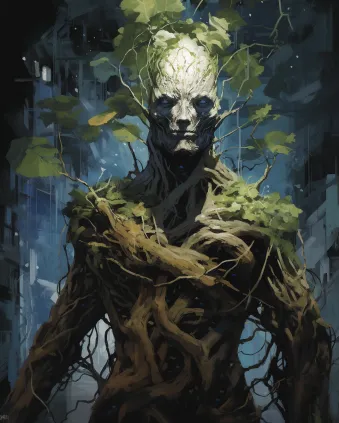
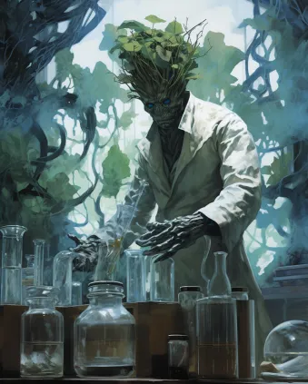
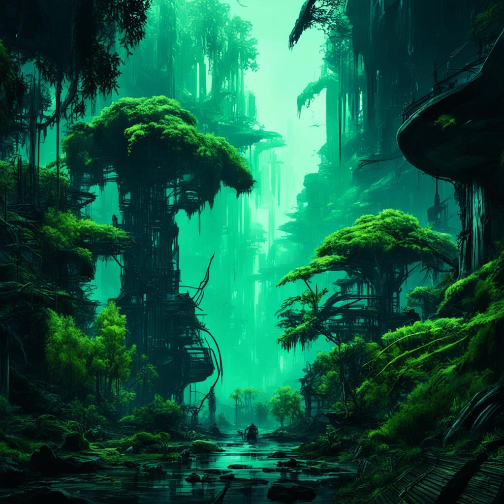

#Дионы
!!! ss220 inline end "Дионы"
    
    ---
    ####Основная информация  
    <li>Родной мир - Джуйя
    <li>Язык - Песнь корней
    <li>Система	- Эпсилон Малой Медведицы
    <li>Средний рост - 190 - ∞
    <li>Дыхание	 - Кислород
**Диона** (множ Дионы) - раса эмпатичных медлительных существа, представляющих собой симбиотические организмы, напоминающие Земные растения. Дионы выходцы с планеты Джуйя, из системы Эпсилон Малой Медведицы. 
 
!!! info "Содержание"
    [Дионам и читателям](#title1)  
    <li>[Правила отыгрыша](#title2)    
    <li>[Язык](#title3)  
    <li>[Имена](#title3.1)  
    <li>[Поведенческие и психологические особенности расы](#title4) 
    <li>[Физиологические особенности расы](#title4.1)
    <li>[Социум и Политика](#title5)  
    <li>[Религия](#title5.2) 
    <li>[Культура](#title5.3)      
    <li>[Взаимоотношения](#title6)  
    <li>[История расы](#title7)  
    <li>[Известные личности и герои дворфийского общества](#title7.1)  
    <li>[Участие в жизни галактики и НТ](#title7.2)   
# <a id="title1">Дворфам и Читателям</a>
Приветствую, уважаемый член экипажа!  

В целях стимулирования межвидового сотрудничества и повышения эффективности на рабочем месте, NanoTrasen составила серию полезных   руководств по разным расам, с которыми Вам, скорее всего, придется работать!  
(ПРИМЕЧАНИЕ: Если вы являетесь представителем вида, к которому относится данное руководство, пожалуйста, передайте его ближайшему члену экипажа другого вида).
Конкретно данное руководство относится к виду, известному как Дионы. (в единственном числе: Диона)
 
# <a id="title2">Правила отыгрыша</a>
* Дионы - раса пацифистов, не инициируйте конфликты и физические столкновения, и старайтесь не принимать в них участия.
* Как фанатичный распространитель жизни во вселенной, окружайте себя самыми разными жизнеформами. Расставляйте на рабочем месте растения, разводите животных, ̶р̶а̶с̶п̶р̶о̶с̶т̶р̶а̶н̶я̶й̶т̶е̶ ̶с̶л̶а̶й̶м̶о̶в̶ ̶и̶ ̶в̶и̶р̶у̶с̶ы̶.  
* Держитесь вместе с другими дионами и помогайте друг другу, ведь вероятно что других сородичей вы рискуете ещё долго не увидеть, поскольку находитесь очень далеко от родной системы. 
* Старайтесь оберегать и защищать любую жизнь, будь то животные, растения или даже опасные для жизни монстры. Каждый из них важен для глобальной космической экосистемы. 
* Тяготейте к хорошо освещённым помещениям, вы всё таки фотосинтезирующий организм. 
* Если вам угрожает опасность, то постарайтесь сбежать или спрятаться от неё. 
* Не подвергайте никого опасности, ни прямо, ни косвенно. 
* Дионы - мемориалисты. Записывайте интересную для вас информацию, особенно культурные и теологические особенности других рас и религий.  
* Дионы брезгуют и боятся насилия. Не причиняйте никому вреда, если только в противном случае вы сами не рискуете погибнуть.
* Если всё таки нелегкая занесла вас в ситуацию, когда без драки никуда, то по возможности старайтесь оглушить своего противника а не ранить его.
* Говорите о себе во множественном числе

# <a id="title3">Язык</a>
В отличии от большинства других разумных видов, владение языком - врожденный навык любой дионы. Язык дион является сложным для воспроизведения и перевода другими разумными видами, по той причине что он во многом является скорее языком тела, нежели техникой использования голосовых связок и дыхания.  \
Для общения между собой дионы используют комбинации звуков, получающихся благодаря трению между сочленениями коры и мицеллярными компонентами по всей поверхности тела.  \
Для общения на других языках дионы используют собственный аналог начальной части пищеварительного тракта, называемый перистомой, однако, ввиду отсутствия языка как органа, они вынуждены имитировать его движения жгутом подвижных усиков, в естественной среде обитания используемых для перемалывания твердой пищи в полости “рта”.    
# <a id="title3.1">Имена</a>  
Каждая диона самостоятельно подбирает имя в период жизни от четырёх до 14 лет. Обозначения самих себя они ищут достаточно скрупулезно, предпочитая использовать описания самых ярких моментов за время своего существования, либо то, что по их мнению  полностью бы их описывало. По этой причине, многие молодые дионы крайне гиперактивны, поскольку пытаются охватить за короткий период времени как можно больше событий или описаний, из которых можно было бы составить себе имя.  \
Дионы могут менять свои имена раз в век, если сочтут это необходимым, однако такое практикуется редко.

Примеры имён:  
Осенний звездопад  
Смотрящий на лес   
Плывущий сквозь речные пороги   
Блуждающий средь белых вершин  

# <a id="title4">Поведенческие и психологические особенности расы</a>  
Дионы - народ эмпатов, прежде чем сделать что-то, они всегда поставят себя на место того объекта, в отношении которого собираются что-то сделать.

По этой причине они несколько медлительны в вопросах принятия решений, поскольку всегда пытаются оценить последствия своих поступков наперед, не желая каким-либо образом никому навредить.

Жизнь для этой расы является наивысшей ценностью, притом не важно чья. Они с одинаковым трепетом будут относится как к жизни безобидной бабочки, так и к жизни кровожадного голиафа с вулканической планеты.

Если диона каким-то образом причинит кому то вред, или того хуже, поспособствует смерти, то это будет воспринято ей как величайшее горе. Причинённый урон должен быть восполнен какими-либо добрыми делами, чтобы диона смог простить самого себя. Однако это не значит что дионы беззащитны! Если жизни дионы будет угрожать опасность, то она постоит за себя.

Больше всего на свете дионы боятся одиночества и неконтролируемых природных стихий, буйство которых сметает перед собой любое существо. По этой причине огонь, молнии или опасные газы довольно быстро заставят диону впасть в панику, в ходе которой она попытается сбежать в безопасное место, спасая как можно больше живых существ в процессе.

Одиночество в свою очередь напоминает древовидным существам о пустоте и холоде космоса, в котором нет никакой жизни, которой они так дорожат. 

В повседневной жизни дионы стремятся окружить себя как можно большим количеством живых существ, что является неким околопсихическим инстинктом, связанным с распространением спор на телах живых существ в экосистеме родного мира дион.

Некоторые дионы и вовсе стремятся к созданию примитивных экологических цепочек в зоне своей работы, высаживая растения и разводя небольшие популяции различных животных. 

Увидеть диону, обставленную цветочными горшками и лотками для кошек, собак и тому подобного - более чем обычное дело.

# <a id="title4.1">Физиологические особенности расы</a>   
!!! inline end ""
    
Дионы - с точки зрения экологии являются облигатными симбионтами, сочетающими в себе непосредственно растительное слоевище и ассоциации колониальных симбиотических организмов, по образу жизни схожими с Земными грибами и слизевиками. Это обстоятельство делает дион похожими на Земные лишайники, однако, без сомнения, куда более продвинутые с точки зрения эволюции.

Именно эволюция "грибной" части дион позволила этим растительным организмам гибко изменять свой образ жизни, комбинируя подвижность и прикрепленность по мере необходимости и смены условий обитания. А также именно это обстоятельство позволяет разным дионам объединять свои организмы в единую, не теряющей своей эффективности, структуру.

Предположительно, развитие моторно-двигательных тканей грибов впоследствии и привела к наращиванию системы симбиотических гиф по всему организму, со временем принявших на себя роль нейронного волокна, ставшего фундаментом для возникновения разума.

Растительную часть дион в ксенобиологии принято называть фотобионтом, а "грибную" - микобионтом. Каждая часть выполняет свои собственные функции в вопросе поддержания жизнеспособности организма.

Роль фотобионта.

Фотобионтные ткани выполняют целый ряд функций в телах дион, связанных с активным фотосинтезом и дыханием посредством зелёных лоз, произрастающих по всей поверхности тела организма. Отмирающие по ходу жизни клетки внешних тканей фотобионтов довольно быстро твердеют и образуют подобие защитной коры, "застывающей" в различных причудливых формах и узорах.

Кроме того, на ранних стадиях развития дион клетки фотобионта развивают ведущие стебли - оси, основа которых в будущем превращается в аналог костной ткани, на которую прикрепляются органоиды микобионтов.

Примечательно, но подобные образования характерны только для будущих конечностей. Скелетный аналог черепа, таза или грудной клетки такие стебли не формируют.

Помимо защитной, питательной и дыхательной функции, образованные фотобионотом органы также участвуют в процессе размножения.

Роль микобионта.

Микобионтные ткани залегают в висцеральной части дионейского организма, между фундаментным растительным слоевищем и под защитными одеревеневшими тканями. Ассоциации симбиотических грибов формируют некое подобие мышечного волокна и децентрализованную нервную систему организма, позволяющей дионе активно передвигаться а также объединяться с другими представителями своего вида. Кроме того, многие органы восприятия дион также были развиты микобионтами.

Не смотря на возможность пассивного фотосинтеза, симбиотические грибы формируют внутри тела организма мицелиевый мешок - питательный канал, предназначенный для переваривания растительной пищи.

Симбиотический грибок также участвует в процессе размножения, заражая спорами пыльцу фотобинота.

**Размножение и жизненный цикл**

Взрослых дион в пору назвать обоеполыми организмами, поскольку разные участки гештальта дион могут иметь разную половую принадлежность.

Дионы способны размножаться двумя способами - половым и бесполым.

Бесполый заключается в почковании, когда полностью развившийся гештальт дион отращивает и сбрасывает нескольких новых нимф для свободного существования.

Это наиболее быстрый и распространенный способ их размножения. Однако потомство, как правило, в генетическом и личностном плане является полной копией своего родителя.

Половое размножение возможно только во влажной среде и происходит посредством распространения облака пыльцы, зараженной спорами симбиотических грибов во влажном воздухе.

По крайней мере одна такая спора должна достигнуть поверхности тела дионы другого гештальта. 

В таком случае, оплодотворенная особь начнёт развитие плодов, представляющих собой зараженные грибком семена, отбрасываемые гештальтами в богатых светом и влагой местах.

Такой способ размножения очень медленный, и практикуется реже, но из-за обмена генетическим материалом считается дионами наиболее ценным для развития их общества.

**Ступени развития**

В развитии организма дион выделяют четыре основные ступени: росток, нимфа, гештальт и супергештальт.

* **Росток** - это ранняя растительная форма дион, ведущая прикреплённый образ жизни, но достаточно быстро развивающая зачатки разума.

    Такие вырастают из семян, и получаются только половым путём. В обществе дион ростки содержаться в специальных "рощах - яслях", где молодняк впитывает питательные вещества из субстрата и постигает мудрость старших дион до момента пока не смогут открепиться от почвы и жить независимо.

* **Нимфа** - развившаяся и обретшая мобильность небольшая диона.

    Ростки превращаются в нимф примерно через 10 лет жизни. При бесполом размножении потомство сразу является нимфами, и как правило уже обладает обширным набором знаний и навыков, присущих гештальту родителю. На этой стадии развития нимфы находятся в поиске других подходящих по характеру нимф для превращения в совместный гештальт и объединения нейронного волокна.Как правило, на этой стадии развития прибывают молодые дионы, поскольку старые нимфы уже настолько сильно срастаются с другими в гештальтах, что уже не хотят или не могут жить 

* **Гештальт** - объединение дюжины низших дион в единый организм. Каждая нимфа в этом организме утрачивает индивидуальность и само-сознание, и становится узкоспециализированной, гиперболизируя свои отдельные органы для служения коллективному организму в той или иной форме.Обычно превращение в органы необратимо, и в случае распада гештальта узкоспециализированные нимфы стремительно погибают. 
Примечательно, но гештальты не обязательно выглядят как гуманоиды, которыми их привыкли видеть другие расы. Это лишь наиболее удобная форма для контактирования с другими разумными видами.  
Сами дионы утверждают, что на их родном мире можно встретит разные "конфигурации" гештальтов, от нечта напоминающего птиц, до рыб, червей и членистоногих.
* **Супергештальт** - древнее скопление дион, срощенных между собой в грандиозном суперорганизме. При том не важно, самостоятельно ли гештальт нарастил свою огромную биомассу, или присоединил к себе других дион.Такая форма исчезающе редка из-за медленных темпов роста и размножения этого вида. Вероятно, что кроме самих дион никто в цивилизованном космосе не видел их воочию.
# <a id="title5">Политика и общество</a>  
Дионы не имеют централизованного государства, вся их раса разбита на так называемые “Рощи” - объединения дион, по численности схожие с планетарными городами, живущие согласно наставлениям старейших и мудрейших своих представителей. Поскольку все дионы по природе своей эмпаты, в их истории никогда не было войн и вооруженных столкновений. Разные Рощи привыкли решать свои проблемы на специальных форумах, называемых “Мытарствами мудрых”, где самые выдающиеся представители дион решают вопросы, затрагивающие весь их вид. 

 

Старейшины дион обычно являются невероятно древними и массивными организмами- супергештальтами. Каждый из них по совместительству является культурным и философским лидером своей общины, ввиду огромного объема накопленного опыта. 

Старешины никогда не появлялись вне системы Эпсилона Малой Медведицы, и никто, кроме самих дион, вероятно не имел возможности пообщаться с ними.

До инфополя цивилизованного космоса дошли имена лишь нескольких старейшин дион, информации о которых, впрочем, всё ещё не слишком много:   

* **Созерцатель Единства** - один из древнейших гештальтов, живущих на Джуйе. Многие дионы считают его самым мудрым существом в известной части космоса.
* **Роща Вечной Тишины** - невероятно огромный гештальт, внешне напоминающий лес, состоящий из мёртвых Дион, посмертно одревесневших и сплетенных между собой. Примерное количество "особей" в гештальте насчитывает более семи миллионов. Площадь гештальта примерна равна 83 500 квадратных километра. Бытует мнение что Роща - самый старый гештальт, однако этому нет никакого научного подтверждений. Сама Роща не может назвать своего возраста, ввиду очень малого количества обновляемого нервного волокна и доминирования в организме мертвых тканей. 
* **Превозмогающий Боль** - огромный гештальт, находящийся на самом дне коралловой пещеры Сэйч Тсуно (в переводе "Коралловые Рога"), вход в которую лежит у подножья спящего супервулкана “Око Джуйи”.  
Этот старейшина - единственный изгнанник супергештальт во всей расе дион. 
По легенде, в молодости, Превозмогающий Боль носил другое имя и был одним из группы монахов, живущих у подножья вулкана. Однако, в его жизни произошло нечто, что привело к гибели огромного числа живых существ во времена его активной деятельности и разрастания.   
Многие связывают его имя с одним из самых разрушительных извержений в истории Джуйии, другие же полагают, что это единственная диона, несущая из глубин веков уникальные знания о методах ведения войны, способах превращения дион в солдат и оружии страшной силы.  
Впрочем, мало кто теперь знает что-то насчёт Превозмогающего наверняка.  
В современное время его существование принято считать сомнительным фактом.   

* **Тень Джуйи** - самый массивный супергештальт из числа дион. Известен тем, что полностью оплел своей органической массой луну Джуйи. Этот зеленый гигант получил жизнь благодаря усилиям древних дион экологов по терраформингу безжизненной поверхности луны, и защищён мощным слоем коры.  
Под поверхностью прячет небольшое поселение, космопорт и исследовательский комплекс дион. Дыхание этого гештальта создало на луне Джуйи собственную атмосферу, что по факту делает его самого одним большим проектом по озеленению мертвого планетоида. 
# <a id="title5.2">Религия</a>  
В обществе дион доминирует учение Вита-ци, автором и пропагандистом которого является старейшина Созерцатель Единства. 

"**Вита-ци**" (в переводе "Учение о жизни") - самое популярное полу философское вероисповедание, суть которого заключается в познании жизни как явления и поиске знаний о ней по всему космосу.  \
Вита-ци является пантеистической мемеориалистической религией, пропагандирующей исследование канонов и культур разных звездных цивилизаций, дабы сохранять их и искать через полученные знания некий Абсолют истины, общий для всех живых существ космоса. 

Согласно представлениям дион, нахождение Абсолюта даст всем живущим понимание того, что необходимо сделать для создания лучшего мира для всех форм жизни, населяющих космос.

Огромные архивы дион, находящиеся в их родной системе, по слухам, уже сейчас содержат просто колоссальные объёмы информации, которую неустанно осмысляют и каталогизируют архивариусы Джуйи.

 

Параллельно, Вита-ци пропагандирует радикальное миролюбие и приверженность идеи озеленения галактики. Факел многообразия жизни, по представлениям монахов, нужно донести до заветной минуты обретения абсолюта. По этой причине, любое проявление насилия и неоправданные убийства находится под строгим запретом, не только в кругах верующих, но и у всего общества дион.   

Кроме того, у дион этого канона есть так называемый “Обет Тишины” - учение, суть которого гласит, что единственный верный способ смерти - это осознанное решение индивида её окончить самостоятельно.

Абсолютное большинство дион согласны с этим учением и идут его пути, стараясь избегать всех опасных ситуаций и случайной смерти. Согласно учению, когда диона готова завершить свой жизненный путь, то ей пора собираться в последнее паломничество на родной мир, где её личность сольется с гештальтом Вечной Тишины, в составе которого диона перестанет самоомолаживаться и принимает добровольную смерть в объятьях рощи усопших.

Кроме этой доминирующей в широких массах религии, существуют и подпольные учения, практически утратившие свою популярность или вовсе признанные запретными. К таким относятся: 

* “Учения Боли” - философия супергештальта Превозмогающего Боль, суть которого заключается в беспощадном прагматизме и функционализме. Согласно этой философии, каждая диона должна быть самодостаточным эгоцентричным организмом, вечно совершенствующим себя и свои навыки ради выживания вида любой ценой.  
Запрещён он по множестве причин, главной из которых является история самого гештальта.
* “Догмат Уничтожителя” - путь _Уничтожителя Сущности_, который гласит, что слепой абсолютный пацифизм ошибочен и не может являться верным принципом как правления, так и принятия мира. Догмат гласит, что каждый из индивидов обязан быть агрессивно настроен к неизвестному, вплоть до того момента, пока неизвестное не станет известным. Также у догмата есть очень большое сходство с Учениями Боли, что может намекать на некую связь этих путей. Этой вере следуют появившиеся относительно недавно дионы одиночки, выращенные вне рощ родного мира. 
# <a id="title5.3">Культура</a>   
!!! ss220 inline end ""
    
Дионы довольно аскетичный народ, пожертвовавший многими благами цивилизации и даже предметами искусства ради пребывания в гармонии с природой и сохранения её богатств.  
В поселениях, которые встречаются только в их родной системе, каждая роща пользуется лишь необходимым минимумом научных достижений для следования своим религиозным целям и поддержания экосистем в стабильном состоянии. 

Большая часть населения этого народа проживает за пределами городов, в глуши и сельской местности, где как правило занимаются облагораживанием земель, общественно и экологически полезными делами, а также ведут биологические и теологические исследования.

У дион также существует весьма причудливая традиция, связанная с усопшими сородичами. Тела павших дион не стесняются использовать в хозяйстве в качестве удобрения или даже топлива, поскольку считается, что даже после смерти дионы всеми способами должны нести пользу для развития жизни во вселенной и помогать своим сородичам. 

Отдельные инициативные объединения этих существ, как правило из культа Вита-ци, и вовсе организуют экспедиции на мертвые миры с целью их терраформировать.  
Для этого они снаряжают корабли с научным и ботаническим оборудованием и отправляются бороздить космос, озеленяя пригодные для этого планетоиды и даже астроиды. Многих таких дион сородичи считают самоотверженными героями, достойными почитания и бесконечного уважения.
# <a id="title6">Взаимоотношения</a>   
С другими расами

Дионы относятся ко всем живым существам с почтением и почитанием. Единственными исключением из этого догмата являются _Силиконы_, отношение к которым сугубо нейтральное. Кроме машин, дионы настороженно относятся ко всем расам, культура которых тяготеет к кровопролитию и милитаризму. В число таких входят вульпкане и унатхи.

С НТ

Дионы порой приходят работать в компании иных видов с целью распространения своей философии или культивации жизни на мертвых планетах. 

Конкретно в Нанотрейзен служит не очень много дион, и большая их часть, как правило,это работники связанные с биологическими науками, такими как ботаника, ксенобиология, генетика, врачебное дело и т.п. 
# <a id="title7">История расы</a>   
!!! ss220 inline end ""
    
Предками дион считаются симбиотические пары грибоподобных простейших и микроскопических растений произрастающих на песчаных отмелях океана Джуйи.  
Считается, что подобная симбиотическая структура смогла выжить и развиваться до полноценного сложного организма благодаря особой экосистеме планеты, богатой влагой и солнечным светом, что смягчило конкурентную борьбу настолько, что гетеротрофы попросту были эволюционно не выгодными в вопросе выживания многоклеточных организмов. 

В качестве первых из симбиотических органимов протодионы получили большое преимущество перед другими растительными организмами, благодаря полному разделению питательных функций между мико- и фотобиотической частью, что позволило максимизировать эффективность питания и привело к появлению “двигательных функций” у мицеллярной части симбионта и зарождению простейшей нервной системы, служащей первоначально для поиска наиболее пригодных для развития и питания сред обитания. Эта простая форма нервной системы впоследствии и подарила дионам разум.  

**Дни, когда огонь пировал**

В древние времена, когда на Джуйе начали появляться первые группы разумных протодион, расселившихся по джунглям и лесам прибрежной полосы, курс планеты впервые за долгие миллионы лет существования жизни на её поверхности начал приближать её всё ближе к тепловому краю обитаемости, граничащим с жаром, который спровоцировал бы испарения океанов.

В эти времена по всей планете бушевали сильные пожары, спровоцировавшие первое великое вымирание на родном мире дион.  

Предкам современных гештальтов удалось выжить лишь сгрудившись вокруг океанов на полюсах планеты, не подвергающихся избыточному нагреву со стороны звезды. 

В эти тысячи лет, отмеченных скудностью лесов и невыносимым жаром, дионы развивали свою культуру, усложнение которой остановилось на средневековом уровне.

**Дни, когда ветер окрасился пеплом**

Через пару тысячелетий жар наконец начал сходить на нет, позволяя жизни снова робко заходить на экваториальные территории, до того бывшие безжизненной раскаленной пустошью. Этот период позволил дионам объединить цивилизации южного и северного полюса, что в конечном итоге привело к первой индустриальной революцией, всю силу которой обитатели Джуйи пустили на восстановление биологического баланса планеты. 

**Дни, когда моря застыли **

Когда экосистемы начали постепенно приходить в порядок, через ещё несколько сотен лет на планету обрушился очередной климатический кризис. Планета, ушедшая от звезды, отлетела к границе холода в зоне обитаемости. Стремительно развивался ледниковый период, за которым следовало очередное великое вымирание.

Благо, развивавшие науку дионы на сей раз оказались готовы, и подготовили целый ряд мер, направленных на сохранение видового разнообразия в специальных хранилищах.

Не смотря на то, что разные рощи дион снова оказались разлучены, научный прогресс продолжил двигаться вперёд, благодаря открытию радиоволн и обмена данными между исследователями с разных участков планеты.     

Именно в эти времена Созерцатель Единства создал учение Вита-ци. 

**Дни, когда пришла весна** 

Спустя ещё 1000 лет, планетарная ось снова вышла на приемлемую для развития жизни орбиту. Наконец, пришла весна и климатические условия медленно возвращаться в норму. 

Это время также обусловлено существенными усилиями рощ по расселению жизни по полумертвой планете. В эти же десятилетия начались полномасштабные исследования космоса, основной причиной которых были поиски решения проблемы нестабильности осей вращения Джуйи и создание способа потенциального спасения от очередного катаклизма.   

**Дни, когда твердь дрожала **

Около шестиста лет назад на планете произошло извержение мощного вулкана “Око Джуйи”, которое унесло множество жизней и окутало планету пепельными тучами, снизившими температуру на планете. 

По легенде, этого извержения не должно было произойти, однако один из древних гештальтов, что сейчас носит имя Превозмогающего Боль, каким-то образом вызвал этот катаклизм. Точных данных об этом периоде немного, преимущественно по той причине, что старейшины дион осознанно запретили обращаться к истории этого времени. 

Тем не менее, именно в эти годы дионы начали массово осваивать космос родной системы и колонизировали свою луну, впоследствии превратившуюся в дионский супергештальт по имени Тень Джуйи.

**Дни, когда звезды заговорили** 

В 2204 году по Земному летоисчислению исследовательский корабль скреллов засек неизвестный сигнал в системе Эпсилона Малой Медведицы и начал расследовать его источник. Именно в этот период времени произошел первый контакт рощ с другими галактическими цивилизациями. 

Тем не менее, родная система дион всё ещё остаётся невероятно отдалённой от владений других видов. Джуйю, вне фото и видеоматериалов, из пришельцев видели лишь исследователи из числа тех скреллов, что готовы отлетать на сотни парсек от границ своей Империи дабы посетить миры дион. 

**Дни, когда зацвели планеты**

Этот период истории по многим меркам выделен как самый важный в истории вида.

В инфополе Империи Скрепллов существует множество упоминаний о том, что дионы обнаружили нечто, обладающее квантовыми свойствами. Что это конкретно этот объект из себя представляет - неизвестно, поскольку гештальты тщательно спрятали это знание в одном из своих архивов.

В этот период дионы соорудили астрономический объект, под названием “Мнимое Святилище”. После его постройки в обитаемом космосе, в сотнях парсек от родной системы растениевидных существ, впервые появились дионы и начали постройку космических станций-портов для общего пользования, в которых каждый может остановится на какое-то время и воспользоваться предоставляемыми услугами. Данные порты выглядят достаточно странно, так как с одной из них частей есть полость, в которой как-будто бы должно что-то быть, однако они пустые. Такие порты находятся в секторах: Альтаир, 41 Орла и 9 Кормы.

Эти станции - святилища дионы научились использовать в транспортных целях, для быстрого перемещения из своей отдалённой системы в цивилизованный космос. Однако никто кроме них так и не понял, как в действительности они работают. 

**Современность** 

В настоящее время общество дион всё ещё озабочено проблемой нестабильности орбиты своей родной планеты, и усиленно ищут способ стабилизировать её, параллельно колонизируя свою систему.

 

Случайные проповедники Вита-ци покидают родные миры для озеленения космоса, и иногда встречаются в пределах границ других видов и даже в неизученных областях космоса. 

Часть дион, в рамках следования учению Вита-ци поступает на службу инопланетным компаниям и объединениям, принося таким образом пользу своим родным рощам и их архивам.

В общем и целом, большой роли в глобальной космической политике дионы не играют, выступая скорее как малозначительный фактор улучшения жизни в космосе, что достигается благодаря попыткам терраформирования пустых планетоидов и помощи в улучшении экологии уже колонизированных миров.   

