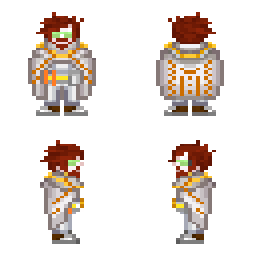
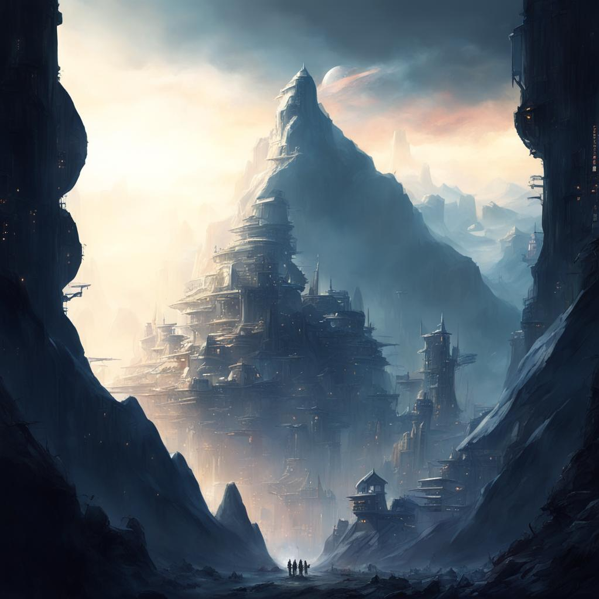
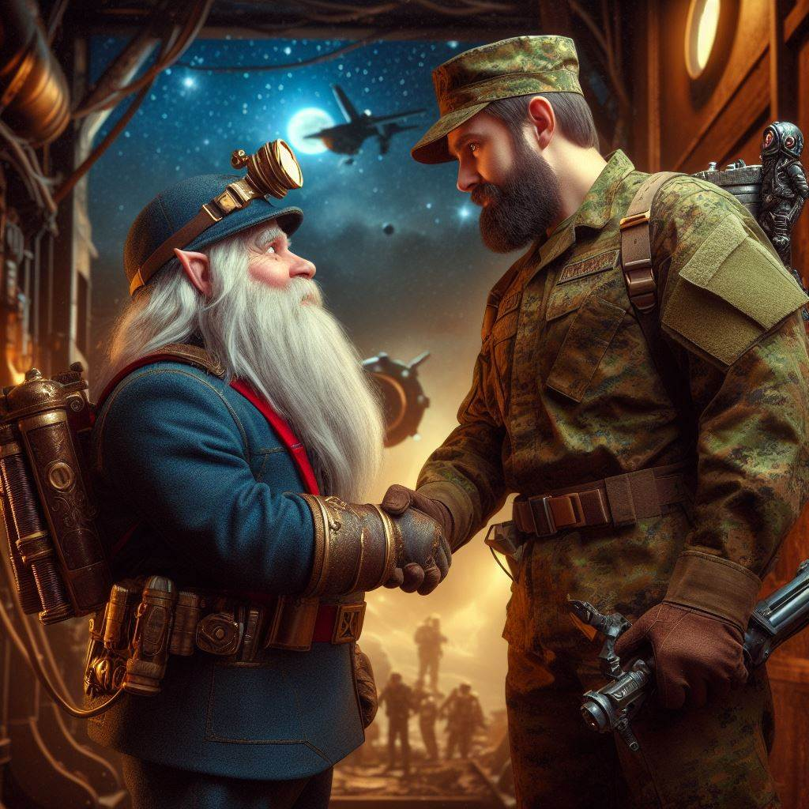

# Дворфы

!!! warning "Страница находится в разработке"
    - <a href="#">Редакторы вики</a> уже ведут работу над данной статьёй. 
    - При желании, вы можете подать заявку на редактора в нашем <a href="">Discord</a> и тоже принять участие в улучшении статьи.
    - Данный этап: **В активной разработке**

!!! ss220 inline end "Дварфы"
    
    ---
    ####Основная информация  
    <li>Родной мир - планета Гаурдин
    <li>Язык - Эл’Дварф
    <li>Система	- Альфа-ворона
    <li>Средний рост - 140 см
    <li>Дыхание	 - Кислород
**Дворф** (альт. Цверги) — Вид разумных гуманоидных существ, имеющие определенные сходства с человеческой расой. Им характерна коренастость, высокая выносливость и густую бороду, которая на их родной планете выполняла функцию защиты от запыленности планеты.Средний рост мужского пола - 140-150 см, у женщин - 130-140 см, практически всегда имеют низкий, баритональный голос.Полные древнего величия королевства и вырезанные в толще гор чертоги, удары кирок и молотков, раздающиеся в глубоких шахтах и пылающий кузнечный горн, верность клану и традициям и пылающая ненависть к слизням — вот вещи, объединяющие всех дварфов.
 
!!! info "Содержание"
    [Дворфам и читателям](#title1)  
    <li>[Правила отыгрыша](#title2)    
    <li>[Язык](#title3)  
    <li>[Имена](#title3.1)  
    <li>[Физиология расы](#title4)    
    <li>[Социум](#title5)  
    <li>[Политика](#title5.1)
    <li>[Религия](#title5.2) 
    <li>[Культура](#title5.3) 
    <li>[Архитектура](#title5.4)
    <li>[Родная планета](#title5.5)     
    <li>[Взаимоотношения](#title6)  
    <li>[История расы](#title7)  
    <li>[Известные личности и герои дворфийского общества](#title7.1)  
    <li>[Участие в жизни галактики и НТ](#title7.2)   
# <a id="title1">Дворфам и Читателям</a>
Приветствую, уважаемый член экипажа!  

В целях стимулирования межвидового сотрудничества и повышения эффективности на рабочем месте, NanoTrasen составила серию полезных   руководств по разным расам, с которыми Вам, скорее всего, придется работать!  
(ПРИМЕЧАНИЕ: Если вы являетесь представителем вида, к которому относится данное руководство, пожалуйста, передайте его ближайшему члену экипажа другого вида).
Конкретно данное руководство относится к виду, известному как Дворфы. (в единственном числе: Дворф)
 
# <a id="title2">Правила отыгрыша</a>

* **Мужественность**
 
Дворфы - всегда мужественны, какого бы вы пола не были. Вы будто состоите из тестостерона и алкоголя. Поэтому именно этой расе подходят такие должности, как шахтеры и утилизаторы, будто они созданы для них. 
* **Стойкость/упрямство**  
Дворфы стоят на своем до конца, ваше мужество не только достоинство, но и в каких то моментах недочет. Дворф упрямый толстолоб, его тяжело переубедить и заставить делать что - либо без вашей прихоти.Авторитет для дворфа- это друг по выпивке и работе.
 
* **Алкоголь и вы** 
Дворфы, имеют происхождение с планеты в котором содержание этанола в атмосфере всегда находится на повышенном уровне, у дворфов высокая толерантность к алкоголю, но как следствие повышенное пристрастие к нему. Отсутствие кружечки пенного в руке дворфа скорее не решение проблемы, а ее источник. 
* **Мастер своего дела** 
Если дворф взялся за дело, все ожидают чудес. В обществе ходят слухи, что руки дворфа были благословлены самими богами, может в этом есть даже доля правды, ведь чаще всего всё, до чего доходят руки старого и опытного дворфа, становится произведением искусства. 
* **Долгая память, долгие обиды** 
Дварфы могут жить около 200 лет, и старейшие из них часто помнят этот мир сильно отличным от нынешнего, так-же дворфы злопамятны, если вы как-то пересекли дорогу дворфу, вам не сдобровать.

# <a id="title3">Язык</a> 
Дворфы в речи используют грубый язык с малым количеством гласных, таким образом повторяя некоторые звуки присущие природе называющийся Эл’Дварф. Но при общении с представителями Элизиума, официальных документах стараются использовать язык gutter, чтобы сохранить лояльность от Элизиума. 

**Аз Зиндризнаррвел** - Самоцвет Синдри.  
**Аз Кнурлдратхн** - Каменные Деревья. 
**Аз Рагни** - река. 
**Акх** — за, для. 
**Аскудгамлн** - Стальные Кулаки. 
**Барзул** — ругательство; проклятые; означает также: «дурная судьба». 
**Барзулн** - несчастья, беды. 
**Беогх!** - На колени! 
**Беор** - пещерный медведь (эльфийское слово). 
**Варгримс** - "не имеющий клана", изгой. 
**Верг** - нечто вроде междометия "угу" или "хм...", тьфу, уфф и т.п. 
**Вреншрргн** - Волки Войны. 
**Вррон!** - Довольно! Достаточно! 
**Галдхайм** - Сверкающая (сияющая) голова. 
**Гирна** - похожесть. 
**Гримстборитх** - вождь клана (или "хозяин замка"; множественное число - "гримстборитхн"). 
**Гримсткарвлос** - домоправительница. 
**Гримстнзборитх** - правитель гномов (король или королева). 
**Гхастар** - поединок с метанием копий, нечто схожее с рыцарским турниром; проводится верхом на фельдуностах. 
**Дельва** - слово нежности у гномов; означает также "золотой самородок", какие встречаются в Беорских горах и весьма ценятся гномами. 
**Дур** - наш. 
**Дургримст** — клан; дом; Большой дом (фольклорное понятие). 
**Дургримстврен** - война кланов. 
**Ингеитум** — кузнецы, ювелиры, оружейники. 
**Кнурл** — камень, скала. 
**Кнурла** — гном (то есть «тот, кто из камня»; множественное число "кнурлан"). 
**Кнурлаг** - мужчина у гномов (множественное число "кнурлагн) 
**Кнурлан** - люди. 
**Кнурлаф** - женщина у гномов. 
**Кнурлнин** - Каменное Сердце. 
**Кнурлкаратхн** - камнетесы, каменщики. 
**Кнурлхайм** - Каменная Голова. 
**Коста мерна** — Нижняя заводь (название озера). 
**Ледвонну** - ожерелье Килф ил просто ожерелье. 
**Менкунрлан** - "некаменные", т.е. те, кто не сделан из камня или не имеет камня (самое тяжкое оскорбление в языке дворфов; не имеет прямого перевода).

## <a id="title3.1">Имена</a> 
Имя дварфу даётся старейшиной клана согласно традиции. Каждое подходящее имя используется из поколения в поколение. Имя дварфа принадлежит клану, а не отдельному дварфу. Дварф, опорочивший своё имя, лишается его, и согласно законам, ему запрещается использовать любое другое дварфское имя. 

Мужские имена: 
Адрик, Альберих, Баренд, Баэрн, Броттор, Бруенор, Вондал, Вэйт, Гардаин, Даин, Даррак, Делг, Килдрак, Моргран, Орсик, Оскар, Рангрим, Рюрик, Таклинн, Торадин, Тордек, Торин, Травок, Траубон, Ульфгар, Фаргрим, Флинт, Харбек, Эберк, Эйнкиль 

Женские имена: 
Артин, Бардрин, Вистра, Гуннлода, Гурдис, Дагнал, Диеза, Илде, Катра, Кристид, Лифтраса, Мардред, Одхильд, Рисвин, Саннл, Торбера, Торгга, Фалкрунн, Финеллен, Хельджа, Хлин, Эльдет, Эмбер  

Названия кланов:  
Балдерк, Боевой Молот, Горунн,Данкил, Железный Кулак, Крепкая Наковальня, Ледяная Борода, Лодерр, Лютгер, Огненная Кузня, Рамнахейм, Стракелн, Торунн, Унгарт, Холдерхек  

Система формирования имён:  

Адрик Балдерк - [Адрик - имя], [Балдерк - название клана]
  
 

# <a id="title4">Физиология расы</a> 
!!! inline end " "
    
Дворфы изначально являются ***генетически выведенными существами*** Республики Элизиум, созданные для добычи минералов в системе Альфа-Ворона, на землеподобной планете с огромной гравитацией, низким уровнем кислорода и пещерным ландшафтом, в котором обитают множество враждебных хищников

**Дворфы** - гуманоиды низкого роста, но крепкого и плотного телосложения, с широкими крепкими костями. К особенностям дворфов можно отнести их большую, относительно всего тела, голову - плотный крепкий череп обеспечивает им естественную защиту от ударов по голове без вреда для здоровья. Короткие мускулистые ноги не позволяют дворфам быстро передвигаться, однако дарят прекрасную опору. Из-за физиологических особенностей строения скелета и мышц, дворфы не отличаются гибкостью - им сложнее уворачиваться и сгибаться. Высокие прыжки также совсем не привлекают подгорных жителей - они предпочитают крепко стоять на своих двоих, как можно реже теряя связь с землёй.

Дворфы обладают бледной, реже, смуглой кожей. Из-за отсутствия солнечного освещения их кожа крайне чувствительна к ультрафиолету. Толстая огрубевшая кожа играет роль естественной брони, прекрасно оберегая владельца от царапин и порезов. Глаза дворфов во многом отличаются от человеческих - многие подземные жители страдают близорукостью и дальтонизмом, а яркие источники света могут ослепить цверга. Потому многим приходится носить специальные очки, которые помогают им видеть всё в привычных тонах. Цвет глаз чаще всего бледно-голубой, серый или же бледно-карий. Куда реже встречаются зеленоглазые и красноглазые дворфы. Черты лица у дворфов грубые, по меркам людей - крупные мясистые носы, часто большие уши и плотные толстые губы. У мужчин и женщин дворфов довольно рано появляются морщины, которые являются хорошим знаком и говорят о половом созревании индивида.

Бороды являются предметом гордости любого дворфа. Из-за обильного роста волосяного покрова, цверги практически не бреются, предпочитая заплетать свои волосы в замудрённые бороды, которые, к тому же, ещё и украшают различными драгоценностями. Цвет волос дворфов почти всегда белый или же пепельный от рождения, однако, в моде красить свои волосы в различные цвета, некоторые из которых могут говорить о положении личности в обществе, его роде занятий и успешности в этом деле.

Борода играет роль в общественной жизни дворфов и является показателем жизненного опыта и мудрости. Чем старше дворф, тем длиннее его борода и тем сложнее она уложена. Если же у дворфа борода отсутствует - значит, что он опозорен за какое-либо преступное деяние. Самым действенным способом унизить оппонента среди цвергов является хватание его за бороду. Обычно за этим следует серьёзная потасовка. Бытует миф, что у женщин дворфов также растёт борода, однако это не совсем правда - нередки случаи, когда у женщин росли усы, однако эти случаи никогда не имели порицания в обществе подгорного народа - такая женщина не сбривает усы и ухаживает за ними также тщательно, как и мужчины ухаживают за своими бородами.

Иммунитет дворфов гораздо крепче, чем у людей, многие сходятся во мнении, что именно она стала причиной возможности дворфов переживать без особых осложнений многие виды болезней. Однако дворфы предрасположены к другим, весьма специфичным для поверхности заболеваниям.

Средняя продолжительность жизни цвергов – 180-200 лет, однако есть представители, что доживали до 250 лет. Дворфы рано взрослеют - в возрасте 15-18 лет они уже выглядят, как зрелые человеческие мужчины, покрыты морщинами и носят пышные бороды.
   
 
**Печень** дворфов постоянно гипертрофируется для постоянной продукции Алкогольдегидрогеназы в огромных количествах и последующего апоптоза под действием формальдегидов,альдегидов и алкалоидов накапливающейся в клетке, и выводе этих клеток через мочу, за это отвечают зоны роста Альберих-Балдрика, эта специфическая особенность была добавлена генетическими изменениями в Элизиуме.Эта биологическая особенность дает им огромную толерантность к множеству веществ, помогая избежать полной интоксикации организма после попадания на кожу ядов Глифидов, но также оно связано с огромным риском смерти из-за передавливания органов при редкой интоксикации, по этой причине большинство дворфов вынуждены употреблять огромное кол-во алкоголя 

**Лёгкие** дворфов имеют строение идентичное человеческому, но содержат более эффективные методы сдерживания пыли, а также позволяют дышать дворфам в среде с повышенной концентрацией углекислого и угарного газа. 

**Пищеварительная система** дворфов незначительно отличается от человеческой несколько большей кислотностью желудка и увеличенной поджелудочной железой, обусловленными высоким потреблением алкоголя и относительно высоким содержанием паров этилового спирта в воздухе. Традиционное употребление плодовых вин и пивных напитков высокой кислотности и их усвоение организмом в качестве источника простых углеводов привело к чрезвычайно высокому уровню выработки инсулинов поджелудочной железой и более высокой, по сравнению с человеческой кислотности желудочных соков.

## <a id="title5">Социум</a>  
<a id="tittle 5.1">Политика</a>  
Политика дворфов контролируется Элизиумом, на планете расположено основное представительство в котором состоят исключительно люди,скрыто дающие курс развития кланам путем лоббирования для создания представления что дворфы самостоятельно контролируют своё общество и ситуацию в целом для избегания попыток восстании и гос.переворотов.Основная часть дварфов проживает в системе “Альфа-ворона”, которая находится под контролем республики Элизиум. Сама концепция государства дворфов отличается от общепринятого понятия, вместо государств у дворфов общество делится на кланы, контролируемые “вожаками”. Власть же внутри кланов передается по наследству, что подразумевает под собой “монархическую” систему власти. Кроме как по наследству дворф может стать вожаком, победив в традиционной битве “Альтеирра”. В случае поединка дворфийское общество подготавливает пир, тем самым придавая битве более традиционный вид. Хоть и “клановая” концепция для государства является устаревшим, республика Элизиум с почестью относится к дворфийским племенам. С крупными кланами были заключены сделки не только в плане экономической, но и политической целью. Экономика основана на экспорте добытого сырья и особой стали, производимой только в данной системе на грузовые корабли Элизиума.
 

Крупные дворфийские кланы, проживающие на планете “Гаурдин” система “Альфа-ворона”: 
**Балдрек** - Один из старейших кланов дворфийского общества. Центр находится на материке “Тугуртиний” западной части планеты.  
**Холдерхек** - Клан “высоко живущих” дварфов, проживающих в горном хребте “центурион”. Выходцы из клана имеют повышенную устойчивость к перепадам давления и температуры.  
**Огненная Кузня** - Крупный подземный клан, расположенный в огромной сети вулканических пещер “грааль”. Главными особенностями дварфов из данного клана, является повышенная термическая устойчивость.  
  
<a id="tittle 5.2">Религия</a>  
Хоть и общество Цвергов придерживаются клановой системы общества, общей концепции религии у них нету. Для них вероисповедание - их навыки и достижения, атеистическая система мышления для дварфов является основной, но это не исключает возможность принятия какой либо религии.  
  
<a id="tittle 5.3">Культура</a>  
Великая и могучая раса Цвергов известна своими древними традициями, умением обращаться с металлами и камнем, а также своими величественными подземными и горными городами, в которых они почитают своих предков. Дворфы славятся своим мастерством в кузнечном деле, добыче драгоценных камней и металлов, а также своим сильным духом и стремлением к созданию прочных и функциональных сооружений.

Их общество пропитано уважением к предкам и древним традициям. Важной частью их культуры является ценность честности и упорства. Дворфы часто рассказывают легенды о своих героях и древних воинах, что поддерживает их силу и единство.

В горных городах дворфов нет места лени и бездействию. Они ценят трудолюбие и добросовестность, вкладывая всю свою страсть и мастерство в создание крепких и элегантных сооружений, а также в сложные механизмы и улучшение оружия.

Среди дворфов часто слышны песни и легенды об их великих подземных королевствах и о захватывающих подвигах героев. Их культура пропитана духом оптимизма, жаждой приключений и готовности защищать свои дома и традиции от любых угроз.

Для дворфов честь и мастерство всегда стоят на первом месте. Их общество, мудрое и стойкое, стремится к созданию мирных и процветающих городов под землей, где каждый дварф может найти свое место под солнцем, хоть они и предпочитают его теплый свет добыть из световых хрустальных камней.  

 
<a id="tittle 5.4">Архитектура</a>  
 

Дворфы, в большинстве своем, предпочитают строить свои города и поселения внутри гор, где они могут лучше обрабатывать металлы, добывать драгоценные камни и обеспечивать защиту от врагов. Их подземные города часто славятся своими мастерски выдолбленными залами, сложными туннелями и древней архитектурой. Основной строительный материал - это камень и металл в своей архитектуре, создавая устойчивые и внушительные конструкции. Они мастерски обрабатывают камень и выдалбливают его для создания крепких стен, извилистых укреплений и величественных залов.
Их архитектурные элементы могут содержать изогнутые фасады, украшенные фресками и гравюрами, а также массивные беседки, создающие величественный внешний вид и образ.  
  
<a id="tittle 5.5">Родная планета</a>   
Цверги были посажены Элизиумом в систему “Альфа-Ворона” на планету “Гаурдин”  

Гаурдин - это горная планета, известная своими могучими вершинами, глубокими ущельями и обширными подземными системами, которые служат домом для великой и крепкой расы дворфов. Мир Гаурдин представляет собой уникальную комбинацию живописных ландшафтов, обильных рудников, прекрасных водоемов и величественных городов, вписанных в скалистые обширные массивы.

# <a id="title6">Взаимоотношения</a> 
Для цверга не имеет особого влияния внешность или рост собеседника. Единственное на что смотрит взрослая особь и что является для него показателем - навыки и умения. Исключением только являются расой арахнидов, нианов, унатхов. Они напоминают им хищников с родной системы. Отношение к ним резко негативное. 

Большая часть цвергов, работающих на корпорацию NanoTrasen, являются беженцами с родной планеты. В связи с их генетическими характеристиками, НТ с большим удовольствием заключает рабочие контракты с дварфами в любые отрасли работы.
# <a id="title7">История расы</a> 
Появление расы было обусловлено стремлением Республики Элизиум к созданию промышленного “работника” с возможностью приспосабливаться к существованию в особо опасных и враждебных средах, где выживание человека не было бы возможным или было бы чрезвычайно затруднительным. 
 Дворфы искусственно выведенные гуманоиды на основе человеческих эмбрионов, получившиеся настолько удачно, что оказались не только способными к самостоятельной репродукции, но и полностью соответствовали требованиям так называемого "суперработника". Создание искусственного вида подразумевало несколько важнейших стадий разработки: 
 1.   Создание продвинутого генома.
 2.   Внедрение ГМР ( генно модифицированной расы ) в экосистему планеты.
 3.   Создание ложной общности и истории.
 4.   “Контролирование” искусственного общества.  
  
Разработки так называемого проекта "Proyecto de colonización de sistemas de baja utilidad" (сокр. название "Pionero") начались еще за несколько лет до появления республики Элизиум еще при их бытие в качестве мегакорпораций "Nutritec" и "Sol-Minería.inc" как попытка адаптации генома человеческого существа для проживания в малопригодных условиях космического пространства и повышения выживаемости персонала-колонизаторов на новых территориях. Проект был заброшен вследствии выкупа контрольного пакета акций "Nutritec" и "Sol-Minería.inc" верхушкой НТ, но результаты исследований удалось сохранить благодаря директору исследований главного филиала "Sol-Minería.inc" Густаво Сото, который впоследствии стоял у истоков Элизиума, разработка продолжалась, но без должного финансирования продвигалась крайне медленными темпами, пока разработкой не заинтересовался новый на тот момент президент республики от фракции прагматиков Фернандо Царденас, по слухам имеющий связи с Бюро Специальных Операций. С новым финансовым обеспечением и притоком новой крови среди исследователей проект продвигался семимильными шагами под руководством уже дочери Густаво Сото, Шарлотты Сото. Уже за первые 2 года был получен впечатляющий результат. Высокая выносливость, невероятно прочные мышцевые волокна и повышенный метаболизм - главные признаки нового "человека Элизиума".  
  
К сожалению даже хорошие результаты исследований и высокий профессионализм исследователей, не был встречен с таким же позитивом Пуристами, и новым президентом Антуаном Роччи. Исследовательский комплекс в котором семья Сото работала со времен основания республики был распущен, а сама глава разработки Шарлотта Сото осуждена на 5 лет. Результаты исследований спасло только то, что в них было заинтересовано Бюро. Более 300 молодых особей "нового человека" были скрыты на непригодной для жизни планете. Именно эти особи и стали прародителями расы дворфов. Долгое время уже новый вид назвавший себя Цвергами (или же дворфами) жил на территории системы "Альфы-ворона", которая считается необитаемой как межгалактическим сообществом так и самой республикой, пока Элизиуму не потребовалось открыть новые горизонты, где рассекреченный проект "Pionero" заиграл новыми красками не только для прежде заинтересованной фракции прагматиков, но и для готовой смириться с некоторым наличием "ксеносов" фракцией пуристов, так как их использование дало Элизиуму рабочую силу, которая удешевила бы добычу ископаемых в несколько раз.  

Дворфы стали гражданами Элизиума с весьма ограниченными правами и ложными воспоминаниями о своей истории, некоторые из которых предпринимают попытки покинуть родину и поселиться в местах где они смогут раскрыть свои таланты в полной мере.  
  
  
  
## <a id="title7.1">Известные личности и герои дворфийского общества:</a> 
**Рюрик Балдрек** - Основатель клана Балдрек, входит в группу “Первенцев”  
**Альтерра Темнобород** - Текущий вождь клана Темнобород, известная личность в узких кругах.  
**Кастолио Хашо** - начальник местного штаба Элизиума.

## <a id="title7.2">Участие в жизни галактики и НТ</a> 
!!! inline end " "
    
В родной системе дворфы не имеют никакой власти, и редко участвуют в какой либо активности и полностью контролируются Элизиумом.
В NanoTrasen они выполняют роль дешевой рабочей силы, которая была выкуплена у Элизиума верхушкой Нанотрейзен, или же работают ради того чтобы выжить, после побега с Элизиума посредством утилизационных кораблей
 
