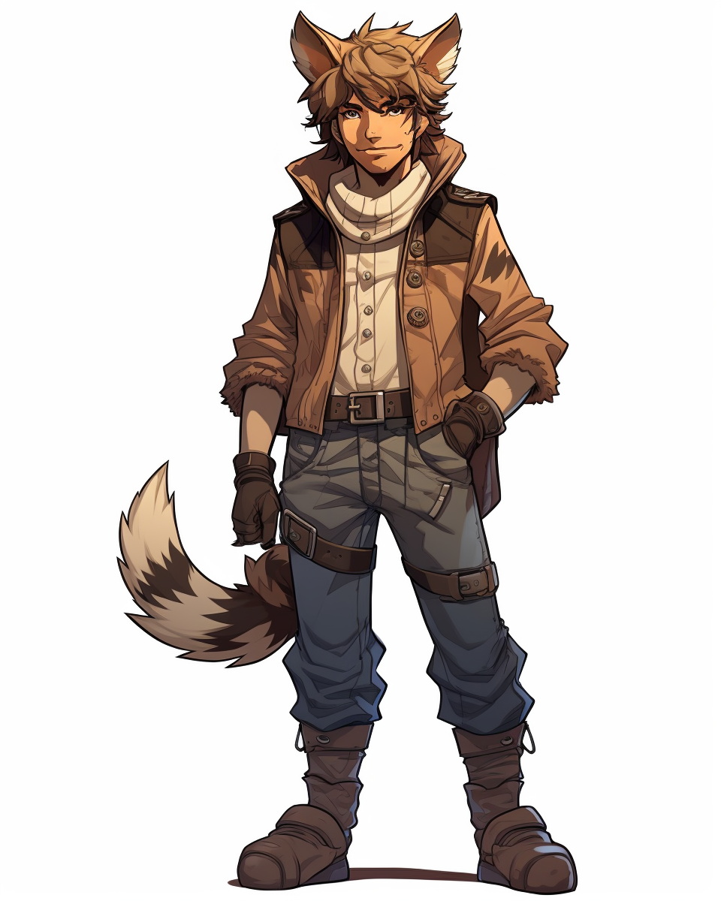
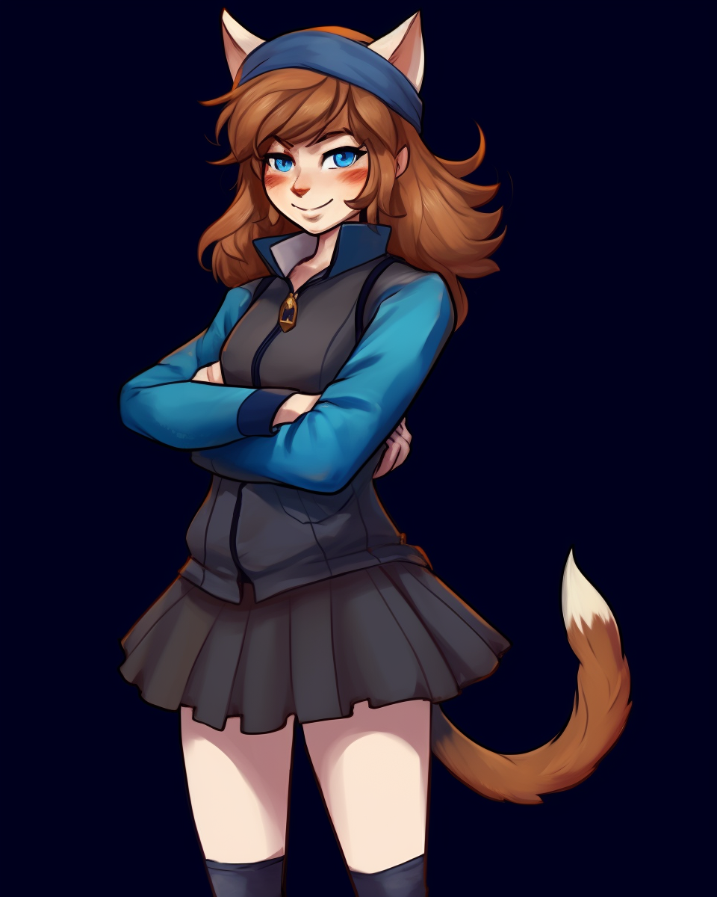

# Фелиниды  

!!! warning "Страница находится в разработке"
    - <a href="#">Редакторы вики</a> уже ведут работу над данной статьёй. 
    - При желании, вы можете подать заявку на редактора в нашем <a href="">Discord</a> и тоже принять участие в улучшении статьи.
    - Данный этап: **В активной разработке**

!!! ss220 inline end "Фелиниды"  
    
    ---
    ####Основная информация  
    <li>Родной мир - Общегалактический
    <li>Язык - Общегалактический
    <li>Система	- Солнечная система
    <li>Средний рост - 120-145 см
    <li>Дыхание	 - Кислород  
**Фелинид** (множ. Фелиниды) — это вид двуногих гуманоидов, сочетающих в себе черты рас Людей и Таяран. Они известны своей любовью к еде и природе.
Средний рост значительно ниже человеческого, серьезно выделяются уши и хвост. На руках у них также находятся коготки, которые сгодятся для самозащиты, а особенности языка и речевого аппарата приводят к тому, что они не могут выговаривать некоторые буквы.
!!! info "Содержание"
    [Фелинидам и читателям](#title1)  
    [Правила и заметки по отыгрышу](#title2)  
    <li>[Правила отыгрыша](#title2.1)  
    <li>[Заметки по отыгрышу](#title2.2)  
    <li>[Язык](#title3)  
    <li>[Схема наименовании](#title3.1)  
    <li>[Физиология расы](#title14)  
    <li>[Сначала кратко все для врачей и глав](#title4.1)  
    <li>[Подробная анатомия и т.д.](#title4.2)  
    <li>[Питание](#title4.3)  
    <li>[Репродуктивная система](#title4.4)  
    <li>[Поведенческие и психологические особенности расы и т.д.](#title4.5)  
    <li>[Устройство общества](#title5)  
    <li>[Краткая информация о психологии](#title5.1)  
    <li>[Взаимоотношения](#title6)  
    <li>[История](#title6.1)  
  
# <a id="title1">Фелинидам и Читателям</a>
Приветствую, уважаемый член экипажа!  

В целях стимулирования межвидового сотрудничества и повышения эффективности на рабочем месте, NanoTrasen составила серию полезных   руководств по разным расам, с которыми Вам, скорее всего, придется работать!  
(ПРИМЕЧАНИЕ: Если вы являетесь представителем вида, к которому относится данное руководство, пожалуйста, передайте его ближайшему члену экипажа другого вида).
Конкретно данное руководство относится к виду, известному как Фелиниды. (в единственном числе: Фелинид)
# <a id="title2">Правила и заметки по отыгрышу</a>  
## <a id="title2.1">Правила отыгрыша</a>  
 ***Придерживайтесь схемы именования***  
Придумайте себе любое имя, используя шипящие звуки, характерные для кошачьего мира. Фамилией может служить характерная особенность или черта внешности. Примерами имен фелинидов могут быть «Вишчи Меховой Хвост» и «Шучча Шумная».  
***Ограничение по должностям***  
Помимо того, что НТ не приемлет фелинидов на руководящих должностях, у вашего персонажа также вряд ли была возможность полноценно обучиться такому роду деятельности. Ну и самое главное - в обществе фелинидов нет главных или старших, все равны между собой, а потому вы попросту не сможете надлежаще справиться с руководством отделом или, тем более, капитанством. Также это касается работы в службе безопасности. Вашему виду не свойственно первыми проявлять насилие и читать кому-либо нотации, да и в общем-то вас никто в СБ и не ждёт.  
***Кушайте много, кушайте вкусно***  
Хорошо поесть - самое важное в течение дня фелинида, а перерывы на обед должны происходить как можно чаще (но старайтесь, чтобы они не мешали выполнению ваших рабочих обязанностей). Подходите к ритуалу принятия пищи со всей ответственностью - найдите себе компанию, вместе наберите побольше разнообразной мясной еды и наслаждайтесь.  
***Ударники труда***   
!!! ss220 inline end " "
    
Трудолюбие - неотъемлемая черта каждого фелинида. Если фелиниду была поставлена определенная задача - он во что бы то ни стало постарается ее добросовестно выполнить. Особенно высоко фелиниды ценят грязную, трудоемкую и сложную работу, будь то уборка, разгрузка или ботаника.  
***Эмоциональность***    
Не стесняйтесь пускать в ход больше эмоций - мяукайте, шипите, рычите, покажите всем окружающим, насколько вы рады или огорчены происходящим на станции.   
## <a id="title2.2">Заметки по отыгрышу</a>  
***Самобытность***     
Фелиниды - это не люди, но и не таяраны. Фелиниды - нечто совершенно иное. Вы вольны комбинировать поведение этих двух рас, балансируя между ними или делая уклон в сторону кого то из них по своему усмотрению.  
***Интересы общества***  
Фелиниды ставят интересы коллектива и общества превыше своих. Если нужно работать - они работают. Если нужно ликвидировать аварию на станции - они готовы пожертвовать собой, если потребуется.  
***Загнанные в угол***  
Фелиниды практически никогда не атакуют первыми. Они стремятся избежать назревающего конфликта или убежать, но если путей отступления не осталось - они будут защищать себя всеми силами.  
***Дефекты речи***  
У фелинидов наблюдается проблема с произношением некоторых букв, а также наблюдается немного “детская” манера общения.    
***Новые граждане СССП***  
Несмотря на то, что фелинидское видение коммунизма немного расходится с принятым в СССП, фелиниды все еще безмерно благодарны своей новой родине за предоставленное политическое убежище и новый дом.  
# <a id="title3">Язык</a>   
## <a id="title3.1">Имена и фамилии</a>  
Имена фелинидов часто содержат шипящие звуки, характерные для кошачьего мира, избегая употребление звуков [Л] и [Р]. Фамилии формируются от характерных черт или особенностей.
Примерами имен фелинидов могут быть «Вишши Меховой Хвост» и «Шувя Беспокойная».
# <a id="title4">Физиология расы</a>  
## <a id="title4.1">Сначала кратко все для врачей и глав</a>  
Фелиниды обладают подобием человеческого телосложения, но с кошачьими чертами: ушами, напоминающими уши кошки, острыми когтями, обширным диапазоном цветовых восприятий и тонким, пушистым покровом на теле. Их глаза часто имеют вертикальные зрачки, что придает им острый взгляд.  
## <a id="title4.2">Подробная анатомия и т.д.</a>  
***Общая физиология***   
!!! ss220 inline end " "
    
Внутренняя анатомия фелинидов сочетает элементы кошачьей гибкости с человеческой выносливостью. Их костная и мышечная структура позволяют им легко приспосабливаться к различным условиям среды. Гибкая ось позвоночника, хребетная структура и подвижный широкий таз обеспечивают гибкость хода, а улучшенные рефлексы делают их быстрыми и ловкими существами.

Вдоль спины располагаются сильные мышцы, которые нужны для обеспечения возможности переносить тяжелую добычу или груз на большие расстояния.

От индивида к индивиду наблюдаются самые различные мутации. Так, у большинства фелинидов на руках наблюдается волосяной покров на руках и тыльной стороне ладоней, схожий с таковым у человека, но немного более густой.Также у фелинидов часто встречаются рудиментарные подушечки на кончиках пальцев. Из прочих редких мутаций встречаются кошачье строение глаз, гипертрихоз и искривление нижних конечностей.

Основные внешние признаки фелинида, свойственные для всех представителей - наличие хвоста и кошачьих ушей (иногда в дополнение к обычным человеческим ушам).

Фелиниды довольно быстро взрослеют. К 2 годам они уже соответствуют 15 летнему человеку, к 4 годам - 30-летнему человеку. После достижения 4 лет их старение резко замедляется, и 40 летний фелинид во многом соответствует 80-летнему человеку. Средняя продолжительность жизни фелинида - предположительно около 30-40 лет.

Любопытно, что по причине своего происхождения в результате мутации, фелиниды склонны к перенесению болезней, свойственных как для людей, так и для представителей земных кошачьих. Таким образом, они больше подвержены заболеваниям мочевыделительной, эндокринной системы, раковым заболеваниям и заболеваниям нижних конечностей. Но наиболее часто встречающейся болезнью у фелинидов является железодефицитная анемия, из-за чего примерно четверть фелинидов не доживают до 20 лет.  
   
<a id="title4.3">***Питание***</a>  
У фелинидов необычайно быстрый обмен веществ, из-за чего они вынуждены очень часто питаться. Побочными эффектами такого метаболизма является худоба, сложности с набором веса, а также легкая нервозность при чувстве голода.

Питание фелинидов базируется на потреблении исключительно белковой пищи. Их организм легко усваивает пищевые вещества из мяса, но не обладает ферментами для расщепления растительной еды, овощей, фруктов, а также сладкого. Основной диетой являются различные виды мяса, рыба и птица.  
У фелинидов наблюдается легкая нервозность при чувстве голода, обусловленная высоким метаболизмом. Многие фелиниды также переживают из-за своего скромного веса.

Принятие пищи для фелинидов является очень важным ритуалом в течение дня. Они обожают кушать и даже чувствовать перенасыщение. Хоть малость голодный фелинид - несчастливый фелинид. Поэтому при каждом удобном случае они покидают рабочее место и уходят на обед, или устраиваются работать как можно ближе к кухне и еде.
в
Важной частью культуры фелинидов является обед в семейном кругу, где разнообразные блюда служат не только источником питательных веществ, но и поводом для общения и укрепления взаимоотношений. Поэтому фелинид перед трапезой предпочтет сначала найти себе друга, желательно представителя своей расы. Одиноко обедающий фелинид считается очень печальным и грустным зрелищем.

## <a id="title4.3">***Репродуктивная система***</a>  
Репродуктивная система фелинидов тесно связана с их семейными ценностями. У них есть сезоны размножения, когда особенно высоки шансы успешного зачатия. Однако у них есть и сезоны апатии, когда фелиниды сторонятся таких контактов и негативно реагируют на флирт и любые фразы с подтекстом и намеком от окружающих. Корпорация НаноТрейзен специально подсчитывает эти сезоны у каждого потенциального сотрудника-фелинида, чтобы отправить его на станцию в период наименьшей вероятности возможного поиска любовных интересов. 

Семейный союз считается важным этапом в жизни каждого фелинида. Пары фелинидов создают крепкие союзы, их основой является взаимопонимание и взаимная поддержка. Беременность у фелинидов длится относительно короткое время, примерно пять месяцев. Фелениды не дают жизнеспособного потомства ни от кого, кроме себе подобных. 

Новорожденные фелиниды чрезвычайно быстро развиваются и становятся способными к самостоятельной жизни. Забота о потомстве является обязанностью не только родителей, но и всего общества, что способствует формированию крепких семейных уз и поддержанию гармонии в обществе фелинидов.  
# <a id="title4.5">***Поведенческие и психологические особенности расы и т.д.***</a>  
***Психология Фелинидов и Вы. Краткая информация.***  
Фелиниды в большинстве своем довольно дружелюбны. Их больше заботит выполнение поставленной задачи и регулярные перерывы на обед, нежели словесные перепалки и конфликты.

У фелинидов развитое чувство территории, потому они часто проявляют территориальные черты в общественных взаимодействиях. 

Они почти никогда не выступают зачинщиками конфликта и предпочитают не лезть на рожон, но если фелинид загнан в угол и драка неизбежна - он готов постоять за себя.

Любопытство и ловкость в сочетании с гибким интеллектом делают их отличными исследователями, а дружелюбие и ответственность - ценными сотрудниками отдела сервиса и снабжения.  
***Подробный психоанализ, причины и последствия***  
Фелиниды обладают сильной социальной структурой, основанной на взаимном уважении и заботе друг о друге. Внутренний инстинкт защиты территории и близких приводит к тому, что они склонны к дипломатии, но в случае угрозы проявляют быструю и решительную агрессию. Их общество ценит художественные выражения и разнообразные формы искусства.

Фелиниды не любят читать нотации и в особенности выслушивать их. Любые нравоучения в свой адрес они воспринимают крайне негативно. Тем не менее, в конфликт они не вступают, но довольно злопамятны. Из-за этого у них часто возникают недопонимания с начальством и офицерами службы безопасности.

Так же раса испытывает определенную ненависть к грызунам. Если фелинид видит грызуна - он с огромным трудом может сдержать порыв начать бегать за ним по всей округе.  
# <a id="title5">Устройство общества</a>    
***Политика и общество Социализм с феленидской спецификой:***  
Быт фелинидов основан в какой-то степени на труды Мо-цзы и на “Город Солнца” Кампанеллы. В последнем случае с той лишь разницей, что в то время, как у Кампанеллы “Город Солнца” представлен протосоциалистическим обществом без семьи и неравенства, у фелинидов же всё общество является одной большой Семьей.
Фелиниды возвеличивают концепцию общности и солидарности, создавая уникальную форму социализма с характерными лишь для фелинидов чертами. Вместо централизованной власти существует коллегиальное руководство, где решения принимаются совместно. Важные вопросы обсуждаются на общественных собраниях, а лидеры являются всего лишь фасилитаторами процесса, но не обладают полной властью. 

Так, в общине фелинидов существует Большой Совет, включающий всех взрослых граждан, он собирается дважды в лунный месяц, но его функции весьма ограничены: он лишь обсуждает порядок выполнения обязанностей должностными лицами, и гражданам предоставляется на нём возможность высказаться об имеющихся недочетах. Подлинное же обсуждение государственных дел и выбор должностных лиц осуществляются не Большим советом: он только намечает кандидатуры. Каждый восьмой день собираются все должностные лица. Они и выбирают между собой “секретарей”, ведающих основными отраслями хозяйства и управления.
Таковыми секретарями, например, являются Секретарь Мудрости (руководит поэтами, скульпторами, писцами, музыкантами и историографами), Секретарь Любви (под его началом находятся воспитатели, повары, медики, агрономы, скотоводы, и т.д.), Секретарь Общения (заведует дипломатами, миссионерами, и целом внешними связями с представителями СССП и других государств), Секретарь Природы (руководит друидами, и в целом вопросами экологии и сохранения природы), и прочие Секретари.   
!!! ss220 inline end " "
    

Фелиниды предпочитают решать конфликты через дипломатические каналы. Они активно поддерживают обмен знаниями и культурой с другими расами. Фелинидские дипломаты считаются хорошими переговорщиками, несмотря на особенности их манеры общения. Военные действия рассматриваются как крайняя мера, и фелиниды стремятся к предотвращению конфликтов через диалог и сотрудничество. Они часто предлагают создание миротворческих миссий и соглашений о ненападении.
Особое внимание в обществе фелинидов уделяется экологическим вопросам и сохранению природы. Фелиниды активно участвуют в программах по спасению экосистем и сотрудничают с другими расами в устойчивом использовании ресурсов.
Несмотря на свои взгляды, фелиниды никогда не будут ругать, например, корпоратов за их стиль жизни. Они уважают выбор каждого, и лишь считают, что им как виду больше по душе невоинственность, общность всего имущества и существование в полной гармонии.  

***Религия 
Едины с природой:***  
Фелиниды исповедуют уважение к природе и силам, существующим в космосе. Их религиозные обряды включают танцы, песни и медитации, направленные на гармонию с окружающим миром. 
Данное религиозное течение чем то схоже с друидизмом. Фелиниды почитают природу и природные объекты, и порицают любое покушение на растения и деревья. Любой предмет естественного природного происхождения вполне может стать для фелинида своеобразным талисманом, с которым он будет ходить и демонстрировать окружающим.
Если на станции есть уголок с деревьями и природой, почти весь свой досуг фелинид будет проводить там.
Если на станции присутствует священник-фелинид, почти со стопроцентной вероятностью он будет неким подобием друида, защитника природы и живых существ.
Однако проповеди и молитвы чужды фелинидам. Они не считают себя религиозными, несмотря на всё вышесказанное. Для них уважение к природе просто является естественным и само собой разумеющимся. Фелинид не будет никому в горячем споре доказывать свою правоту в этом вопросе, он скорее мечтательно поделиться своими воспоминаниями о посиделках в лесу с друзьями или о том, как вкусна утренняя роса.
Стоит отметить, что любовь к природе не особо распространяется на животных, в особенности - на грызунов, за которыми фелиниды любят лишний раз поохотиться.  
***Культура:***  
Семья играет центральную роль в обществе фелинидов. Каждый фелинид входит в обширную семейную общность, где забота о каждом члене является обязанностью всего коллектива. Жизнь вместе, обмен знаниями и опытом создают крепкие связи, а также обеспечивают устойчивость общества. Работа и образование рассматриваются как служение обществу, а не как средство личного обогащения.  
# <a id="title6">Взаимоотношения</a>  
***С другими расами***  
Плохие отношения с людьми и таярами
Нейтральные отношения со всеми остальными расами  
***Взаимоотношения с НаноТрейзен***  
Фелиниды индифферентны по отношению ко всем корпорациям и государствам. 
Они высоко ценятся в отделе сервиса, но также считаются неприемлемыми кадрами для руководящих должностей или Службы Безопасности.
# <a id="title6.1">История</a>  
***История расы Фелинидов с древнейших времен по наши дни***  
***Нелегальные эксперименты***    
Первые упоминания существ, внешне напоминающих современных феленидов, появились ещё в 24 веке. Первоначально они встречались лишь как товар чёрного рынка во внешних человеческих секторах, производимый некой подпольной сетью генетических клиник “Восход”, занимающихся исследованием человеческого, звериного и инопланетного генома, с целью выращивания существ с самыми разными физическими характеристиками на продажу, и для других, куда менее понятных, целей. 
Из комплексов “Восхода” вышло немалое количество самых разных гибридизированных тварей разной степени жизнеспособности и полезности. Многие из них не получили особого распространения, оставаясь лишь частью слухов о “мутантах с захолустных планет”, которые водились в периферийных мирах человечества, прислуживая криминальным силам космоса. 
Фелиниды, впрочем, оказались исключением, и до самой Великой Войны их число неуклонно росло. Вскоре начали говорить не только о “диковинных кошкоподобных рабах”, но и о свободных фелинидах, сумевших сбежать, заслужить свободу или выкупить себя у своих криминальных хозяев. Такие одиночки скитались по космосу, ища собственное место в мире, который смотрел на них лишь как на генетических уродцев или мутантов. Само собой, холод и жестокость мира вокруг очень быстро приводили к спонтанному объединению освободившихся феленидов в чрезвычайно сплоченные группы, помогающих друг другу выжить и приспособится.
Когда сеть нелегальных генно инженерных комплексов “Восхода” была уничтожена в ходе глобального расследования правоохранительных органов ТСФ, искусственное производство феленидов было прекращено, а схемы, необходимые для этого, были либо уничтожены, либо переданы в архив ТСФ. 
Несмотря на это, популяция феленидов, разбросанных по самым разным уголкам космоса, уже стала достаточно большой для поддержания собственного существования без применения генетического проектирования или клонирования.  
***Гонения и поиск дома***  
В вышеописанном статусе фелиниды пробыли более 20 лет, постепенно узнавая о существовании друг друга и объединяясь в импровизированные клубы и кружки. Основной системой, где сконцентрировалось достаточно много фелинидов, стала Солнечная Система и в особенности планета Марс. 
Это привело к реакции со стороны местной администрации, конфликтным ситуациям и гонениям на почве страха и ненависти. Тогда фелинидская организация “Дружный Круг” направила обращения к правительствам ТСФ, СССП и Таяранского Адомая с просьбами предоставить политическое убежище для сообщества фелинидов. Адомай и ТСФ проигнорировали запрос, тогда как новообразованное государство СССП предложило основать колонию на незаселенной безымянной планете в системе Альфа Печи, находящейся в юрисдикции Советов.  
***Колонизация***  
Фактически, предложенная фелинидам планета была практически непригодна для жизни - регулярные холодные дожди и ураганы, низкая плодородность почвы и повсеместная тундра. Однако фелинидам не оставалось иного выбора и они через доступные каналы связи призвали всех представителей своего вида скооперироваться держать свой путь в систему Альфа Печи. 
Новоиспеченный “родной” мир фелинидов получил название Nadejjda, и довольно скоро там появились первые колонии и самоуправление под наблюдением представителей СССП. Руководством страны немедленно была дана команда распространить среди новых граждан государства коммунистическую литературу и разработать социальные и образовательные программы. Любопытно, что в рамках одной из этих программ (названной “Освоение Целины”), в первые месяцы колонизации, фелиниды получили груз из 100 тысяч тонн семян кукурузы. Недоумевающие фелиниды не стали никому доказывать, что не способны употреблять и перерабатывать кукурузу, однако послушно вырастили её и вскоре направили груз аналогичного объема уже выращенной кукурузы обратно в столицу СССП, а оставшийся урожай использовали для корма скота. Кукуруза и по сей день в огромных масштабах выращивается на Nadejjda и поставляется во все ближайшие системы.  
***Филендиский социализм  и общность жен***  
Программа коммунизации фелинидов шла полным ходом: поставлялись учебники по истории коммунизма и СССП, на планету прибывали теоретики и учителя, за ходом развития коммунистического общества фелинидов внимательно следили наблюдатели из столичной системы. Однако далее что-то пошло не так - с годами наблюдение и нажимы со стороны верхушки СССП ослабевали, потому осталось незамеченным возникновение своего понимания коммунизма со стороны фелинидов. Многие элементы были либо чужды фелинидам, либо были недопоняты, либо были истолкованы иначе. Особое влияние на фелинидов произвели идеи человеческого древнего философа Мо-цзы, а именно: всеобщая любовь друг к другу, необходимость отказа от завоевательных войн, восхваление добродетели, экономия в затратах, коммунистический консеквенциализм и критика фатализма.
Так появилась идея “финляндского социализма”, которая со стороны может выглядеть как коммунизм, доведенный до абсурда. Общество фелинидов стало одной большой семьей с общими интересами и общим имуществом вплоть до общности жен. 
Дополняло это зрелище возникшая необычайная любовь к природе вплоть до друидизма и некоей формы поклонения - фелиниды радовались богатому урожаю, проводили все свободное время в лесу, водили хороводы вокруг плодородных деревьев. Идеально описывает данное поведение следующее изречение одного из первых фелинидов-колонизаторов: “Если эта река или этот лес были здесь до меня, и будут здесь после меня, если для них я всего лишь мгновение и мимолетная секунда в истории их существования, какое я имею право навредить им, как я могу не уважать то, что эта река кормит меня, то, что этот лес защищает меня от ветра?”  
***Реакция СССП***  
Представители СССП, мягко говоря, крайне удивились, вскоре обнаружив, что именно происходит на планете новоиспеченных граждан своего государства. Примерно в 2565 году была начата работа по мирному искоренению старых традиций фелинидов и прививанию новых. В добровольно-принудительном порядке в школах изменяют образовательную программу, в СМИ усиленно пропагандируют Марксизм-Ленинизм, стараясь избавиться от появившихся на Надежде абсурдных идей. На данный момент эти попытки не приносят желаемого успеха, но к чему это приведёт - лишь предстоить выяснить.  
***Фелиниды сейчас. Участие в жизни галактики и НТ***  
На данный момент фелиниды практически не участвуют в жизни галактики. Будучи в начале своего существования отбросами общества, они получили убежище на полупустой планете на границе СССП и сейчас занимаются в основном лишь развитием своего нового дома. 
Иногда фелинидов можно встретить на станциях Нанотрейзен в самых разных отделах и преимущественно - в отделе сервиса и обслуживания. Это трудолюбивые создания, четко выполняющие поставленную работу.
