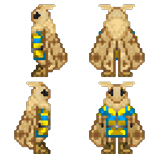
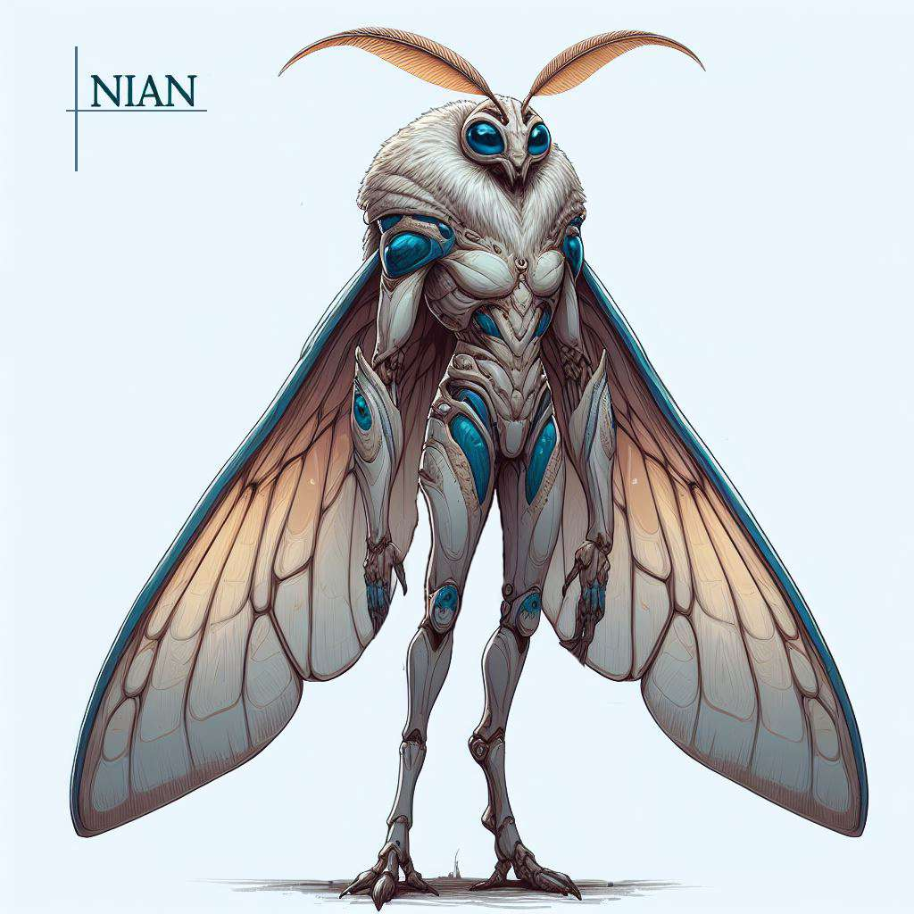
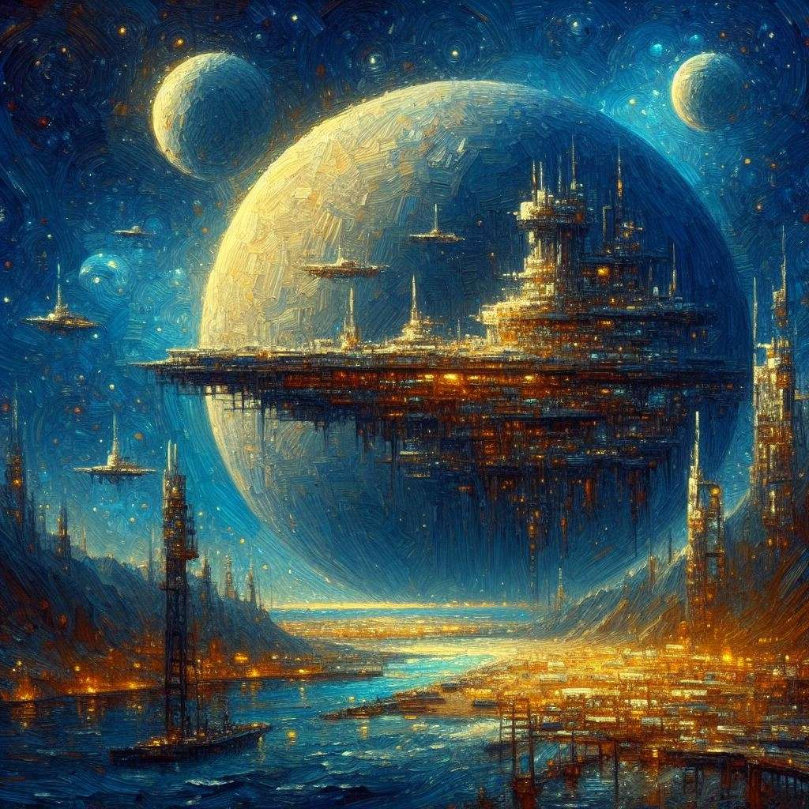
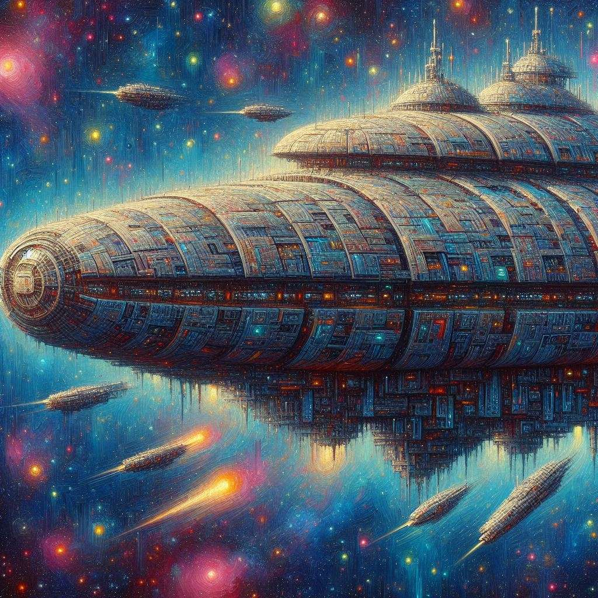
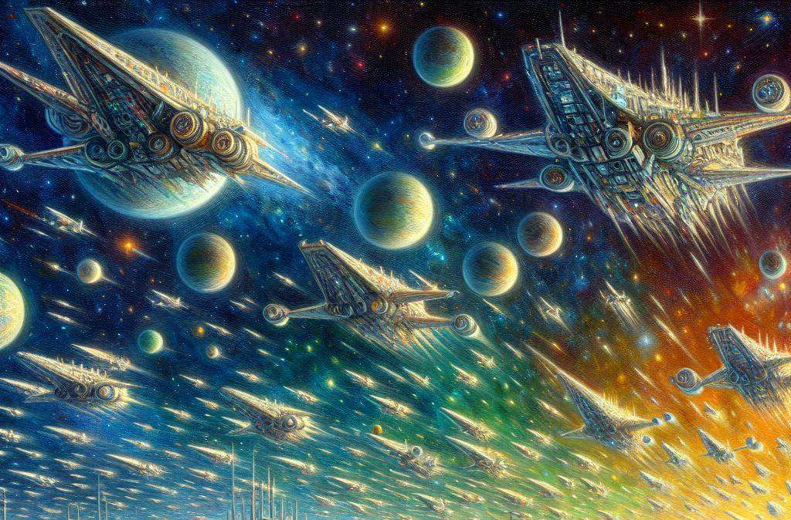

# Ниан

!!! warning "Страница находится в разработке"
    - <a href="#">Редакторы вики</a> уже ведут работу над данной статьёй. 
    - При желании, вы можете подать заявку на редактора в нашем <a href="">Discord</a> и тоже принять участие в улучшении статьи.
    - Данный этап: **В активной разработке**

!!! ss220 inline end "Ниан"
    
    ---
    ####Основная информация  
    <li>Родной мир - планета Зувийен
    <li>Язык - Ткачий
    <li>Система	- Караван Небесных Рек
    <li>Средний рост - 150 см
    <li>Дыхание	 - Кислород
**Ниан** (нескл.) — это вид двуногих инсектоидных гуманоидов, подобных земным мотылькам, ростом полтора метра. Известны своим влиянием на экономическое развитие других рас и высоким уровнем социального интеллекта. В основном выделяются предпринимательским складом ума и инженерными навыками и чрезмерной тягой к эстетике.
 
!!! info "Содержание"
    [Нианам и читателям](#title1)  
    <li>[Правила отыгрыша](#title2)    
    <li>[Язык и наименования](#title3)  
    <li>[Язык](#title3.1)  
    <li>[Наименования](#title3.2)    
    <li>[Физиологические особенности расы](#title4)  
    <li>[Строение](#title4.1)
    <li>[Процесс взросленияя](#title4.2) 
    <li>[Поведенческие и психологические особенности расы](#title5) 
    <li>[Краткое перечисление особенностей поведения](#title5.1)
    <li>[Подробный психоанализ, причины и последствия](#title5.2)     
    <li>[Внешние связи](#title6)  
    <li>[Особенности общества](#title7)  
    <li>[Политика](#title7.1)  
    <li>[История](#title7.2)
    <li>[Культура](#title7.3)
    <li>[Религия](#title7.4)
    <li>[Караван](#title7.5)      
# <a id="title1">Нианам и Читателям</a>
Приветствую, уважаемый член экипажа!  

В целях стимулирования межвидового сотрудничества и повышения эффективности на рабочем месте, NanoTrasen составила серию полезных   руководств по разным расам, с которыми Вам, скорее всего, придется работать!  
(ПРИМЕЧАНИЕ: Если вы являетесь представителем вида, к которому относится данное руководство, пожалуйста, передайте его ближайшему члену экипажа другого вида).
Конкретно данное руководство относится к виду, известному как Нианы. (в единственном числе: Ниан)
 

# <a id="title2">Правила отыгрыша</a>

**Имя**
 
Придерживайтесь схемы именования. Придумайте себе имя: первая часть имени это призвание, должность, или олицетворяющая мотылька описательная часть, вторая часть это космический объект, феномен или корабль из Каравана Ниан.. Для повышения читаемости можно использовать предлоги или соединения. Отличными примерами имён будут: Песнь Звезд Андромеды, Светоч Сикуи Фрон-15, Вечный Свет Кассиопеи, Поэт Туманов Лебедя-9-бета, Слуга Минор Туманности Улитка и т.д. (см пункт "Наименования").
 

**Речь**   
При общении старайтесь использовать как можно больше описательных элементов, красочных или вычурных слов, вашу речь нельзя назвать формальной, но сохраняйте в ней уважение к собеседнику. Не ошибкой будет растягивать свою мысль на несколько предложений, перескакивать на другие темы, давать комментарии касательно эстетики посреди разговора: лаконичность не конёк ниан. Когда разговор идёт в техническом, научном или строгом характере, не забывайте разбавлять свои реплики, ведь даже в строгие науки ниан привносят красоту. В целом, считайте разговор как предмет искусства, и чем более красивым вы его сделаете, тем лучше. 
Приблизительный пример:  *“Добрейшего вам дня, капитан! Как дела на нашей спокойной как течение лесного ручья станции? Думаю, наши товарищи тут все в хорошем расположении духа, но я как раз подумываю над тем, чтобы расширить ассортимент ваших… немного скудных припасов. Как насчет партии свежих фруктов, по скидке? Это же как вдохнуть океанским ветрам в каждом укусе! А, может, и ваши ассистенты оценят сей замысел, что скажете?”* 

**Поведение.** 
- Будьте **патриотичны** и трепетны к своей родной планете Зувийен, относитесь с уважением к Каравану. (Подробнее в "Особенности общества")  
- Общайтесь с минимальным применением слов-паразитов и простых жаргонизмов (типа, короче и т.д.) и жестикулируйте. Скудная или невыразительная речь воспринимается ниан в лучшем случае как плохой вкус, а если это касается сородичей, ниан могут подумать что с ними что то не так.
- Будьте в достаточной мере импульсивными и эмоциональными, но не перегибайте.
- Игнорируйте личное пространство: обнять унатха при встрече это нормально, преследовать грея до туалета это нормально, спрашивать напрямую про семью, тяжелые жизненные ситуации и личную жизнь это нормально.
- В конфликтных ситуациях старайтесь всё решить ненасильственным способом, либо уговорами и обещаниями, либо подкупом и шантажом. **Грязную** работу старайтесь делать чужими руками.
- Старайтесь легально приумножить свой капитал, предлагать на продажу добытые вами вещи Помните, вас интересуют не только деньги, но и красивые вещи, предметы искусства, ценные знания. Не занимайтесь бессмысленным собирательством мусора, вас интересуют только красивые вещи, особенно предметы гардероба.
- Уважайте богатых: для вас богатство это признак таланта и навыков.
 

**Больше идей для отыгрыша можно почерпнуть прочитав остальные пункты статьи**  

# <a id="title3">Язык и наименования</a> 
## <a id="title3.1">Язык</a> 
**Название языка:** «ткачий». Такое название пошло потому что мотыльки сравнивают процесс речи на своём родном языке с плетением. 

**Речь.** В основе языка ниан лежат жужжащие звуки. Для построения речи используется ритмичность, длительность издаваемых звуков, интервал, интонация. Грамматически язык обладает огромным количеством языковых конструкций и форм, которые способствуют определению контекста в излагаемой речи. Также в языковую модель ниан интегрированы жесты и движениями крыльями, как уникальные вербальные элементы, присущие исключительно этому виду, которые могут передавать смысл или усиление смысла высказываемого. Вдобавок эти жесты варьируются от категории, к которой принадлежит индивид. 

**Письменность.** Письменность ниан составляется из иероглифов. В основе иероглифов лежит произношение, поэтому чтение текстов на языке ниан идентично тому, как бы она произносилась. Иероглиф состоит из 3-х уровней.: 
На верхнем уровне описывается издаваемый звук, размер этой части иероглифа также отвечает за интонацию звука. В письменности принято разделять интонацию на три уровня: слабую, умеренную и сильную.
На среднем уровне описывается длительность издаваемого звука и количество повторений звука. Если звук не повторяется, то описывается только длительность.
На нижнем уровне описывается длительность паузы перед следующим иероглифом, и если звук повторяется, то добавляется знак, который указывает интервал между 
произношениями данного звука.  

## <a id="title3.2">Наименования</a> 
Ниан — именно так произнесли мотыльки название своего вида при первом контакте со скреллами. Если примерно перевести это слово с Ткачьего на общегалактический дословно, то получится “Путники Сумрачного Простора”. Так же примечательно, что разница в произношении названия вида мотыльками в единственном или множественном числе настолько незначительна, что слух представителей другого вида, в частности людей, не может уловить разницы. Поэтому в общегалактическом название расы мотыльков принято не склонять.  

**Имя.** Имена ниан состоят из двух частей: звездная часть, и часть сути.  

**Звездная часть.** Звездная часть даётся мотыльку с рождения. Это какой то объект или феномен, связанный с космосом и звездами. Зачастую эта часть олицетворяет семейные корни ниан.  

**Часть сути.** Часть сути  ниан дают себе сами, осознав себя во время метаморфозы во взрослую особь. Данная часть имени формируется по разному, в зависимости от склада ума ниан: ниан с рациональным мышлением берут в имя профессию или призвание, к которому они открыли в себе предрасположенность, а ниан с творческим и эмоциональным мышлением берут себе в имя описание, сравнение или метафору звездной части имени, которой, как они считают, лучше всего можно описать состояние их души.
В произношении первым идёт часть сути, вторым звездная часть. Схоже с человеческими именами и фамилиями.  

**Примеры имён:**  
- Песнь Звезд Андромеды
- Вечный Свет Кассиопеи
- Слуга Минор Туманности Улитка 
- Поэт Туманов Лебедя-9-бета
- Строитель Арок Звездного Ветра  

**Корабли ниан.** Суда ниан обычно несут в своём названии  две части из следующих вариантов:
- класс корабля
- красочное описание назначения судна,
- описание, связанное с его путём, 
- звездную суть владельца суда 
- наименование организации-владельца
- название произведения искусства  

**Примеры наименований судов:**
- Скиталец Бескрайних Простор Пегаса
- Обоз Института изучения плазмы,
- Рáти Небесного Пути,
- Лаборатория Андромеды
- Сикуи Фрон-15

# <a id="title4">Физиологические особенности расы</a> 
## <a id="title4.1">Строение</a> 
По своему строению ниан являются антропоморфными инсектоидами.
Рост взрослых особей колеблется в большом диапазоне: от 130 до 155 см.
Ткачи имеют стройное телосложение, длинные четырехпалые гуманоидные конечности с когтями и крупные крылья. Они обладают фасеточными глазами, чувствительными ворсинками, покрывающими всё тело и  ворсистые антенны как важный орган чувств на голове, что в совокупности позволяет хорошо ориентироваться в неосвещенном пространстве. А также каскадом хитиновых пластин. 
!!! ss220 inline end "Ниан в полный рост"
    

**Хитиновые пластины.** Хитиновые пластины  находятся под произрастающим из них ворсинками,имеют пористую структуру, не имеют собственной чувствительности, обладают средней жесткостью и упругостью. Упругость пластин добивается благодаря тому, что пластины состоят не из чистого хитина, а имеют примеси эластомер, однако это приводит к электропроводности материала, а следствие - уязвимости мотыльков к электрическому току.  

**Ворсовое покрытие.** Ворсовое покрытие имеет характерные отличия в окрасе, что свидетельствует об различающемся образе жизни данного вида в многочисленных климатических зонах их родной планеты в период до катаклизма. На сегодняшний день, после смешения представителей разных доменов, окрас носит исключительно эстетический характер, и зачастую индивиды могут обладать чертами чьё происхождение из нескольких доменов.  

**Речевой аппарат.** Речевой аппарат ниан является совокупностью вибрационных голосовых связок, позволяющих производить высокочастотные вибрации, резонаторных полостей которые усиливают звуки и участвуют в их модуляции и сильных гортанных мышц, которые позволяют производить более тонкий контроль и создавать сложные и многоуровневые звуки. Строение речевого аппарата в целом не мешает ниан разговаривать на обще-галактическом языке без постороннего вмешательства в его функционирование.  

**Крылья.** Крылья ниан выполнены из хитиновых полых трубок и множества мелких чешуек, покрытыми ворсинками, которые зачастую создают на крыльях причудливый узор. Габариты этого летательного органа внушают: в сложенном виде, произрастающие из плечевых суставов крылья, в длину практически достигают уровня ступней, а в ширину могут превосходить ширину тела в 2 раза. Пористая хитиновая структура покрытия и эндоскелета, большой размах крыльев, высокая плотность атмосферы и слегка пониженная по земным меркам гравитация, позволяют мотылькам осуществлять свободный полёт в их родном мире. Однако условия на большинстве космических объектов, предназначенных для проживания множества видов не позволяют им летать. Исключением являются те объекты, на которых вышел из строя или просто не функционирует генератор гравитации.  

**Кокон.** Ткачи обладают железами, которые производят шелковистую нить. С помощью этой нити они образовывают кокон, затем используя желудочные железы и симбиотическую микрофлору, производят в этом коконе субстрат, активирующий регенеративный процесс внешних тканей. Данный процесс крайне энергозатратен и не сможет заживить серьезные ранения, однако очень эффективен при восстановлении таких тонких и важных органов как крылья и усики. Данная особенность крайне важна этому виду, так как их крылья являются довольно хрупкими и громоздкими, из-за чего нередким является их повреждение.  

**Пищеварение.** Пищеварение ниан из-за особенностей экосистемы их родного мира хорошо приспособлено к перевариванию пищи содержащей простые углеводы, волокнистую структуру или пищу растительного происхождения. Большинство белков животного происхождения не усваивается, а сам процесс переваривания происходит очень болезненно.  
## <a id="title4.2">Процесс взросления</a> 
*Взросление ниан происходит в 4 этапа: яйцо, личинка, молодая особь, взрослая особь.*  

**Этап яйца**: Этот начальный этап развития ниан начинается с откладывания яйца. Яйцо обеспечивает первичную защиту и питание для развивающегося организма. Период инкубации яйца составляет ~1 земной месяц.  
**Этап личинки.** На этом этапе вылупившаяся из яйца личинка активно растет и питается, готовясь к следующему этапу. В этой стадии ткачи остаются на протяжение ~3 земных месяцев.  
**Этап молодой особи.** Как только личинка помещается в кокон начинается процесс метаморфозы. Это довольно длительный процесс, который до завершения занимает 2 земных месяца.Это критический период, в течение которого происходит трансформация личинки в молодую особь. После завершения метаморфозы, получившаяся молодая особь начинает обладать самосознанием и начинает познавать окружающий её мир. На этой стадии особь пребывает ~5 земных лет.  
**Этап Взрослой Особи.** Данный этап также протекает через метаморфозу в коконе, хоть на этот раз длительность пребывания в нем увеличена по сравнению с предыдущим и составляет 6 земных месяцев. Во время этой метаморфозы , помимо физического роста протекают внушительные мозговые процессы, так как в этот момент завершается интеллектуальное и психологическое созревание особи. По выходу из последнего кокона особь становится полностью взрослой, обладая всеми характеристиками и способностями взрослого ниана. Это включает в себя полную социальную, культурную и физическую зрелость.  
  
Дальнейшие метаморфозы не предвидятся и у особи начинают протекать процессы старения. По этой причине средняя продолжительность жизни ниан без особого вмешательства в био-процессы составляет 64 земных лет.

# <a id="title5">Поведенческие и психологические особенности расы</a> 
## <a id="title5.1">Краткое перечисление особенностей поведения</a> 
- Ниан обладают врожденным любопытством. 
- Большинство представителей вида имеют сильную любовь к эстетике, хотя она и может проявляться по разному. 
- Подавляющее большинство имеет патриотические наклонности.
- Речь ниан используют богатый литературный язык и разную артистичную жестикуляцию, в целом перегружена множеством художественных элементов.
- Средний уровень интеллекта, сравним с человеческим, у представителей вида прослеживаются перекосы в эмоциональную и творческую сторону.
- Любят освещенные пространства с  надёжными источниками света.
- С осторожностью относятся к электричеству и крупным механизмам.
- Боятся резких вспышек.
- В еде предпочитают сладкую пищу.  
- Игнорируют личное пространство.
- Чистоплотные.  

## <a id="title5.2">Подробный психоанализ, причины и последствия</a> 
**Исследовательский Нрав.** Ниан обладают естественным стремлением к исследованию и познанию. Они могут быть увлечены изучением природы, космоса, технологий или социальных наук. Данная черта прослеживается практически у всех мотыльков, берет свое начало со становления молодой особью и закрепляется за ними уже после взросления.  

**Эстетическое Разнообразие.** Хотя все ниан ценят красоту, проявления этой любви могут сильно различаться. Некоторые могут украшать свои дома и рабочие пространства, другие выражают свою любовь к эстетике через создание предметов искусства или дизайн одежды. Бывают и довольно девиантные эстетические наклонности.  

**Речь.** Сложность родного языка ниан и их тяга к красоте. привела к тому что, при переводе на общегалактический их речь кажется очень возвышенной, с частым использованием метафор, аллегорий и сравнений или научной терминологии, что делает их речь особенно красноречивой и выразительной. Даже когда ниан говорят о каких-то научных или формальных вещах, они используют множество художественных приемов. Так как в родном языке часто используются жесты, мотыльки не избавились от привычки их использовать и при общении на общегалактическом языке.  

**Интеллект.** Ниан имеют крайне большую предрасположенность к творческим способностям, преобладают эмоциональные и интуитивные аспекты. Хоть ниан и сведущи в точных науках и технике, но результаты их научной и технической деятельности всегда полны эстетических элементов или иных проявлений тяги мотыльков к красоте.  

**Отношение к свету.** По своей природе ткачи являются ночными существами, однако присутствие на родной планете хищников, обладающих светобоязнью, в ниан заложило тягу к источникам света в слабо освещенной местности на генетическом уровне - в таком месте они ощущают чувство умиротворения и спокойствия.  

**Пища.** Хотя ниан могут употреблять различную пищу, в основном растительного происхождения, большие энергозатраты на образ жизни этого вида и на возможность регенеративных процессов наружных тканей привили мотылькам тягу к сладкой высококалорийной пище.  

**Отношение к электричеству и крупным механизмам.** Ниан физиологически крайне уязвимы к электрическому току, поражения им проходят крайне болезненно и травматично, поэтому они относятся к нему с опаской. Настороженность к крупным механизмам связана с тем, что частоты, издаваемые ими, в некотором диапазоне совпадают с частотами, применяемыми в речи ниан, из за чего мотылькам может казаться, что машины издают крайне озлобленную речь.  

**Боязнь резких вспышек.** Глаза ткачей приспособлены к слабо освещенным средам, резкие вспышки света для них физически неприятны и болезненны. Резкие вспышки инстинктивно ассоциируются с опасностью, что вызывает у них страх или стресс. Это является эволюционно обусловленной реакцией, предназначенной для быстрого реагирования на потенциальные угрозы.

## <a id="title6">Внешние связи</a>  
На данной момент **Домены Звездных Архитекторов** имеют политические связи с немногочисленными государствами, хотя торговля ниан и простирается далеко за пределы зоны влияния Доменов.  

- **Скреллианская Империя.** У мотыльков довольно теплые дипломатические отношения со Скреллианской империей - это самая близкая цивилизация к населенному ими сектору космоса, первая встреченная на галактических просторах цивилизация и первая цивилизация, которая оказало поддержку Доменам  

- **ТСФ.** В целом ниан относятся нейтрально к Транс-солнечной Федерации, однако их крайне смущает политика ТСФ относительно кидан и их Аурумской Демократической Республики.  

- **Воксы.** Домены не видят причин налаживать дипломатические связи с воксами. Постоянные налеты воксов-рейдеров лишь усугубляют их отношения.  

- **Плазмамены.** Ниан не устанавливали контакта с Церковью Распада, однако им доводилось иметь дело с исследовательской флотилией Нового Мира, с которой установили торговые отношения. Домены получили от них немало важных знаний об устройстве вселенной, а также технологий для проекта Вирдис.  

- **НТ.** Домены почерпнули немало идей из организации данной корпорации. Хоть маршруты Каравана частенько пролегают через торговые порты Нанотрейзен, в целом, к НТ у ниан холодные отношения, что связано с их довольно сомнительными этическими нормами.  

- **Синдикат.** Ниан настроены крайне негативно к Синдикату ибо пиратские группировки входящие в его состав не прочь всякий раз организовать рейд на пролетающий в нейтральных секторах Караван.

# <a id="title7">Особенности общества</a>  
## <a id="title7.1">Политика</a>  

**Домены Звездных Архитекторов** - Конфедеративная Плутократическая Монархия. Данный политический строй взял свое начало еще с родной планеты мотыльков, и изначально представлял собой объединение 5 крупных автономных образований, которые называются Домены. Национальным представительным органом является Совет Доменов, а представителями - кураторы. Кураторы выбираются Советом Доменов на вакантное место бессрочно на основе своих достижений и вклада в экономическое развитие нации и домена, который новоизбранный куратор будет представлять.  

**Рыночно-Ориентированное Управление:** Все аспекты общества, включая образование, здравоохранение и даже правительственные услуги, работают на основе рыночных принципов, с сильным акцентом на конкуренции и инновациях.  

**Власть и Богатство.** Политическая власть тесно связана с экономическим успехом и богатством. Лидеры доменов могут быть успешными предпринимателями или влиятельными бизнес-магнатами.  

**Социальная Мобильность.** Социальный статус и положение в обществе определяются экономическим успехом. Существует возможность подъема по социальной лестнице через предпринимательство и инновации.

## <a id="title7.2">История</a>  
!!! ss220 inline end "Зувийен"
    
Родная планета ниан - **Зувийен**, если дословно перевести это название на общегалактический, то получится *“земля под звездами”*. Некогда это был мир, с всевозможными климатическими зонами, начиная с тропических лесов и арктических шапок, заканчивая мицеллярными колониями и кислотными озерами, мир, полный изобилия видов и ресурсов.  

***До летоисчисления.** Продолжительное время ниан вели беззаботную  жизнь в кругу своих кланов, предпочитая не покидать родной для их клана биом. Формирование кланов происходило относительно безболезненно - на территории большинства биомов было обилие ресурсов, исключением стали объединение кланов на территориях арктического пояса “Падшая луна”, участка тропической зоны с преимущественно ядовитыми видами “Ядовитый лес” и региона с экстремально кислотной средой “Долина разложения”.*  

***Вестники.** Хоть кланы жили практически в изоляции, после объединений появилась группа фанатиков, которая хотела установить связь между кланами для поиска и обмена знаниями, они называли себя “вестниками”. Эта группа ниан путешествовала между разными регионами, собирая информацию о событиях, культуре, достижениях в области науки, попутно набирая в свои ряды новых адептов.*  

***Эпоха восхода.** Именно представители вестников начали вести летоисчисление, принятое на территории большинства кланов. Отправной точкой стал день, когда вестники заручились одобрением последнего клана в их путешествии , этот день назвали “день первой вести”, в будущем, эпоху, начинающуюся с этого дня назовут “Эпохой восхода”. Данная эпоха протекала практически мирно: бывали мелкие стычки на клановых границах, редкие внутренние распри, столкновения с варварскими племенами, но не более. Благодаря вестникам, развитие цивилизации шло стремительно и равномерно по всей заселенной мотыльками территории. Эпоха длилась до 441 года со дня первой вести. На этот момент их общество напоминало земное общество после индустриальной революции.*  

***Эпоха раздора.** В 441 году со дня первой вести активность Йеллар, местной звезды класса K, начала неизбежно губить климат планеты, предзнаменовав об этом мощным коронарным выбросом. Климатические зоны стали исчезать, стихийные бедствия становились обыденностью, многие виды начали вымирать, началась “эпоха раздора”. Нарастающий дефицит ресурсов вынудил кланы поднять свои головы на своих соседей. Начались довольно кровопролитные объединительные войны, правители, вышедшие из них победителями, стали именовать себя монархами, оставив на планете семь классических монархических государств.*  

***Образование Доменов.** Объединительные войны, как и эпоха раздора, закончились к  474 году со дня первой вести. Климат планеты был практически уничтожен, Зувийен стал похожим на пустынный мир, а мощнейший за всю историю коронарный выброс, озарявший всё небо на протяжение нескольких дней стал символом окончания эпохи. Общество осознало несостоятельность королевского подхода, и чтобы предотвратить болезненный переход и потерю драгоценного времени, правители пяти королевств совместно выпустили “Эдикт Процветания”, упразднивший монархию в привычном виде: в качестве альтернативы, монархи начали искать самых выдающихся и состоятельных ниан и поощрять стремление мотыльков к достижению политических высот и конкуренцию, а сами стали первыми кураторами Доменов Звездных Архитекторов. Два королевства, не принявших Эдикт находились в самой неблагоприятной для жизни части планеты, и вскоре перестали существовать, оставив после себя как напоминание лишь мертвые руины в зоне отчуждения.*  

***Путь надежды.** В 479 году со дня первой вести была завершена разработка стратегии по спасению вида “Путь Надежды”. Стратегия делилась на две части: выход в космос и спасение планеты.*  

***Космическая программа.** Кураторы понимали, что оставаясь на Зувийене они не смогут противостоять вымиранию, поэтому они нацелились на покорение космического пространства. Перед космической программой стояло две задачи: найти возможный для заселения мир и звездные цивилизации, способные протянуть им руку помощи. У ниан были серьезные основания полагать что за пределами их родного мира существует разумная жизнь, так как на поверхности планеты сохранились немногочисленные загадочные постройки предтечей. Для реализации, Домены выделили баснословные ресурсы и начали поиск исполнителей путем тендеров и прямых инвестиций в проекты, которые обеспечат технологическую, инфраструктурную и кадровую базы для космической верфи и космических кораблей. В 484 году ниан смогли успешно покинуть орбиту Зувийена. В 501 году Был успешно завершён первый межзвёздный перелёт.*  

!!! ss220 inline end ""
    
***Эпоха исхода.** К 506 году со дня первой вести был оснащен и отправлен первый экспедиционный флот Доменов Звездных Архитекторов на свою исследовательскую миссию. С этого момента начинается “эпоха исхода”.*  

***Первый контакт.** В 4-м году после исхода первый экспедиционный флот наткнулся на пограничный форпост Скреллианской империи. Установив дипломатические отношения, скреллов заинтересовали предметы искусства ниан и их философия. Проявив снисходительность, скреллы предоставили мотылькам знания о политическом устройстве галактики и рекомендации научной группе экспедиции. Посчитав данные открытия крайне важными, флот вернулся на Зувийен к 5-му году. Так завершился первый маршрут флота ниан.*  

***Караван.** Получив сведения с экспедиции, кураторы увидели возможность использовать торговлю для продвижения планетарных проектов и начали активно строить торговый флот. Было огромное количество желающих попытать свои силы на поприще межзвездной торговли. Получившийся флот внушительных размеров получил название “Караван Небесных Рек”, в дальнейшем будет называться “Караван”, а после каждого путешествия он становился только больше. Первый его маршрут был уже намечен и в 10-м году после исхода начался первый скреллианский маршрут.*  

***Проект Вирдис.** Чтобы спасти родную планету, ниан согласовали проект терраформирования “Вирдис”. Но реализация данного проекта длительное время находилась в тупике из-за острой нехватки нужных ресурсов и технологий, окончание первого скреллианского маршрута в 15-м году после исхода дало ощутимый толчок в развитие этого проекта, что вселило в сердца ниан надежду вновь увидеть их планету живой. А основной опорой проекта Вирдис стал считаться Караван.*  

***Контакт с воксами.** Во время первого центрального маршрута в 38-м году после  исхода Караван впервые наткнулся на группу воксов-рейдеров. Наладить контакт не удалось, а вооруженное столкновение с воксами привело к потере 60% флота, что вынудило свернуть маршрут, вернуться Каравану на Зувийен и обеспокоиться о вооружении флота. Год окончания первого центрального маршрута (40-й год после  исхода) стал годом выпуска первого боевого корабля ниан.*  

***Контакт с людьми.** Во время третьего скреллианского маршрута Караван решил двигаться сквозь Скреллианскую Империю дальше. Покинув Территорию империи флоту не потребовалось много времени чтобы повстречать на своём пути цивилизацию людей. Первый контакт произошел с отдалённой добывающей станцией Нанотрейзен на периферии Транс-солнечной Федерации в 53-м году после исхода. Ниан были впечатлены корпоративным устройством НТ и заключили несколько долгосрочных торговых контрактов с корпорацией.*  

***Синтетическая катастрофа.** В проекте терраформирования довольно активно использовались автономные механизмы - автоматоны. Их можно было запечатлеть практически в каждом из аспектов проекта. В 59-м году после исхода завершился первый транс-солнечный маршрут: вместе с различными ресурсами мотыльки привезли на Зувийен и развитый искусственный интеллект. Его подключили к проекту Вирдис для надзора и контроля за автоматонами. Данный шаг существенно повысил эффективность работы, но ниан не учли губительное влияние Йеллар: в 63-м году после исхода сильная солнечная вспышка с лёгкостью прошла сквозь магнитосферу Зувийена и поразила ядро ИИ своим излучением, вызвав целый каскад ионических законов. Сбой ядра привёл к крайне разрушительному поведению работающих под его началом автоматонов. Мотыльки не были готовы к такому стечению обстоятельств, поэтому были вынуждены организовать орбитальную бомбардировку региона дислокации ядра. В результате были уничтожены практически все вычислительные мощности проекта и откинут прогресс терраформирования на годы назад, а сами мотыльки начали скептически относиться к синтетическому разуму.*  
## <a id="title7.3">Культура</a>  
В основе современной культуры ниан стоит три столпа: 
1. Родная умирающая планета
2. Космический порт
3. Караван  

**Деньги.** Ниан относятся к деньгам по разному, но в большинстве случаев это две крайности: когда ниан слишком дорожит своими личными деньгами, накапливая большие суммы, или, наоборот, не считает деньги важной вещью, опираясь на бартер и накопление богатства в ином виде, предпочитая предметы искусства, артефакты, технологии, патенты или просто красивые вещи. В конечном итоге для большинства мотыльков успех в накоплении в том или ином виде является отражением личных достижений, умений и талантов.  

Вся жизнь ниан крутится вокруг Каравана, путь которого зачастую пролегает через весь известный космос, а иногда лежит и за пределы изученной части, поэтому путешествие флота может занимать от 5 до 15 земных лет.  

Само их общество делится на четыре категории:
- те, кто всю жизнь проводит на Караване, путешествуя, торгуя и исследуя.
- те, кто полжизни провёл на планете и полжизни провёл в Караване (большинство). Все нианы, живущие на торговых постах, либо временно работающие на станциях других корпораций - считаются частью каравана.
- те, кто всю жизнь провел на родной планете и ни разу не покидал её атмосферу, занимаясь исследованиями и поддержанием проекта терраформирования.
- те, кто основали новые колонии Доменов или поселились уже на существующих для добычи ресурсов и снабжения родного мира.  

Однако есть и прослойка ткачей, что решили поселится на планетах других рас, покинув Караван и Домены. Они считаются изгоями и к ним чаще всего относятся с неприязнью, но не более.  

**Летоисчисление.** Год по календарю ниан составляет 1.14 земного года. Крайне важные дни в культуре ниан - это день отправки и день прибытия Каравана, поэтому в летоисчислении стало принято отсчитывать года от отправления первого экспедиционного флота, приписывая номер маршрута каравана и его описание одним словом, обозначающее какое либо важное событие, например: 32 год от исхода, второй скреллианский маршрут, 38 год от исхода, первый центральный маршрут, 69 год от исхода, пятый плазменный маршрут. Годы до принятия Эдикта и образования Каравана отсчитываются от дня завершения первого путешествия вестников например: 300 год со дня первой вести  

**Значимые даты.**  

**День Первой Вести** - день, когда группа вестников завершила свое первое путешествие по кланам и положила начало цивилизации ниан.

**День Процветания** - день когда был издан и вступил в силу Эдикт Процветания, ставший первым шагом в становлении современной государственности ниан.

**День Небесного Взлёта** - день, когда окончены торги Каравана с планетой, окончена передача ресурсов и молодых ниан с каравана на планету, и с планеты на караван через порт.

**День Первой и Последней Остановки** - день, конец путешествия и возвращение каравана на Зувийен после облета всех назначенных на путешествие точек интереса.  
 

**Традиции.** Глубоко в традициях осталось духовное имя . Эти имена имеют большое значение в культуре Ткачей. Согласно фольклору, имена неразрывно связаны с владельцем, как ключ к его душе, который нужно беречь, иначе он столкнётся с ужасными последствиями, если кто-то с недобрыми намерениями узнает его духовное имя. В более современные времена раскрытие собственного имени стало символом большого личного доверия. Это происходит так редко, что некоторые ниан часто забывают свое имя, и, так как данные имена непереводимы на общегалактический из-за того, что больше похожи на осмысленную игру слов, их существование, как и понятия смысла возможно осознать только на «ткачьем». Строение этих имён неразрывно связано с «Эфиром» который является синонимом души в вере Ниан.  

Ниан довольно общительны, особенно среди представителей своего вида — это обусловлено жизнью в плотно переплетенном сообществе Каравана.  

Успешным мотыльком считается тот, кто богат и кому при этом удается сохранять свою красоту и достоинство — в первую очередь это касается узоров на усиках и крыльях. Ниан с ухоженными крыльями и внушительными накопленными богатствами уважают и стараются слушаться.  

Одни из главных положительных черт Ниан — их чистоплотность и нарядность, не существует Ткача, что спокойно бы стояли рядом с пятном масла на полу. Также их волнует то, как обустроено помещение: мотыльки стремятся сделать всё как можно более приятным глазу. Если мотылёк не украшает свое жилище или рабочее место — это верный знак отшельника или не гостеприимного мотылька. Такие ниан часто обделены вниманием и подвержены тяжелому испытанию одиночества.  

Ниан часто являются большими поклонниками парфюмерии и ароматических масел, которые те с удовольствием наносят на свои тела. Ниан отдают предпочтение духам, которые покажутся другим расам приятными и привлекательными. Среди них могут быть как легкие цветочные и сладкие запахи, так и свежие цитрусовые и древесные оттенки.  

Претворяя в жизнь свою тягу к украшению, ниан иногда окрашивают свои ворсинки и тело в оттенки, отличные от естественных, для того, чтобы показать свой статус и важность на родном корабле или в поселении Домена. Значимую роль в этом играют естественные узоры на крыльях и антеннах: их отсутствие свидетельствует о молодости и неопытности Ниан или его несостоятельности. Блеклость крыльев часто заставляет относиться к их носителю с осторожностью и недоверием — такие ниан едва ли смогут занять ответственные должности в своём обществе. Ввиду того, что узоры чаще всего теряются при восстановлении частей тела, их отсутствие — один из прямых признаков для обозначения солдат или изгоев.  

## <a id="title7.4">Религия</a>  
**Божества.** Пантеон божеств Ткачей пестр и многочисленен, но в нём можно выделить три главных, древних божества, чаще всего упоминаемых в фольклоре и обладающих наиболее сформированными образами: **Та, Что Переплетает Судьбы; Тот, Кто Направляет Ветра и Бестия, Что Искажает Нас.**  
 

**Та, Что Переплетает Судьбы.** Шестирукая богиня жизни и смерти, называемая также Ткачихой. Одна пара её рук сплетает полотно судеб из всего, что в них попадает, другая вышивает на нем узор нитями судеб существ, а третья пара обрезает нити, заканчивая узор и знаменуя окончание жизненного цикла.  Те, кто хотят заработать благосклонность Той, Что Переплетает Судьбы, наматывают на свои запястья, шеи или антенны цветные ленты из шёлка — метафорическое изображение нитей судеб, переплетенных богиней, сжигают на алтарях веточки ароматных трав и возносят песнопения.  

**Тот, Кто Направляет Ветра.** Также известный как Навигатор, Тот, Кто Направляет Ветра — божество, направляющее потоки Каравана по блюспейс потокам, обеспечивая безопасность торгового флота.  
В древние времена был божеством ветров, а после дня Эдикта стал главным божеством Каравана, тем кто обеспечивает безопасность в путешествии.  
Так его описывают некоторые из проповедников: *“Мужчина-ниан с огромными крыльями, узоры которых складываются в бесконечно меняющиеся светила. Пыльца с его крыльев — бесчисленные звезды и планеты на пути кочевников ниан, их взмахи — космический ветер, влекущий Караван по потокам.”* Мотыльки верят, что крошечная искорка света с крыльев Того, Кто Направляет Ветра сопровождает каждого путешественника. Эта искра есть движущая сила, дарующая нианам ясность ума и стремления.  
**Навигатор** — божество странников и искателей, покровитель капитанов и советник любого ниана, который чувствует себя заблудившимся на пути. В качестве амулета, посвящённого Навигатору, ниан нередко покрывают маленькие метеоритные камушки резьбой и заполняют гравировку светящимся пигментом, пытаясь имитировать сложный и постоянно меняющийся узор на его крыльях.  

**Смотрящий из бездны.** Не поддающаяся описанию безликая сущность, Бестия олицетворяет всё неизведанное, злобное и пугающее, что может встретиться на пути ниана.  
Антагонист того, кто Направляет ветра, чаще всего упоминается в негативном контексте, эта бестия всегда старается сбить путешественника с пути, исказить и обезобразить. Это нечто неизвестное, сама пустота смотрящая в ответ.  
Согласно легендам, Бестия прячется на самой границе взгляда, на пересечении сна и яви и — чаще всего — в глубинах космоса, если начать всматриваться.  
Мотыльки верят, что те, кто слишком долго любуется своим отражением в зеркале, добровольно приносят свою сущность в жертву неописуемой сущности, а та с готовностью пирует ими, пожирая мечты и стремления незадачливых нарциссов, саму их суть, замещая её чем-то чужеродным, мрачным и жестоким.  
Пустоте не молятся — напротив, стараются всеми силами избежать её пагубного влияния: избегают продолжительные взгляды в зеркало, себе в глаза, а также в иллюминатор корабля и пучины космоса. **Отсюда и стремление ниан заполнять пустые пространства.**  
*“Тронутый Бездной”* — ужасное оскорбление в кругах ниан, используемое обычно в адрес беспричинно жестоких, бесчувственных и агрессивных мотыльков.  

**Младшие божества.** Трое этих божеств считаются старшими, те, с которыми считаются все ниан зная о них, помимо старших, есть младшие божества, которым поклоняются малое количество последователей, от одной семьи, до жилого корабля с населением от миллиона особей.  
Очень часто младшие божества противопоставлены друг другу, представляя из себя несколько противоположных сил, к примеру:  *Многие мотыльки инженеры почитают божество Трепетный Вольтант, эфемерную сущность, что олицетворяет электричество, ведь без электричества Караван никуда не улетит, но и при этом до ужаса страшатся его гнева.*
Среди инженеров даже есть **ритуал почтения Вольтанту** - обряд, при котором мотылёк путешествует по тех тоннелям корабля, покрывая проводку защитой и скрывая её из виду, дабы обезопасить.  
Полной противоположностью Вольтанта является - **Дитя Тени, Вихрь Полумрака**, малое божество, что питается светом, убивая всё живое на своём пути, открывая охоту на экипаж корабля.”  

**Другие сущности.** Помимо божеств ниан верят в призраков, духов и мифические существ. Например:  *“Часто считается что на пустых кораблях, в составе Каравана, водятся призраки, что обживают этот корабль и чем дольше судно пустует, тем сильнее будет дух, что принял его во свои владения и тем тяжелее его будет изгнать, либо ужиться.”* Также считается что у каждого судна из флота Каравана есть свой дух, что оберегает его.  

**Сторонние религии.** К сторонним религиям ниан относятся терпимо, и даже добавили в пантеон малых божеств **Космо Иисуса**, как покровителя нищих и обездоленных мира сего.  

## <a id="title7.5">Караван</a>  
**Краткое описание Каравана:**

Караван, или же, полное название - Караван Небесных Рек. Это флот, состоящий из около 900 судов в его составе. С флагманом Эклипсар в середине формации, вокруг которого движутся корабли мегаполисы, посольства и исследовательские судна, дальше на растяжении идут охранные корабли и частные судна, в конце судна карго, конструкторское бюро и суда класса Гоми́ и Оии́.  

Сообщение экипажа между кораблей внутри флота осуществляется системой квантум падов, которые отключаются во время путешествия внутри трубки. Корабли класса Рати осуществляют доставку массивных грузов и оптовые поставки на частные судна и в мегаполисы внутри Каравана и во время торговли с планетами других рас. Суда класса сикуи́ осуществляют роль военных и полиции одновременно, защищая Путь от внутренних и внешних угроз.  

**Классификация флота:**  

А — «Амира́ль»  
*Флагман флота, Э́клипсар, на котором проходят все заседания и решаются все стратегические вопросы. Хотя данный корабль и обладает собственным вооружением, он обязательно должен сопровождаться кораблями класса Сикуи́. Капитаны данного корабля — только члены Совета Доменов. Представляет из себя автономное, пятипалубное судно с тяжёлым вооружением из батарей блюспейс артиллерии. Эклипсар расположен в центре формации.*  

С — «Сикуи́»  
!!! ss220 inline end "Сикуи"
    
*Оборонительные суда, защищающие Караван, представляющие стратегическую важность и являются одними из самых обслуживаемых кораблей. Деятельность данных кораблей строго контролируется и не допускает неточностей. Капитаны данных кораблей очень уважаемы и высокооплачиваемы. Предназначен для военных операций в космическом пространстве на всём протяжении Каравана, в состав входит 213 боевых единиц.* 

Ф — «Фуне́»  
*Обозначение любого малого корабля. Такие суда можно встретить в любой части космоса вне зависимости от положения флота и их состояние не является особо важным параметром. Составляют большую численность Каравана, около 400 единиц и состоит из частных кораблей, предпринимателей, небольших корпораций, богатых семей и всех решивших заработать путешествуя в с Караваном частных лиц.*  

Р — «Рáти»  
*Обозначение грузовых и промышленных кораблей — главной артерии флота. Эти корабли являются основной всего снабжения и торговли Флота, обладают чрезвычайной вместительностью, а также перерабатывающими комплексами на борту, не обладают тяжелым вооружением. Количество - 120 единиц.*

Л — «Лáакет»  
*Корабли научных и медицинских направленностей. Практически всегда сопровождают большие суда, либо сами сопровождаются, если вопрос касается научно-исследовательских операций. По своему стандарту они не имеют капитанов как таковых: пилотирует корабль специально обученный член экипажа, а функции капитана выполняет Директор Исследований. Количество, 22 единицы, расположены позади флагмана.*

И — «Ису́ин»  
*Корабли, выполняющие функции неких городов, по размерам не уступают, а иногда и превосходят все остальные обычно это колониальные корабли. Они всегда густо населены и не могут работать без снабжения извне. Такие гиганты чаще всего обладают самыми комфортными условиями для проживания во флоте. Капитаны таких «курортов» принадлежат членам Совета Доменов. Количество - 5 единиц, 3 расположены перед флагманом и два позади. Крайне медлительны и уязвимы, всегда сопровождаются несколькими судами класса Сикуи́. В одном из кораблей население может доходить до 200 миллионов, чаще всего внутри Исуинов есть коммерческие зоны, биржи, рынки, зоны отдыха, объекты высокотехнологичной промышленности.*

О — «Оии́»  
*Добывающие корабли. Снабжены оборудованием, позволяющим добывать из астероидов ресурсы и перерабатывать их на месте для дальнейшей отправки на корабли класса Рáти и Ису́ин. Часть кораблей принадлежат частным лицам и добывают ресурсы для собственных нужд, остальные работают по контракту с Советом. Количество - 155 единиц, расположены в конце Пути. Начинают работу во время дрейфа от точки выхода блюспейс трубки и до входа в следующую трубку. Были случаи что капитаны кораблей из-за жадности не успевали и Караван улетал без них, оставляя позади и закрывая за собой трубку.*

Ж — «Жи́су»  
*Автономные корабли представительств, по сути это  посольство, в составе Каравана, известны судна-посольства: Скреллианской Империи, Нанотрейзен,  ТСФ, СССП и т.д. Находятся вблизи Флагмана под надежной охраной.*

Г - «Гоми́»  
*Полупустые, заброшенные, сломанные корабли, что проходят ремонт или разбор вблизи Рати́, разбор осуществляется Оии́. Караван довольно часто по пути подхватывает космический “мусор” после баталий на полях битвы, после их восстанавливают, либо разбирают на запчасти и переплавку.*