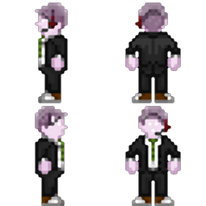
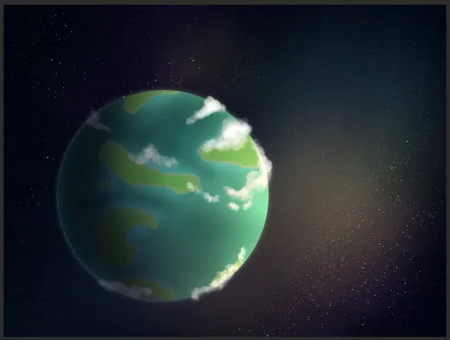

#Слаймолюды
!!! ss220 inline end "Слаймолюды"
    
    ---
    ####Основная информация  
    <li>Родной мир - Ксарксис 5
    <li>Язык - Пузырчатый (:f)
    <li>Система	- 41 Жертвенника
    <li>Средний рост - 145 см
    <li>Дыхание	 - Азот
**Слаймолюд** (множ. Слаймолюды) — раса гуманоидных желеобразных полупрозрачных существ. Слаймомены происходят из системы 41 Жертвенника, с планеты Ксарксис, представляющей собой океанический мир. 
!!! info "Содержание"
    [Слаймолюдам и читателям](#title1)  
    [Правила и заметки по отыгрышу](#title2)  
    <li>[Правила отыгрыша](#title2.1)  
    <li>[Заметки по отыгрышу](#title2.2)  
    [Язык](#title3)  
    <li>[Схема наименовании](#title3.1)  
    [Физиология расы](#title14)  
    <li>[Общая физиология](#title4.1)  
    <li>[Питание](#title4.2)  
    <li>[Размножение](#title4.3)  
    <li>[Полиморфирование](#title4.4)  
    <li>[Экскурс для врачей и хирургов](#title4.5)  
    [Поведенческие особенности расы](#title5)  
    <li>[Краткая информация о психологии](#title5.1)  
    [Общество](#title6)  
    <li>[Религия](#title6.1)  
    <li>[Армия](#title6.2)  
    [Взаимоотношения](#title7)  
    <li>[Взаимоотношения с NT](#title7.1)  
    <li>[С другими видами](#title7.2)  
    [История](#title8)  
# <a id="title1">Слаймолюдям и Читателям</a>
Приветствую, уважаемый член экипажа!  

В целях стимулирования межвидового сотрудничества и повышения эффективности на рабочем месте, NanoTrasen составила серию полезных   руководств по разным расам, с которыми Вам, скорее всего, придется работать!  
(ПРИМЕЧАНИЕ: Если вы являетесь представителем вида, к которому относится данное руководство, пожалуйста, передайте его ближайшему члену экипажа другого вида).
Конкретно данное руководство относится к виду, известному как Слаймолюды. (в единственном числе: Слаймолюды)
 
# <a id="title2">Правила и заметки по отыгрышу</a>
## <a id="title2.1">Правила отыгрыша</a>   
**Подражайте**
 
Слаймомены - подражатели. Подражайте эмоциям и действиям других, но не нарушайте рамки. (Этот пункт не является оправданием для ПГ и ВХ, вы не должны оправдывать нарушения правил отыгрышем) 
**Дружелюбие и отношение к другим**
Слаймомены воспринимают всех вокруг как своих сородичей и любят свое племя. А еще они рады когда их сравнивают с другими, даже если это сравнение негативное.
 
Пусть вы и дружелюбны, но не выбираете выражений, концепция расовых оскорблений для вас неизвестна. Помните, все - просто другие люди и если мохнатому человеку не нравится, что вы называете его мохнатым или ящеру-человеку не нравится быть человекоящером это он глупый, не вы.
 
**Соблюдайте языковые привычки** 
Всеобщему языку слаймомены обучились от простых рабочих. Общайтесь как можно проще. 
**Помните о своей физиологии и пищевых привычках** 
Вы неразборчивы в еде и не чувствуете вкуса поэтому можете есть все что кажется вам съедобным. Но постарайтесь избегать гигроскопичного сахара и соли, они вам неприятны и кажутся “вяжущими”.  
Пожертвовать техникой безопасности и рукой для вас не такая уж и большая проблема. 
**“Эмоциональность”** 
Вы может и не полноценно понимаете эмоции, но эта черта ваших коллег вам, определенно нравится, пытайтесь чаще пользоваться панелью эмоций. Улыбайтесь! 
## <a id="title2.2">Заметки по отыгрышу</a> 
**Любопытство, подражательство и беспринципность.** 
Слаймомены чрезвычайно любознательны и беспринципны. Старайтесь собрать побольше любой информации, спрашивайте других о их работе.
Слаймомены не привыкли строить какие-то долгосрочные планы и зачастую способны довольствоваться малым.
Слаймомены - подражатели. Подражайте эмоциям других, подражайте действиям коллег или других членов экипажа, вы можете играть как хорошо интегрированного в общество слаймомена и использовать эмоции так же хорошо как человек, а можете просто глупо улыбаться, когда на вас наставили оружие… вы просто не знали, что это его расстроит… 
Вы повторяете не только эмоции, но и действия. Это не дает вам право избивать клоуна или антагониста потому что так делает СБ, но вы можете взять палку или багет и размахивать им в воздухе или перед клоуном, побейте грушу в дормах или предложите клоуну спарринг на голодеке. Попробуйте, например, сделать то что делает ваш коллега. (Этот пункт не является оправданием для ПГ и ВХ, вы не должны оправдывать нарушения правил отыгрышем) 
**Слабое понимание концепции рас.** 
Слаймомен, человек, драск, таяра, вульпканин, грей - это люди, для вас все равны. И что что человек маленький, серый и с большой головой вы тоже таким можете стать. Вы не понимаете концепции рас, для вас это скорее разные племена. 
**Адаптация и нестандартные ситуации.** 
Слаймы хорошо адаптируются, но встретив нестандартную ситуацию могут впасть в ступор или панику. 
**Гордость за свой народ.** 
Будучи СБ и победив в схватке морфа или генокрада, порадуйтесь этому, вы несколько раз превзошли одного из лучших подражателей - значит, что сламомены - лучше! 
**При отыгрыше за синдикат.** 
Вы - агент, элита. Слаймомены часто становятся целью синдиката из-за своей высокой обучаемости. Существуют подразделения состоящие исключительно из слаймолюдей, обученных методам ведения подрывной деятельности на пропагандистских роликах и записях успешных операций. Несмотря на выгоду, таких агентов используют неохотно из-за их низкой надежности вследствие пробелов в обучении и обработке. Большая часть информации о вооружении синдиката была получена как раз таки от таких агентов. 
# <a id="title3">Язык</a> 
У слаймоменов отсутствует привычное для человека понятие языка, общение происходит посредством булькающих и хлюпающих звуков разных частот и продолжительностей, воспроизводимых ими с помощью дыхательной системы и вибрации ядер. Природа и разнообразие этих звуков делает использование этого языка для любых других существ невозможным, а перевод чрезвычайно затруднительным даже при использовании ЭВМ. 
## <a id="title3.1">Схема наименований</a> 
Имена слаймоменов непереводимы на человеческие языки из-за чего интегрированные в человеческие общества и путешествующие по другим системам слаймомены берут себе новые имена на общегалактическом языке, включая в свои имена характерные “хлюпающие” звуки своего языка (“хлюп”, “блоб” и пр.). Это делается для удобства общения на своем собственном языке, так как после выбора нового имени слаймомен почти полностью перестает пользоваться старым именем. 
# <a id="title4">Физиология расы</a> 
## <a id="title4.1">Общая физиология</a> 
Эволюционно слаймомены, как и обычные слаймы являются потомками древних слаймов, населяющих Ксарксис в стародавние времена. О них известно чрезвычайно немного, но согласно исследованиям они схожи с земными паразитическими инфузориями Balantidium coli. Рост конкретного слаймомена зависит от количества биомассы, но редко превышает 150 см., хотя среди военных Временного Правительства можно встретить и более высоких слаймов в гуманоидных формах. 
Преимущественно состоят из смеси веществ, которая при нормальных земных условиях является неким подобием баллистического геля, внутри которого находится скелет-подобная структура прочность которой обеспечивается прочными, но гибкими коллагеновыми волокнами. Кожа представляет собой коллагеновый “мешок”, который служит для защиты внутреннего пространства организма от повреждений и попаданий внутрь инородных тел. 
Из-за строения скелета травмы, которые для человека были бы чрезвычайно болезненными проходят для слаймоменов значительно легче. При этом их организм плохо приспособлен к перепадам температур и если высокие температуры значительно меньше нарушают функции организма, холод - напротив переводит жидкости организма в кристаллическое состояние, что может привести к ранениям как внешней оболочки, так и внутренних органов, вплоть до полного нарушения жизненных функций организма. 
Слаймомены имеют центральную нервную систему, работающую через вибрации ядра, которое является подобием мозга и также обеспечивает их аналогом человеческого зрения. Из-за этого слаймомены не способны воспринимать цвета, и лишь слабо способны к различию “оттенков” цвета благодаря высокой восприимчивости к смене температур. Помимо ядра внутренние органы представлены дыхательной системой и “сердцем”, которые выполняют функции обеспечения организма энергией путем экзотермических реакций с белками, липидами и углеводами получаемыми из пищи. Коллаген не синтезируется организмами слаймоменов и запасается исключительно при питании, что определяет их рацион.
Физиология дыхательной системы плазмоменов позволяет им впитывать окружающий газ из водных пространств и использовать его для перемещения в воде. Большое количество гелия в атмосфере позволяет использовать собственное желеобразное тело как плавательный пузырь и перемещаться вертикально в толще воды с высокой скоростью. 
Дыхание в свою очередь проходит через всю поверхность тела, но может быть сосредоточено в отдельной части организма, преимущественно голове. 
## <a id="title4.2">Питание</a> 
Слаймомены, абсолютно всеядны и способны даже включать в свой метаболизм крайне токсичные для людей соединения, но из-за особенностей своего организма не любят сильно соленую и сладкую пищу. Сахар и соль имеют высокую гигроскопичность и кажутся слаймоменам “вяжущими”, даже с учетом того что вкусов слаймомены не различают. 
## <a id="title4.3">Размножение</a> 
Слаймомены не имеют половой принадлежности и способны размножаться митозом, при котором организм-родитель, разделяется на два дочерних идентичных организма. Дочерние организмы абсолютно идентичны организму-родителю, кроме ядра, которое проходит частичную деградацию из-за разделения на два копирующих органа, вследствие чего дочерние организмы имеют куда менее высокий интеллект в первые годы существования. При этом информация из нервной системы переносится только частично и включает в себя некоторые моторные навыки.
Средний срок жизни слаймомена зависит от “изношенности” его ядра и редко когда превышает 120-130 лет, при этом чем старше индивид - тем меньше вероятность успешного разделения. 
## <a id="title4.4">Полиморфирование</a> 
Форма организма представляющая собой “мешок” жидкости позволяет слаймоменам иметь некую форму полиморфизма и предоставляет возможность на протяжении своего жизненного цикла менять форму, в том числе и подражая человеческим и другим чертам, а также при достаточном количестве биомассы восстанавливать утерянные части организма (за исключением органов).
На родной планете можно встретить слайма почти любого вида и даже в негуманоидной форме, но с выходом в космос их способности к полиморфизму крайне ограничиваются из-за изменения внешнего и внутреннего давлений.
## <a id="title4.5">Экскурс для врачей и хирургов</a> 
Слаймомены, как и люди дышат азотом, но он используется исключительно в ходе экзотермических реакций внутри организма. 
Слаймомены не имеют стандартного набора органов, а только ядро, систему дыхания и “сердце”. 
Вместо кожи имеют крайне упругую, но все еще поддающуюся повреждениям оболочку из коллагена с жидким содержимым.
Температура, особенно холод, способны менять агрегатные состояния жидкости и сильно повреждать оболочку и внутренние органы. Температура - враг слаймолюда. Костей в привычном понимании у слаймолюдей нет, их заменяет гель который способен к самовосстановлению.
Слаймомены не имеют крови - все что у них есть это содержимое их организма, используйте слаймовое желе вместо пакетов крови. Если слаймомен потерял конечность, вы не обязаны его лечить и пришивать ему руку, пошлите медбрата за маргаритой и наблюдайте как рука восстановится у вас на глазах. К сожалению, клонировать слаймоменов техника НТ ещё не умеет, но вы же что-то придумаете?... 
# <a id="title5">Поведенческие и психологические особенности расы</a> 
Слаймомены - дружелюбные, простые, даже в некотором роде примитивные личности. Экосистема Ксарксиса подталкивала отдельные племена к сотрудничеству и не позволяла появляться крупным конфликтам, что объясняет такой пацифизм среди расы хищных существ. Из-за способности адаптировать свои организмы слаймомены не способны видеть очевидные различия рас, как особенности отличающие их от других организмов. Лишь немногие слаймомены-врачи задаются вопросами о том почему другие “люди” устроены иначе, чем все остальные. Это выливается в достаточно странное для других населяющих галактику рас мнение слаймоменов о том, что на самом деле все расы одинаковы, подобны обычным людям и просто имеют разные подвиды. 
## <a id="title5.1">Краткая информация о психологии</a> 
Слаймомены не обладают ни исключительным интеллектом ни полноценным мозгом, но даже такие физиологические ограничения не мешают их главному преимуществу перед другими обитателями Ксарксиса и остальной галактики - адаптации. Слаймомены чрезвычайно податливы и изменяются под внешние условия гораздо активнее чем другие расы, что позволяет им работать почти что в любых условиях, чувствуя себя в них абсолютно комфортно. Эта же адаптивность позволяет слаймоменам обучаться в рекордно малые сроки, но только при активном взаимодействии с субъектом изучения. Так исследования проведенные еще в начале первого контакта показали, что слаймомен обученный на личном примере уже через пару десятков минут способен выполнять свою задачу, почти с механической точностью повторяя действия показанные учителем. Сложность в обучении слаймоменов начинается тогда когда необходимо принимать решения в нестандартных ситуациях, поэтому NanoTrasen при участии управления Ксарксиса была разработана специальная учебная программа, позволяющая подготовить студента-слаймомена к работе на объектах NT и правительства Ксарксиса, заключающаяся в многочисленном моделировании ситуаций с помощью голографических устройств, что сводит “нестандартные” ситуации к минимуму. Их неприхотливость к условиям работы и обучаемость активно эксплуатируется NT, на исключительно медицинских, научных и даже некоторых военных объектах нередко можно увидеть слаймоменов в составе руководящего аппарата. 
# <a id="title6">Общество</a> 
!!! ss220 inline end ""
      
Традиционно слаймомены имеют коллективное устройства общества что во многом связано с верованиями и культурой народа, но в настоящее время оно все больше и больше уходит от своих истоков, что связано с высокой интеграцией большой части общества слаймоменов в межгалактическое сообщество. 
В настоящее время большинство племен были ассимилированы и включены в состав единого государства, но до событий контакта на поверхности планеты и в толще вод располагались многочисленные поселения называемые “кругами” до интеграции расы в межгалактическое сообщество разные “круги” редко контактировали друг с другом и держались изолированно, лишь в редких случаях сталкиваясь в конфликтах за места обитания и охотничьи угодья. 
Каждый круг являтся отдельной общиной построенной вокруг слайма-старейшины, центральной персоны и учителя, основной задачей которого является передача знаний и информации более молодым слаймоменам. При гибели старейшины им выбирается самый почитаемый слайм в поселении или же близнец бывшего старейшины. Круги взаимодействуют друг с другом на общих собраниях раз в десятилетие, на которых старейшины делятся собранными знаниями и произошедшими событиями. Сейчас эта традиция упразднена, но культурно существует как “праздник единения”. До прихода людей популяции слаймоменов концентрировались в 5 основных поселениях: 
**Хлоо** - “житель земли”. Расположено в толще большого скопления магниевых руд, что и обуславливает их роль в устройстве общины слаймоменов. Первое поселение вышедшее на контакт с человечеством. Состоит из живущих исключительно в толщах земли слаймоменов, верующих в “земное солнце”. Традиционно занимается рудокопством и поиском “даров земли”, образований драгоценных камней или металлов, из которых создаются различные украшения и краски. Являются первооткрывателями гончарного дела среди слаймоменов. 
**Дооу** - “дети неба”. Поселение, население которого проживает исключительно на земле и самых теплых из широт Ксарксиса. Почти полная зависимость от солнечного дня сформировали чрезвычайно религиозную общину верующую в “небесное солнце” - основной источник тепла доступный, большинству из жителей . Многие из них до сих пор воспринимают корабли NT как воплощение бога, что правда перешло в некое прославление флотоводства и капитанства. Сейчас многие из потомков жителей Дооу - элита флота слаймоменов. 
**Соошо** - “растящие воды”. Поселение обитающих в глубинах “разлома” - большой поводной расщелины, чья близость к ядру планеты поддерживает относительно комфортные температуры круглогодично. Первые из слаймоменов, что заимели некоторое понятие частной собственности еще до прихода людей. Занимаются разведением пищевых водорослей и некоторых трав произрастающих на поверхности. Разделены на меньшие общества в зависимости от выращиваемой культуры, но имеют общее управление в лице старейшины. Предоставляют пищу для других поселений взамен заключая “контракты” на работы или обмениваясь на предметы роскоши. 
**Нууоок** - “жизнеродящие”. Разводчики животных и рыбы. Живут под водой на территориях с большим количеством подводных пещер и источников, которые необходимы им для разведения рыбы. Единственные кто научился выращивать и одомашнивать некоторые виды подводной фауны, способной к перевозке грузов. Часто конфликтуют с кругом Соошо из-за того, что те воспринимают их животных не как членов общины. Разводят вьючных морских червей, которые используются повсеместно всеми слаймоменами. 
**Оол** - “глаз”. Малочисленное общество слаймов, живущее на подводном источнике этилена. Способны видеть “видения” будущего, которые на самом деле являются следствием наркотического действия этилена. Считалось что они имеют особые силы, так как на местах их смертей активно вырастала флора. В настоящее время поселение существует только как “артефакт” прошлого и своего рода курорт. Выходцы из этого поселения наиболее часто занимаются творческой работой и занимают должности архивариусов, архитекторов, художников, писателей, инженеров-проектировщиков и др., что связывается именно с их вечно несколько “помутненным” рассудком. 
Помимо стандартных поселений в обществе слаймоменов существует некое подобие “гильдий” - общих объединений странствующих представителей некоторых профессий, чьи знания передаются только внутри своей кочующей общины: 
**Воолооб** - “глубинные странники”. Одни из самых образованных и общительных слаймоменов. 
Почти каждый слаймомен-целитель является либо бывшим представителем этого круга, либо учеником одного из их старейшин. Ставят своей целью накопление историй и знаний из-за чего большинство из них не имеют постоянного места жительства и путешествуют по глубинам океана от одного поселения к другому. Основоположники медицины слаймоменов, способные даже к сложной для своего уровня развития хирургии. 
**Уроо** - “копье глубин”. Гильдия охотников и войнов, постоянно меняющее свое место охоты, чтобы фауна могла восстановиться. Не имеет полноценного права называться отдельным обществом, но выделяется как таковое самими слаймоменами. Представляет собой общины внутри других поселений, которые не ведут военных действий друг с другом даже в конфликтах и вступают в бой только если конфликт регулируют в “турнирном” порядке. Являются неким органом полицейского управления и судебной власти. Основные добытчики пищи из-за чего о преступлении совершенном слаймоменом быстро становится известно всему поселению, которое в назидание лишается помощи охотников, что делает преступника изгнанником. Многие из войнов именуют себя приверженцами поселения из которого происходят добавляя наименование “гильдии” к наименованию своего места рождения (напр. Уроо-Воолоб). В отличии от других кругов не имеют постоянного старейшину, он избирается сроком на 10 лет на общем турнире из представителей “чемпионов” поселений и является общим гласом войнов и главным судьей.
С помощью NanoTrasen было основано Временное Правительство - общий государственный орган управления и законодательства в котором задействован персонал состоящий из обеих рас и представляющий преимущественно интересы NT,но с оглядкой на интересы коренного населения. В настоящее время Временное Правительство преследует идеи развития Ксарксиса до новой державы галактического стандарта с целью укрепления влияния корпорации и получения нового преданного союзника. 
## <a id="title6.1">Религия</a> 
Религиозные обычаи слаймоменов повсеместно связаны с циклом перерождения, что связано в первую очередь с их способом размножения. Согласно верованиям каждый слаймомен является отражением своего родителя, особо отличившихся в талантах и знаниях с детства почитают как перерожденных и зачастую отдают им самые важные роли в обществе. 
Помимо веры в перерождения у слаймоменов присутствует некая форма языческих верований, так наиболее важные вещи в жизни племени обретают своих почитателей и культы. Среди этих культов, культ охоты, культ земного солнца и культ небесного солнца.
С приходом Временного Правительства получают распространение религиозные идеи землян. 
## <a id="title6.2">Армия</a> 
В обществе слаймоменов традиционно охотники выполняют и роль войск, но с приходом к власти Временного Правительства армия стала отдельным институтом. Войска стали представлять собой контрактную службу. Контракт заключается напрямую с министерством обороны Временного Правительства и подразумевает за собой также охрану объектов NanoTrasen на территории системы. Многие слаймомены идут на службу с целью покинуть родную планету и посмотреть на мир. Примерно 20% армии составляют наемники со стороны NanoTrasen, которые осуществляют оборону активов NT и занимают роли спецподразделений и консультантов. 
# <a id="title7">Взаимоотношения</a> 
## <a id="title7.1">Взаимоотношения с NT</a> 
Слаймомены крайне благодарны корпорации НаноТрейзен и людям и даже ассоциируют корпоратов со всей расой людей. Корпорация чрезвычайно сильно повлияла на становление и развитие Ксарксиса как галактического игрока.
Слаймомены видят в НТ и человечестве в целом благодетеля, некоторые даже обожествляя момент посещения людьми Ксарксиса.
НаноТрейзен, в свою очередь, видит финансовый потенциал в использовании неприхотливых и легко обучаемых слаймоменов в составе своей корпорации. 
## <a id="title7.2">С другими видами</a> 
Люди - некоторые слаймомены еще помнят первые контакты с человечеством и считают их своими благодетелями, относятся крайне положительно. Скреллы - из-за того что большая часть слаймоменов настроена к NT положительно это же настроение распространяется и на официальных союзников корпорации. Воксы - недолюбливают из-за их негативных отношений с людьми, и пропаганды на объектах NT.
Плазмомены - непонимание граничащее с пренебрежением из-за общих настроений расы. Не видят в них “живых” существ.
С остальными расами официальные контакты не производились. 
## <a id="title8">История</a> 
!!! ss220 inline end ""
    
Слаймомены происходят из системы 41 Жертвенника, с планеты Ксарксис, представляющей собой океанический мир. Наиболее примечательной чертой планеты Ксарксис является ее высокоэллиптическая орбита, которая приводит к чередованию продолжительных холодных зим и чуть менее продолжительных жарких летних периодов. Атмосфера планеты состоит из 70% гелия и 17% кислорода 9% углекислого газа и 4% газов-примесей. Сама планета имеет чрезвычайно горячее ядро, содержащее большие количества гелия, что обеспечивает выживание видов в холодные периоды и объясняет большое количество живности в глубинах. Краткая историческая сводка Обнаружение расы слаймоменов людьми произошло вследствие малого конфликта с одной из общин, кругов, население которого было обнаружено в процессе раскопок магниевых руд.
Шахтерский корпус NT в процессе раскопок столкнулся с потерями большого количества оборудования. Вследствие расследования было обнаружено, что оборудование подвергалось расхищению со стороны одного из племен слаймоменов проживающего недалеко от места раскопок. Корпорацией было принято решение о налаживании контакта с этим племенем. Контакт происходил на удивление мирно, хоть на тот момент общение с безликими существами вызывало сомнения. 
Первый договор с слаймоменами был заключен через 2 года. Племя согласилось предоставлять свои рабочие силы в качестве шахтеров, позволяя NT таким образом перебросить силы шахтерского корпуса на другую планету. Также примерно в течение 15 лет были обнаружены и другие “круги”, многие из которых были заинтересованы рассказами сородичей о космических гигантах (на тот момент средний рост слаймомена был около 120 см из-за отсутствия у них голов, для подражания людям). Для изучения языка и физиологии слаймоменов было организована первая колония человечества на Ксарксисе, являющаяся небольшим исследовательским аванпостом с персоналом в количестве 50 человек. На аванпосте велась торговля с племенем и предоставлялись бесплатные медицинские услуги для шахтеров-слаймоменов с целью изучения их физиологии. 
Заинтересованный, инопланетными способами лечения на контакт выходит круг Воолооб, традиционные знахари слаймоменов.
Постепенно коренное население было ассимилировано, появились учебные центры с целью подготовки слаймоменов к работе на объектах NT.
На данный момент данный аванпост разросся до планетарной столицы общества слаймоменов города “Блобу”, который также является самым крупным космопортом планеты. Пещеры же превратили в музейный комплекс, привлекающий большое количество интересующихся культурой слаймоменов туристов 

