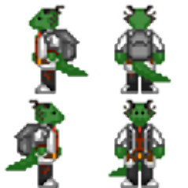
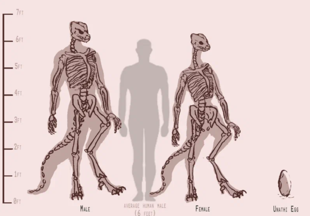
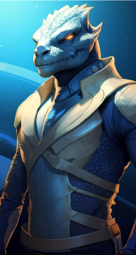

#Унатхи
!!! ss220 inline end "Унатхи"
    
    ---
    ####Основная информация  
    <li>Родной мир - Morec
    <li>Язык - Синта’унати
    <li>Система	- 20 LMi
    <li>Средний рост - от 180 до 230 см
    <li>Дыхание	 - Кислород
**Унатхи** (прост. — унати, унатх) — это вид чешуйчатых холоднокровных гуманоидов родом с тропической планеты Могес, расположенной в звездной системе 20 LMi, управляемой монархическим государством «Великая Империя Кхси’Ра».
!!! info "Содержание"
    [Унатхам и читателям](#title1)  
    [Правила и заметки по отыгрышу](#title2)
    <li>[Правила отыгрыша](#title2.1)
    [Язык](#title3)  
    <li>[Словарь](title3.1)
    <li>[Слэнг](title3.2)
    <li>[Схема наименовании](#title3.3)  
    [Психология](#title4)   
    <li>[Социальное поведение](#title5.1)  
    <li>[Ксенофобия](#title5.2)  
    [Физиология и диета](#title6)  
    <li>[Половой диморфизм](#title6.1)  
    <li>[Диета](#title6.2)  
    [Культурные особенности](#title7)  
    <li>[Религия](#title7.1)  
    <li>[Иерархия кланов](#title7.2)  
    <li>[Семья](#title7.3)  
    <li>[Внутренняя политика](title7.4)  
    <li>[Образование](title7.5)  
    <li>[Экономика](title7.6)  
    [Внешняя политика](title8)  
    [История](title9)  
# <a id="title1">Унатхам и Читателям</a>
Приветствую, уважаемый член экипажа!  

В целях стимулирования межвидового сотрудничества и повышения эффективности на рабочем месте, NanoTrasen составила серию полезных   руководств по разным расам, с которыми Вам, скорее всего, придется работать!  
(ПРИМЕЧАНИЕ: Если вы являетесь представителем вида, к которому относится данное руководство, пожалуйста, передайте его ближайшему члену экипажа другого вида).
Конкретно данное руководство относится к виду, известному как Унатхи. (в единственном числе: Унатх)
 
# <a id="title2">Правила и заметки по отыгрышу</a>  
**Имена**  
Придерживайтесь схемы наименования унатхов.  
**Клановая система**  
Выберите себе клан, к которому принадлежит ваш персонаж, и следуйте характерному поведению для их представителей. Если ваш персонаж из Узо, вас не сковывают клановые, религиозные и общественные нормы, однако, вы всё ещё унатх, и будете агрессивнее/активнее человека.Если вы выбрали себе клан, то соблюдайте его ритуалы. Унатхи крайне религиозны. 
**Язык**  
Чаще прибегайте к разговору на Синта’унати, старайтесь не применять в речи структурно сложных слов. Пытайтесь заменять нецензурные выражения их более мягкими аналогами.  
**Религии**  
Если ваш персонаж религиозен — запомните имена основных богов Унат’шу, обращайтесь к ним в трудную минуту и следуйте их заповедям и примеру.  
**Половой диморфизм**  
Играя за самца, избегайте любых споров и оскорблений в сторону представителей женского пола своего вида.  
Играя за самку, ведите себя более уверенно и агрессивно, чем делали бы это, играя за человека.  
**Самостоятельность**  
Избегайте помощи со стороны других персонажей, если это возможно, пример — если вы ранены и идете в медбей, не давайте никому себя довести, пока вы способны стоять на ногах.  
**Оскорбления**  
Самое обидное оскорбление для унатха — это назвать его глупым, или слабым, избегайте подобного по отношению к представителям собственного вида. Также довольно серьёзным оскорблением считается утверждение о неудачной охоте на ковчег воксов.  
**Инициативность**  
Проявляйте инициативность, конкурируйте с коллегами и будьте общительны, не бойтесь перечить начальнику и вступать в споры. Отстаивайте свою честь, если кто-то вас оскорбил, вплоть до вызова на дуэль, но учтите что это не позволяет вам нарушать общие правила сервера.  
**Жестикуляции**  
По возможности используйте «эмоуты» для жестикуляции и помощи в выражении чувств, например вставайте на дыбы, в случае агрессии используйте шипение, рычание, бейте хвостом о землю, раскрывайте пасть. И в целом чаще показывайте свои эмоции.  
**Гаптофобия**  
Избегайте телесного контакта, однако, если ваши персонажи достаточно близки, можно использовать особые жесты унатхов вместо объятий, поцелуев, и т. д. (P.S Не пытайтесь коснуться унатха без спроса, особенно его хвоста, это может быть расценено ими как попытка навредить, с соответствующей защитной реакцией) 
# <a id="title3">Язык</a>  
## <a id="title3.1">Словарь</a>  
Здесь расположены некоторые типичные слова из лексикона среднего унатха, вы можете свободно использовать их в речи, что ещё лучше подчеркнет принадлежность вашего персонажа к данному виду.

Зо — приветствие  
Оз — прощание  
Кусси — самка  
Кусх — самец  
Ширх — предельно плохо (о ситуации)  
Укоз — мерзкий (обычно в отношении воксов, но может быть применено в сторону иных особо неприятных членов экипажа.)  
Кхар — охота, война, сражение.  
Кусс — зверь, опасное существо.  
Ризх — божество.  
Хисо — мать.  
Саах — империя (Применимо исключительно в контексте упоминания Великой Империи Кхси’Ра.)  
Хасали — императрица (Аналогично, применимо только к правительницам Саах.)  
Схассас — смерть.  
Сассахс — рождение.  
## <a id="title3.2">Слэнг</a>  
Венсарар - друг.  
Сухрессар - брат по оружию.  
Вассибик - жидкотелый, в отношении слаймоменов.  
Курхутс - дословно означает куст, часто в отношении дион.   
Хоссэрща - двуногая мартышка, оскорбление в сторону людей.   
Шармутшархи - часто упоминается в сторону вульп, дословно переводят как "Озабоченные шакалы".   
Артизарак - непереводимое оскорбления, но часто произносят в сторону начальства. Лингвисты отмечают что возможно имеет схожий посыл что и жестикуляции средним пальцем.   
Нобибдек Бданн - ссыкло, трус в грубой форме. Дословно - "Самец что сам себе отрезал яйца".  
Зосшмиак - выражения направленное на нетрадиционную ориентацию; дословно переводят как - "Самец что ложится как самка".  
Шармушши - обозначение скреллов.  
Хаавбитши - дряхлая курица; частое выражение в сторону воксов.    
## <a id="title3.3">Имена</a>  
Имена унатхов в переводе на общегалактический означают определённую черту или модель поведения, но встречаются и более поэтичные имена. Примеры перевода: «Зеленый и противный», «Золотая Сердцем», «Вечно Недовольный», «Озорная Поступь». На родном же языке имена звучат примерно так: «Каслурло Скел», «Щи Ихскек», «Ссару Ски». Также, имена унатхов непостоянны, а меняются в соотвецтвии с достижениями, для этого достаточно обратиться к жрице, которой надо доказать, что он изменился, и, после одобрения, сможет применять новое имя. Работая на Nanotrasen, унатхи зачастую пользуются вариантом имени на родном языке.
# <a id="title4">Психология</a>  
## <a id="title5.1">Социальное поведение</a>   
Культура унатхов многогранна и сильно зависит от клана, к которому принадлежит та или иная особь, однако есть некоторые общие, свойственные практически всем, черты. Унатхи довольно религиозны, а также четко следуют клановым обычаям и общественным правилам. Для большинства унатхов характерны вспыльчивость и самоуверенность, что приводит к частым спорам и конфликтам, которые могут вылиться в ритуальные поединки, в которых унатх отстаивает свою честь. Также унатхи довольно прямолинейны, и редко держат на кого-то обиду, любое недовольство могут тут же высказать в лоб. Несмотря на темное прошлое, некоторые традиции вернулись в современности, например практикуются ритуальные жертвоприношения, а в клане охотников ещё более строгая иерархия и практически звериной жестокости отбор кандидатов на повышение. Интересен и тот факт, что понятия «война» как такового в синта’унати нет, любой конфликт приравнивается к охоте, от загона дичи, до масштабной космической битвы, охота для унатха — вопрос чести, и никогда не прекращается. Стоит внимания ещё и отношение к женщинам: их зачастую уважают и почитают больше чем мужчин, что исходит из матриархальности общества, женщина считается более умной, сдержанной, и рациональной по своей природе. Это приводит к тому, что самки унатхов часто манипулируют самцами ради собственной выгоды. Матриархат настолько прочно укоренился в обществе, что даже при общении с самками иных видов, исключение лишь с воксами, кусх будет вести себя покладисто и не позволит дерзости в их адрес. Некоторые ксеноархеологи, что получили разрешение посетить Могес, отмечают что вся раса придерживается негласного кодекса чести, согласно наблюдениям выделили немногие из них, по степени убывания:  
1. Жизнь кусси выше любого кусха  
2. Воля Хасали - это воля Могеса, любые формы очернения должны быть присечены, а кровь обидчика пролита на месте или на алтаре.   
3. Бросить тех кого ты назвал Сухрессаром - это хуже чем побег с поля боя.   
## <a id="title5.2">Ксенофобия</a>   
Унатхи, по всей видимости, редко придерживаются ксенофобных взглядов. В родном мире ящеров нет разделения по цвету чешуи/форме морды/наличию рогов/капюшона и прочих внешних признаков. Отношение к тебе формируется исходя из клана, к которому ты принадлежишь, твоего характера, положения в обществе, принципов, которым ты следуешь.
# <a id="title6">Физиология и диета</a>     
!!! ss220 inline end ""
    
Унатх — гуманоидный вид разумных, холоднокровных существ, внешне отдаленно напоминающих рептилий. Тела покрыты прочной чешуей, цвет сильно варьируется, исключением являются яркие и токсичные цвета (Розовые, ярко синие, ярко красные, и т.д), которые не могли сформироваться в результате эволюции. Окрас напрямую зависит от родителей, однако, у многих особей бывают уникальные «рисунки» на теле. Чешуя представителей данного вида на протяжении всего жизненного цикла твердеет. Примерно каждые 500 дней у унатха происходит линька, которая длится несколько дней. Унатхи отлично переносят жару, влажность и редко болеют, но плохо справляются с низкими температурами. Средний рост самцов находится в районе 210 сантиметров, у самок — 200, однако он сильно разнится от клана к клану: самые высокие представители принадлежат к Кхарси (до 230см), самые низкие — к Зессул (180-190 см). Как и вес, рост может сильно зависеть от клана, к которому принадлежит. Помимо этого, некоторые из представителей вида обладают костными наростами на голове, напоминающими рога, а некоторые — кожными образованиями, похожими на «капюшоны» земных кобр. Общее анатомическое строение тела крайне схоже с таковым у остальных гуманоидных видов, исключением можно назвать гибкий позвоночник, твердый череп и мощную челюсть, чья средняя сила укуса достигает 2500 Н (Сравнимо с укусом варана). Зубов у унатхов 44, они острые, покрыты мелкими зубцами и имеют треугольную форму, расположены равномерно по всей челюсти, с двумя верхними клыками в передней части. Внешнее ухо отсутствует и слух в целом менее развит чем у людей, что компенсируется гораздо более острым зрением. Язык унатхов относительно тонкий и раздвоенный, достигает 20-30 сантиметров в длину и применяется для сбора химических веществ из окружающей среды для последующей передачи вомероназальному органу, также может быть использован для поедания насекомых, или для употребления костного мозга. Мозг унатха в среднем весит от 1 до 1.5 кг, что немного меньше, чем мозг человека. Когнитивные функции среднего представителя вида также немного ниже человеческих, что особенно заметно среди представителей клана Шурси. Общая мускулатура унатхов развита в большей степени, чем у любого другого разумного вида в галактике, что вызвано как неизменным ортодоксальным стилем жизни и селекцией на уровне культуры, так и биологической спецификой самого вида. Чувствительность унатхов к боли слабее человеческой в несколько раз, а болевой порог выше, помимо этого, они обладают быстрой естественной регенерацией. Средняя продолжительность жизни сильно зависит от клана — меньше всего живут представители воинственных кланов: 30-40 лет, рабочие живут 50-60 лет, а представители религии, науки и власти доживают до 80-90 лет. Помимо этого, все представители данного вида обладают когтями как на ногах, так и на руках, а также мощным длинным подвижным хвостом, который помогает удерживать баланс тела и может быть использован в бою.  
## <a id="title6.1">Половой диморфизм</a>   
*Первичные половые признаки — особых отличий для обывателя нет, даже если особь обнажена — половые органы не напоминают человеческие и не выделяются на фоне остального тела, так как скрыты за половыми складками.*  
Вторичные половые признаки — ввиду особенности развития тела унатха рост, вес и объём мышц больше зависит от клана и от образа жизни, нежели от пола, поэтому, при всех прочих равных показателях, телосложение самки и самца будет мало чем отличаться. Единственный способ определить пол наверняка — услышать голос особи (у самок он более высокий), или быть унатхом и иметь возможность определить его по выделяемым феромонам.  
Третичные половые признаки — унатхи самцы гораздо более импульсивны и агрессивны чем самки, их легко разозлить и вывести из себя. Хоть самки и лучше контролируют эмоции, а в присутствии самца унатха будут ожидать, что он заступится за них или поможет решить проблему, выработка тестостерона у них выше, чем у людей мужчин.  
## <a id="title6.2">Диета</a>   
Питаются унатхи исключительно продуктами животного происхождения, что включает в себя, но не ограничивается следующим: мясо, рыба, насекомые, внутренние органы, костный мозг, кожа. Недостаток отсутствия растительности в рационе возмещается употреблением органов, в частности, желудков, в которых хранятся остатки пропитания скота. Хоть у унатхов и есть поля, на которых выращивают растительную пищу; однако она является источником питания для домашнего скота, чье поголовье на Могесе превосходит население. Также на Могесе находится множество ферм насекомых и рыб, которые в культуре считаются деликатесом.
# <a id="title7">Культурные особенности</a>     
## <a id="title7.1">Религия</a>   
!!! ss220 inline end ""
    
**Унат’Шу (Унати’Вера)** — Главное верование унатхов. Ему свойственно многобожие, обширная мифология, религиозный фетишизм, исполнение обрядов, в том числе жертвоприношений. Унатхи верят в то, что наш мир — всего лишь один из множества, он создан Всематерью «Хисош» из тела мёртвого титанического ящера. Сами же божества, в понимании унатхов, живут в так называемом «Полотне Божеств», где делят влияние, соревнуются, дружат, сражаются, а самые удачливые — получают шанс на создание собственной вселенной. Наша же вселенная, несмотря на старания Хисош, довольно жестока и темна, полна ужасающих сущностей и тёмных божеств, жаждущих её захватить. Чтобы отсрочить это, унатхи следуют заветам своих богов, проводят различные обряды, приносят в жертву живых существ, в том числе и друг друга. Согласно Унат’Шу, божества могут оказывать сильное влияние на твою судьбу, а в том случае, если ты пойдёшь против их воли, они жестоко накажут тебя. Хоть унатхи и скорбят о потере близких, они редко боятся за собственную жизнь, если её потеря поможет исполнить волю божеств, ведь, исходя из мифологии, после кончины, они отправляются в широкие объятия Хисош, дабы она убаюкала их в тепле своём, после чего разорвала его на части, подобно титаническому ящеру, а останки послужили материалом для продолжения строительства вселенной и создания новой жизни. Ритуал захоронения плотно связан с религией и мифологией. Согласно правилам, от тела после смерти необходимо отделить голову, и избавившись от её содержимого, передать череп умершего его близким, а если их нет — череп отправляется в специальную комнату одного из храмов, где они хранятся сотнями. Само же тело и содержимое головы необходимо предать земле или оставить в джунглях Могеса, кремация и клонирование при этом строго запрещены.  
## <a id="title7.2">Иерархия кланов</a>  
Социальная иерархия унатхов представляет собой устоявшуюся клановую систему. Положение в обществе передается из поколения в поколение, а перебраться в другой клан очень сложно, при этом ты можешь легко быть изгнан, если нарушишь традиции и правила. Каждый клан занимает определённую нишу в обществе и является незаменимой частью огромного механизма. В зависимости от происхождения, унатхи обладают разными ценностями, поведением, способом жизни и возможностями. Последнее, что стоит упомянуть, так это тот факт, что представители всех кланов, устраиваясь на работу вне Могеса, продолжают платить фиксированный налог империи в размере 10 %, в противном случае они лишаются гражданства и изгоняются из клана. Общество унатхов состоит из следующих кланов:  
  
**Сзаахи (Управленцы)** — Представительницы этого клана покрывают все управляющие должности на Могесе: от императрицы, до командиров охотничих подразделений. Рождённые в Сзаахи самцы переходят в клан Кхарси. Члены этого клана отличаются особой высокомерностью, стремлением к власти, любовью к пафосу и хвастовству. Изредка представителей Сзаахи можно встретить на объектах НТ в должностях юридического и командного отделов.  
**Усшулу (Жрицы)** — Самый малочисленный и закрытый клан — попасть в него могут только особо религиозные унатхи из Сзаахи. После вступления они принимают целибат. Изредка представительниц Усшулу можно встретить на объектах НТ в должности священника.  
**Кхарси (Охотники)** — Охотниками могут быть как самки, так и самцы. Вступить в клан возможно, пройдя обряд посвящения: необходимо выжить в джунглях Могеса без каких-либо изначальных ресурсов, либо же просто быть выращенным в семье охотников. На объектах НТ их можно встретить в должности шахтёров, сотрудников службы безопасности.  
**Зессур (Исследователи)** — Представители этого клана зачастую менее агрессивны и более сдержанны, чем сородичи, также они уделяют мало времени развитию своего тела. Цель их жизни зачастую сводится к получению новых знаний, в связи с чем они довольно закрыты в себе. На объектах НТ их можно встретить в должности учёных, химиков и робототехников.  
**Шурси (Рабочие)** — Самый многочисленный и наименее привилегированный клан на Могесе. Родившись в нём, крайне сложно подняться выше. На объектах НТ их можно встретить в должности инженеров, грузчиков, шахтёров, обслуживающего персонала.  
**Узо (Внеклановые)** — Изгнанные из клана или рождённые вне звездной системы Узулу, на самом Могесе не обладают никакими привилегиями, подвергаются притеснению и презрению. В основном проживают в различных колониях, их также можно встретить работающими на НТ.   
## <a id="title7.3">Семья</a>   
Семья унатхов почти всегда состоит из нескольких особей. Как такового бракосочетания не практикуется, однако, партнёры, желающие провести остаток жизни вместе, могут совершить ритуал «Зукш’Си» (Сплетение хвостов). Условий для сплетение хвостов всего два: группа, желающая его совершить, не может состоять из представителей одного пола и в ней не должно быть родственников. Сам же «Зукш’Си» бывает двух видов: высший — проводится, если в союзе присутствует представительница Сзаахи, и низший — проводится среди всех остальных кланов.  
## <a id="title7.4">Внутренняя политика</a>   
На данный момент Могес управляется императорским дворцом во главе с Императрицей. Её титул передаётся по роду, который основала Кхси’Ра. После смерти текущей правительницы между её дочерьми происходит легальная борьба за власть, состоящая из сдачи сложных экзаменов и участия в различных спортивных соревнованиях. Помимо императрицы, власть представляет совет при дворце и совет представителей, который избирается путем голосования внутри Сзаахи среди выдвинувших свою кандидатуру членов других кланов. Судебная система теократическая и представлена в виде совета высших жриц, которые избираются внутри клана Уссшулу. Обеспечивают власть империи регулярные вооружённые силы Могеса, которые также играют роль полиции. В 26 веке внутренняя политика направлена на закрепление влияния внутри Могеса, и избавление от диссидентов. После контактов с другими цивилизации и с развитием общества, некоторые унатхи обеспокоены текущим состоянием свобод в империи, подобные граждане часто без вести исчезают, или находят себе новое жилье в другом уголке галактики в одной из множества колоний других видов. Колонизация империи ограничена собственной солнечной системой: на данный момент колонизированы спутники Могеса, и пустынная планета Мегалания.  
## <a id="title7.5">Образование</a>   
Общее образование на Могесе доступно только представителям Сзахи, Кхарси, и Зессур, остальные унатхи изучают исключительно профильные навыки, которые пригодятся им в будущей работе. Также, все унатхи обучаются умению читать и писать на синта’унати. Несмотря на отсутствие общего образования, на Могесе довольно много библиотек. Все они спонсируются государством, таким образом одарённые унатхи могут получить новые знания, вне зависимости от происхождения.  
## <a id="title7.6">Экономика</a>  
Несмотря на ориентированность империи на внутренний сектор экономики, реалии вынуждают развивать и внешние сектора. Основными источниками дохода извне считаются продажа плазмы и металлов, предоставление наёмников, и отправка специалистов в разные уголки галактики. Основные же клиенты — ТСФ и НТ.  
# <a id="title8">Внешняя политика</a>  
Империя активно противостоит воксам, горнило войны не утихло спустя даже столетия конфликта. Подлость и норов воксов вызывают отвращение у всех унатхов, без исключений.   
Недавние контакты с другими видами, заставили столкнутся с малочисленными слаймолюдами. Жрецы и Охотники сразу окрестили их неблагородной добычей, из-за желания расы мимикрировать под людей или иные виды, что означало отсутствие духа воина. Также они не имели костей, что бы при удачной охоте, член клана мог доказать важность трофея и почтить жертву принеся ее останки в храм. Из-за этого вся верхушка правительства крайне негативно реагирует на представителей антропоморфных слизнезней.   
Единственный прямой союз у Империи лишь с представителями Таяр, обе силы заключили как торговых, так и оборонительный союз. Уже более 120 лет союз в силе и обе расы удерживают свои скудные территории.   
С ТСФ и НТ установлен торговый и оборонительный союз. Также часто направляют рабов и иную рабочую силу по выгодным для Империи, но не для рабочих, условиях.   
В сторону империи часто выдвигают обвинения об организации рейдерских групп, терроризирующих слабо защищённые сектора космоса в поисках целей для захвата. Достаточных доказательств подобному нет, и дворец отрицает подобное, ссылаясь на то, что не может контролировать всех унатхов. Территориальные притязания империи ограничиваются собственной звёздной системой.  
# <a id="title9">История</a>  
**Эпоха Арены (20 век — 15 век до н. э)**  
Столетия тёмной истории унатхов, следы которой до сих пор можно найти в культуре. Этот временной промежуток назвали в честь событий, которые происходили по всей планете на постоянной основе. После окончания великого солнцестояния унатхи постепенно оправились от продовольственного кризиса, но это сопровождалось возрождением ранее презираемых религиозных течений, что впоследствии привело к радикальному изменению культуры и разрушению современных институтов, выступающих основой для большинства тогдашних государств. Так называемый «Клан Арены» получал все большее распространение, и со временем было создано огромное поселение «Кирс’Ризх», дословно — «Обитель богов». Представлял собой Кирс’Ризх огромное для тех времён скопление каменных построек, в центре которого был расположен величественный храм для поклонения богине кровопролития — «С’сарсхс». Само строение представляло собой шестиугольную каменную пирамиду с плоской верхушкой, высотой около 40 метров, на вершине которой располагалась арена, украшенная по краям костями.  
Огромный скачок развития получила живопись и письменность. Все ритуалы и традиции были подробно описаны и зарисованы. Несмотря на большое влияние клана Арены, все 500 лет периферия Могеса продолжала развиваться самобытно. Все кланы, помимо охотников и целителей, вовсе никак не контактировали с культурой арены, предпочитая вести кочевой образ жизни, не основывая поселений и не ведя записей вовсе. Клан охотников за сотни лет нарастил влияние путём торговли, построил собственные крупные поселения, постепенно все мелкие кланы стекались в города охотников и заключали взаимовыгодные союзы. В конце концов это привело к началу «Эпохи Королевств».  
**Эпоха Королевств (15 век — 5 век до н. э)**    
Ознаменовалось начало этой эпохи созданием союза между всеми кланами, за исключением клана Арены. Союз получил название «Хссаал» — «Единство». Во главе «Единства» стояли представители клана охотников, пользующиеся особым уважением среди остальных. Целью данного союза стало полное уничтожение клана Арены и освобождение Могеса от кровавых оков. Несмотря на огромное влияние и могущество Арены, вероятнее всего, вся власть держалась исключительно на вассалах, уверенных в том, что они принадлежат к непоколебимой силе, которая защитит их от любых невзгод, хоть за это и приходится отдавать дань и мириться с кровопролитием. Уже спустя 10 лет после создания «Единства», было принято решение действовать. В начале 15 века до н. э. под предводительством охотников начался поход, в котором приняли участие все кланы недовольные ареной, даже те, кто ранее не участвовал в охоте. Кирс’Ризх пал, с тиранией арены было покончено, трупы последователей Арены преданы пламени, а поклонение «С’сарсхс» официально запрещено. Город считался проклятым местом, и, хоть дальновидные унатхи решили собрать все рисунки и записи, само поселение было полностью заброшено. К 10 веку до н. э. зародились довольно крупные государства, которые представляли собой, по своей сути, огромные города, окруженные небольшими сельскими поселениями. Правителем же зачастую выступал монарх, исключением стало государство клана охотников, где лидером избирался сильнейший и мудрейший из самцов. Кланы в этот период разрастаются еще больше, за счет огромного роста населения. В эту эпоху происходит развитие металлургии: унатхи открывают стальные сплавы, куют различное оружие и продвинутые инструменты, позволяющие проводить более тонкую работу с камнем. Несмотря на культурный и моральный подъём рост королевств постепенно привел к борьбе за сферы влияния, что к 3 веку до н. э. привело к столкновениям, которые впоследствии спровоцировали распад большинства государств.  
**Эпоха Кровопролития (5 век век до н. э. — 5 век н. э)**  
 Унатхи вели бесконечные локальные конфликты, в этот период многие слабые кланы были полностью уничтожены. Оставшиеся кланы вернулись к жестоким традициям, как, например жертвоприношения, охотники стали куда более жестокими и неприветливыми по отношению к другим кланам. Бесчисленные столкновения привели к кризису продовольствия и упадку демографии, голод стал одной из главных проблем, вследствие чего происходило много случаев каннибализма, как ритуального, так и практического. Происходит возврат к поклонению кровавым божествам, культурный и научный упадок.  
**Становление Империи (5 — 20 век)**   
Основана «Саах Исх Кхси’Ра» (Великая Империя Кхси’Ра"). Столицей новой империи становится бывшее королевство клана охотников, название осталось прежним — «Кирс’Кхарн» (Обитель охотника). Постепенно заменяют всех мужчин, причастных к органам управления, на лояльных новой власти женщин, также была основана имперская гвардия, куда могли вступить только самки. Первые несколько десятков лет общество плохо принимало подобные перемены, но последовательная пропаганда и постепенное, неумолимое, подавление недовольных со стороны жриц, убедили унатхов в необходимости изменений. Смерть императрицы наступает в 479 году н. э. по земному календарю.   
В этот период идет активное развитие науки, медицины, образования, проводится систематизация знаний и истории унатхов, создаются огромные архивы, а изобретение бумаги ближе к нулевому году позволяет накапливать все больше и больше информации. Проводится множество реформ в сфере образования и науки, в конце века вводятся льготы для ученых и студентов. В 15 веке унатхи обучились продвинутой металлургии, созданию сложных видов доспехов и холодного оружия, сильное развитие получили примитивные механизмы, позволяющие сооружать постройки быстрее и упростить труд рабочих. Города унатхов постепенно превратились в огромные мегаполисы, окруженные горнодобывающими и сельскохозяйственными районами. К 17 веку активно развивается судоходство, что способствует открытию ранее неизвестных земель, находки на которых смогли поспособствовать переходу к эпохе современности. В 18 веке унатхи открывают электричество, которое добывают путем сожжения газообразной плазмы. Это приводит к постепенной электрификации городов, зарождению тяжёлой промышленности, дальнейшему развитию металлургии и первичной автоматизации труда. В это время мегаполисы перестраиваются на рельсы индустриализации. Индустриальное общество унатхов к концу 20 века завершает формирование, появляется первая аналоговая электроника.  
**Современность (20 век — наши дни)**   
Начало 20 века истории унатхов ознаменовалось находкой группы мореплавателей из клана исследователей. Посреди океана Хси’Ки (Голубая вода) на небольшом острове были обнаружены огромные скопления обломков космических кораблей, принадлежащих неизвестной расе. Исследователи были поражены находкой и вернулись на родной континент, дабы сообщить об открытии Императрице. Было получено разрешение на дальнейшее исследование. К острову, получившему название «Ксер’с Си» (Дар Богов), начало стекаться большое количество унатхов. На нем возвели небольшой город, в который приплывали корабли с припасами. Исполинские «сооружения» из неизвестных металлов подверглись подробному изучению, каждый механизм и кусок разрушенных судов был изучен. На одной из палуб корабля был обнаружен работающий искусственный интеллект, который за несколько дней контакта с унатхами смог изучить их язык и начал сотрудничать. Всего за три века, благодаря упорству клана исследований, помощи ИИ и содействию со стороны империи почти все технологии инопланетных кораблей были изучены, унатхи сильно продвинулись в исследованиях в области физики и химии. Вывод спутников на орбиту планеты позволил покрыть весь Могес подобием человеческого интернета. Хоть общество оставалось крайне консервативным, новые технологии всегда принимались с распростёртыми объятиями и считались дарами богов.  
В начале 23 века стартовал конфликт с воксами, что одновременно стало и первым контактом унатхов с иной цивилизацией. В 26 веке произошел первый контакт унатхов с Nanotrasen. В одной из добывающих систем корпорации небольшой имперский флот встретился со станцией «Орион». Капитан, при помощи корабельного ИИ, смог наладить контакт, и боевого столкновения не произошло. Это также первая задокументированная встреча с видом homo sapiens. Вскоре после первого контакта между Империей и НТ были заключены договоры, включающие в себя, но не ограничивающиеся этим: торговлю плазмой, обмен специалистами, технологиями и военной техникой. Также в договор входило прекращение официальной рейдерской политики Могеса. Отныне все случаи рейдов списываются на пиратов, и, по совпадению, имущество НТ и ТСФ не подвергается подобным атакам.  

