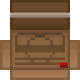

# Аплинк
Аплинк – это устройство, позволяющее получить доступ на черный рынок, где осуществляется торговля телекристаллами. Телекристаллы являются уникальной валютой, необходимой для материализации предметов. Однако, несмотря на преимущества и возможности, использование аплинком и участие в торговле на черном рынке несут в себе определенные риски.

!!! info "Как пользоваться аплинком?"
    Вы, специальный агент синдиката, которому сообщили действующую частоту для входа на рынок.
    Чтобы воспользоваться аплинком, вы должны: 
    1. открыть свой кпк   
    2. Открыть на нем настройки  
    3. Перейти на вкладку рингтоны  
    4. В функции установить рингтон введите шестизначный код из меню персонажа на с
    *Теперь у вас есть доступ на черный рынок, однако все, кто посмотрит в ваш кпк, увидят эту модификацию, так что не забывайте его закрывать.*
    5. Чтобы закрыть аплинк, нажмите кнопку закрыть аплинк, после чего данные сбросятся, и чтобы снова войти вам опять нужно ввести шестизначный код.
    <li>    Ядерным оперативникам предоставляется радио с уже встроенной частотой рынка, так что вам нужно просто его открыть.
    <li>    Доступ в аплинк также можно приобрести через имплант аплинка , с помощью которого всегда будет действующая частота. Чтобы торговать с внутривенным аплинком, вы должны поглотить телекристаллы, вытащив их из кпк.(включить кпк и сверху справа нажать на кнопку вывести и выбрать желаемое количество).
    <li>    Помните, что любой предмет материализуется сражу же после покупки.
    <li>    Купленные предметы нельзя продать через аплинк.
    <li>    Учитывая ваши знания, на некоторых профессиях будут доступны особые предметы.

!!! danger "Аплинк: Врата в черный рынок телекристаллов."  
    «Аплинк – это модификация, предоставляющее доступ в мир черного рынка, где осуществляется торговля с использованием телекристаллов. Телекристаллы являются особым ресурсом, необходимым для покупки различных объектов и предметов. Эти загадочные кристаллы считаются драгоценными, их происхождение долгое время было неизвестно. Однако, многие думают, что руководство синдиката ответственно за поставки телекристаллов на черный рынок. »
    ??? danger 
    
        * Телекристаллы представляют собой необычные камни, с помощью которых можно материализовать реальные предметы... Это позволяет вам получить доступ к редким и эксклюзивным предметам, которые иначе были бы недоступны и находятся вне закона. 
        * Аплинк стал самой продаваемой модификацией для подпольного рынка и преступных организаций, предоставляя возможность перейти к альтернативной системе торговли и получить доступ к необычным товарам. Однако, следует помнить, что использование аплинка и телекристаллов находится вне закона, и вся деятельность с рынком под запретом по всей галактике. Поэтому, перед использованием аплинка, важно нужно обдумать все возможные последствия и принять взвешенное решение.
        * Нт доводилось слышать о незаконной торговлю с помощью специальной валюты тк, однако как ей воспользоваться до сих пор остается загадкой для ученых.
        * Посетители и гости станции (любой с гражданским уровнем доступа) обязаны находиться в баре, библиотеке или жилом отсеке.
        * Все сделки на черном рынке проходят на закрытом канале, который меняется ежедневно, а код доступа известен только нескольким поставщикам, которые предоставляют там товары и услуги. Многие пытались отследить теневой рынок, но все четно. Отследить операции невозможно, если вы не обладаете специальной частотой.

"Вещи Аплинка"
    [Вооружение](#title1)  
    <li>[Боеприпасы](#title2)    
    <li>[Взрывчатка](#title3)  
    <li>[Разное](#title4)  
    <li>[Наборы](#title5) 
    <li>[Инструменты](#title6)
    <li>[Утилиты](#title7)  
    <li>[Импланты](#title8) 
    <li>[Химические импланты](#title9)      
    <li>[Работа](#title10)  
    <li>[Броня](#title11)  
    <li>[Безделушки](#title12)  
*Список вещей которые можно приобрести в аплинке*
# <a id="title1">Вооружение</a> 
| Наименование | Как выглядит | Сколько стоит | Описание | кто может приобрести |
|  |  |  |  |  |
|Кардашев-Мосин  |  |1 ТК |Проверенный временем друг любого охотника или солдата на войне. |Агенты/оперативники |
|Энергокинжал  |  |2 ТК |Обычная черная ручка с сюрпризом в виде энергетического лезвия. |Агенты/оперативники |
|Гадюка |  |3 ТК |Небольшой и маломощный пистолет с автоматическим ресивером. |Агенты/оперативники |
|Кобра |  |4 ТК |Пистолет с глушителем, использующий безгилзовые патроны. |Агенты/оперативники |
|Одноразовая баллистическая турель |  |6 ТК |Обычный ящик, при ударе который превращается в турель, которая стреляет во всех кроме синдиката. Чтобы ее убрать открутите отверткой, а чтобы починить гаечным ключом. |оперативники |
|Питон |  |8 ТК |Брутальный револьвер с бронебойными патронами .45 калибра |Агенты/оперативники |
|Энергетический меч ||8 ТК |Всем известный меч с лучом чистой, концетрированной плазмы, имеет шанс отражение снарядов. |Агенты/оперативники |
|Перчатки Полярной звезды | |8 ТК |Перчатки, позволяющие наносить удары без перерывов. |Агенты/оперативники |
|мини энерго-арбалет ||10 ТК |Арбалет, стреляющие отравленными дротиками, которые валят наповал. |Агенты/оперативники |
|Двкхклинковый энергетический меч ||10 ТК |Самое нашумевшее оружие в преступном сообществе, где к одному из мечей добавили второй луч плазмы, имеет шанс отражение снарядов. |Агенты/оперативники |
# <a id="title2">Боеприпасы</a> 
| Наименование | Как выглядит | Сколько стоит | Описание | кто может приобрести |
|  |  |  |  |  |
|Пистолетный магазин(.25 безгильзовые)  | |1 ТК |Пистолетный магазин совместимый с коброй. |Агенты/оперативники |
|Пистолетный магазин(.35 авто) |  |1 ТК |Пистолетный магазин совместимый с гадюкой. |Агенты/оперативники |
|Коробка патронов (.30 винтовочные) |  |1 ТК |Каробка патронов .30 калибра. |Агенты/оперативники |
|Коробка патронов (.60 крупнокалиберные) |  |2 ТК |Каробка патронов .60 калибра для винтовки Христов. |Агенты/оперативники |
|Магазин ПП (.35 авто) |  |2 ТК |Магазин с пулями .35 калибра для C-20r. |оперативники |
|Спидлоадер (.45 магнум ББ) |  |3 ТК |Магазин для быстрой перезарядки револьверов. |Агенты/оперативники |
# <a id="title3">Взрывчатка</a> 
| Наименование | Как выглядит | Сколько стоит | Описание | кто может приобрести |
|  |  |  |  |  |
|Светошумовая граната  |  |1 ТК |Стандартная граната, которая ослепляет и замедляет движения, кто находиться без защиты глаз. |Агенты/оперативники |
|Дымовая Граната |  |1 ТК |Граната выпускающее продолжительный столб дыма. |Агенты/оперативники |
|ЭМИ граната |  |2 ТК |Граната, выводящая из строя всю электронику вокруг. |Агенты/оперативники |
|Взрывчатка С-4 |  |2 ТК |Взрывчатка для разрушение стен или объектов. |Агенты/оперативники |
|Осколочная граната |  |4 ТК |Граната выпускает серию осколков, наносящик огромный урон. |Агенты/оперативники |
|Разрывная граната |  |4 ТК |Второй лучший друг пехоты, главное кинуть её, когда выдерните чеку. |Агенты/оперативники |
|Зажигательная граната  |  |4 ТК |Выпускает при взрывае серию зажигательных фрагментов. |Агенты/оперативники |
|Взрывающаяся ручка |  |4 ТК |Ручка с сюрпризом и таймером в 4 секунды до взрыва. |Агенты/оперативники |
|Пингвин гренадёр |  |5 ТК |Агрессивный пингвин с гранатой на шее. |оперативники |
|Минибомба Синдиката |  |6 ТК |Мощная, однака очень точечная бомба,наносящая огромный урон в малом радиусе. Подходит для уничтожение трупов. |Агенты/оперативники |
|Граната белой дыры |  |6 ТК |Граната, отталкивающая все вокруг в течение примерно 10 секунд. |оперативники |
|Кластерная граната |  |8 ТК |Связка трёх разрывных гранат. |Агенты/оперативники |
|Бомба Синдиката  |  |9 ТК |Большая бомба, которая взрывается после 120 секунд. Имеет крайне большой радиус взрыва. |Агенты/оперативники |
|Граната суперматерии |  |10 ТК |Граната создает мощный гравитационный колодец. Взрыв сравнимый со взрывом минибомбы. |оперативники |
|Разгрузочный жилет гренадёра |  |12 ТК |Жилет с 4 разрывными гранатами, 2 ЭМИ гранатами и 2 минибомбами |оперативники |
|Набор С-4 | |12 ТК |Сумка с 8 взрывчатками С-4. |оперативники |
# <a id="title4">Разное</a> 
| Наименование | Как выглядит | Сколько стоит | Описание | кто может приобрести |
|  |  |  |  |  |
|Фальшивый диск ядерной авторизации  |  |1 ТК |Точная копия диска активации боеголовки, но только из пластика. |Агенты/оперативники |
|Коробка закусок Синдиката |  |1 ТК |Небольшой набор провизии и напитков, в комплекте идет игрушка. |Агенты/оперативники |
|Ручка Cybersun |  |1 ТК |Ручка фирмы Cybersun, которую можно использовать как отвертку, так и для документов. |Агенты/оперативники |
|Суперскользкое мыло синдиката |  |1 ТК |Ни одна нога не устоит перед этим мылом. |Агенты/оперативники |
|Пачка трав Интердайн |  |2 ТК |Пачка сигарет, наполненные лекарственными травами. |Агенты/оперативники |
|Сверхъяркий светильник |  |2 ТК |Ослепляющий всех вокруг светильник. |Агенты/оперативники |
|Проводящие перчатки  |  |2 ТК |Изолирующие перчатки, которые проводят ток и бьют электричеством хозяина. |Агенты/оперативники |
|Кластерное мыло Скользкопокалипсис | |3 ТК |После приземления разбрасывает вокруг себя кусочки мыла синдиката, которые испаряются через 60 сек |Агенты/оперативники |
|Боевой медипен |  |4 ТК |Одноразовый медипен восстанавливающий большинство видо повреждений. |Агенты/оперативники |
|Стимпак |  |4 ТК |Увеличивает скорость бега и позволяет быстрее восстанавливаться после оглушения. |Агенты/оперативники |
|Набор лоббиста |  |4 ТК |Набор кредитов, помогающий изменить чьё-то мнение. |Агенты/оперативники |
|Боевая аптечка |  |5 ТК |Набор для лечение в полях сражения. |Агенты/оперативники |
|Стильный алый сигвей Синдиката  |  |5 ТК |Алый сигвей для настоящик стиляг. |Агенты/оперативники |
|Баночка с ноктюрином |  |6 ТК |30 единиц сильного снотворного. |Агенты/оперативники |
|Энергощит |  |18 ТК |Щит, отражающий все лазерные лучи. |Агенты/оперативники |
|СиндиКот | |10 ТК |Взрывной, домашний, надресированный питомец. |оперативники |
|Набор стимпаков | |12 ТК |Набор с 6 стимпаками, которые содержат дозу стимулятора. |Агенты/оперативники |

# <a id="title5">Наборы</a> 
| Наименование | Как выглядит | Сколько стоит | Описание | кто может приобрести |
|  |  |  |  |  |
|Набор химического синтеза  | ![[набор химика]](../images/objects/aplink/bundle/BoxVials.png) |4 ТК |Набор химика, включающий в себя токсин и вестин. |Агенты/оперативники |
|Набор отключение электричества |  |6 ТК |Содержит 3 ЭМИ гранаты и имплантер ЭМИ. *Примечание: не выводит из строя настоящее огнестрельное оружие.* |Агенты/оперативники |
|Набор снайпера |  |12 ТК |Содержание набора : Христов, заряженный 5 патронами, коробка из 10 антиматериальных патронов, форма АВД, латексные перчатки, красный галстук. Поставляется в коричневом чемодане. |Агенты/оперативники |
|Набор боеприпасов |  |15 ТК |Содержит 4 магазина для C-20r, 4 барабана для Бульдога и 2 короба патронов для L6 SAW. |оперативники |
|Набор "C-20r" |  |17 ТК |Содержит Пистолет-Пулемёт "C-20r", 3 магазина ПП. |Агенты/оперативники |
|Медицинский набор | .png>) |20 ТК |В набор входит: боевая аптечка, дефибриллятор и три боевых медипена. |оперативники |
|Набор "Бульдог"  |  |20 ТК |Содержание набора : Скорострельный дробовик "Бульдог", 2 барабана дроби и один барабан травматических.  |Агенты/оперативники |
|Ящик припасов синдиката | |20 ТК |Ящик со случайным снаряжением общей стоимостью в 50 теле-кристаллов. *Не может содержать имплант аплинка и голопаразита, пингвина гренадера, набора "зомби", всасывателя энергии, сегвея, некрономикона, мины уборщика; может содержать вещи с категории "работа" любых профессий.* |Агенты |
|Набор "China-Lake" |  |25 ТК |Содержание набора : Гранатомёт "China Lake" ; 4 единицы фугасной гранаты и 4 осколочных. |оперативники |
|Набор "L6 Saw" |  |30 ТК |Содержание набора : Пулемёт "L6 Saw" ; 2 коробки патронов "L6 Saw". |оперативники |
|Ящик суперприпасов синдиката |  |40 ТК |Ящик со случайным снаряжением общей стоимостью в 125 теле-кристаллов. *Из-за стоимости вы не сможете купить этот набор в одиночку. Не может содержать имплант аплинка и голопаразита, пингвина гренадера, набора "зомби", всасывателя энергии, сегвея, некрономикона, мины уборщика; может содержать вещи с категории "работа" любых профессий.* |Агенты |
|Зомби набор синдиката |  |40 ТК |Вещмешок, содержащий в себе шприц с 15u ромерола, питон с обычными патронами .45 магнум, коробку из 60 зажигательных патронов .45 магнум, 4 таблетки  амбузола плюс |оперативники |

# <a id="title6">Инстурменты</a> 
| Наименование | Как выглядит | Сколько стоит | Описание | кто может приобрести |
|  |  |  |  |  |
|Челюсти Жизни |  |2 ТК |Комбинация лома и кусачек, которые могут открыть любую незабалтированную дверь. |Агенты/оперативники |
|Ящик инструментов | |2 ТК |Полный набор инструментов, где также бонусом идут силовые перчатки и противогаз синдиката |Агенты/оперативники |
|Обезвоженный космический карп | |2 ТК |Простой игрушечный карп для которого нужна вода, чтобы быть настоящим. |Агенты |
|Хирургический вещмешок |  |4 ТК |Набор хирургических принадлежностей. |Агенты/оперативники |
# <a id="title7">Утилиты</a> 
| Наименование | Как выглядит | Сколько стоит | Описание | кто может приобрести |
|  |  |  |  |  |
|Плечевая кобура  |  |1 ТК |Кобура, которая вешается на место пояса и имеет 60 слотов для оружия, патронов и коробок патронов. |Агенты/оперативники |
|Двоичный ключ шифрования |  |1 ТК |1 ключ шифрования для подключение к каналу роботов. |Агенты/оперативники |
|Чёрный джетпак |  |2 ТК |Джетпак, позволяющий летать в местах без гравитации.  |Агенты/оперативники |
|Ключи шифрования Синдиката |  |2 ТК |2 ключа шифрования Синдиката, для доступа в специальную частоту, работающую на любом расстоянии и независимо от наличия электроэнергии, не требует сервера.  |Агенты/оперативники |
|Гиподротик |  |2 ТК |Дротик с резервуаром для 7u единиц химикатов. |Агенты/оперативники |
|Голосовая маска |  |2 ТК |Противогаз, позволяющий замаскировать свой голос под любой на ваш вкус. Имеет свойство "Хамелеон", позволяющий маскировать его под любую маску. Через неё можно дышать, пить и есть. |оперативники |
|Визор синдиката  |  |2 ТК |Визор оперативников, помогающий определить кто где.  |оперативники |
|id карта Агента | |3 ТК |ID карта агента, маскирующаяся под простую карту станции. Имеет свойство копировать доступы с других карт и изменять данные "Имя" и "Должность", может копировать доступы с других карт Агента. |Агенты/оперативники |
|Глушитель связи |  |4 ТК |При активации это устройство блокирует любую исходящую поблизости радиосвязь. |Агенты/оперативники |
|Оружейный модуль киборга |  |5 ТК |Модуль, дающий киборгу продвинутый лазерный пистолет и мачете. |Агенты/оперативники |
|Стелс-коробка |  |5 ТК |Ящик, оснащенный технологией невидимости, проникните везде и не двигайтесь слишком быстро! |Агенты/оперативники |
|Гипоручка |  |6 ТК |Механизм работы прямо как у гипоспрея. Имеет вместимость в 10u и перезарядку использования в 0.5 секунд. Вылить химикат из неё нельзя, только вколоть кому-то. |Агенты/оперативники |
|Телепорт обезьяньего подкрепления |  |8 ТК |Вызывает подмогу, в качестве обученной обезьяны. |Агенты/оперативники |
|Криптографический секвенсор  |  |8 ТК |Взламывает устройства, открывая доступ для всех. Имеет 3 заряда, 1 заряд восстанавливается по истечению 90 секунд.  |Агенты/оперативники |
|Маяк сингулярности | |12 ТК |Устройство, притягивающее сингулярность. Поглощенный сингулярностью, заставаляет ее расти |Агенты/оперативники |
|Набор "Голопаразит" |  |14 ТК |Создаёт "роль для призраков". Голопаразита могут слышать окружающие, он не может появится без приказа хозяина и после отдаления в 3-4 тайла испаряется к хозяину. Хозяин и голопаразит имеют общее здоровье. Каждый раз Голопаразит наносит 20 "ударов" с высокой скоростью. Достать голопаразита имплантером нельзя. |Агенты |
|Телепорт подкрепления |  |16 ТК |При использовании издает гудок и создаёт "роль для призраков". Агент появляется с пистолетом, ножом, поисковым навигатором, одетый в комбинезон синдиката. Его задача — помочь вам с выполнением цели. |Агенты/оперативники |
|Телепорт штурмового киборга Синдиката |  |65 ТК |Машина для убийств с доступом к энергомечу, пулемёту, криптографическому секвенсору и пинпоинтеру |оперативники |