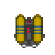
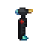
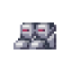
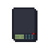
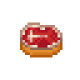

# Особо ценные предметы
*Обратите внимание, что, согласно правилам сервера, вы не должны красть эти предметы, не будучи антагонистом. Если ваш персонаж является владельцем предметов из данного списка, то он не должен прятать их, перекладывать в другое место или носить при себе, чтобы исключить возможность кражи данных предметов антагонистами.*

*Если ношение данных предметов допустимо по СРП или необходимо для исполнения каких-либо задач, то хранение таких предметов или передача в руки доверенных лиц не нарушает правил.*

<<<<<<< HEAD
| Наименование | Как выглядит | где находиться изначально |
|  |  |  |
|Диск ядерной авторизации  |  |шкаф Kапитана|
|ID-карта капитана  ||шкаф Kапитана, офис Kапитана|
|Антикварный лазерный пистолет ||шкаф Kапитана, офис Kапитана|
|Джетпак капитан ||шкаф Kапитана|
|Чрезвычайные приказы по безопасности ||шкаф Главвы Службы безопасности|
|Ручной телепорт ||шкаф Научного Руководителя|
|Скафандр научного руководителя||шкаф Научного Руководителя|
|Гипоспрей ||шкаф Главного Врача|
|Продвинутые магнитные сапоги ||шкаф Старшего Иженера|
|Цифровой планшет заявок ||шкаф Квартирмейстера|
|Первосортное мясо корги ||Иан/офис Главы Персонала|
=======
| Наименование | Как выглядит | где находиться изначально |  

|диск ядерной авторизации  |

|шкаф капитана| 
|айди карта капитана  ||шкаф капитана, офис капитана| 
|Антикварный лазерный пистолет ||шкаф капитана, офис капитана| 
|Джетпак капитан |](../images/objects/highrisks/Captainjetpack.png)|шкаф капитана| 
|Чрезвычайные приказы по безопасности ||шкаф Главвы Службы безопасности| 
|Ручной телепорт ||шкаф Научного Руководителя| 
|Скафандр научного руководителя|](../images/objects/highrisks/ResearchDirectorSpacesuit.png)|шкаф Научного Руководителя| 
|Гипоспрей ||шкаф Главного Врача| 
|Продвинутые магнитные сапоги ||шкаф Старшего Иженера| 
|Цифровой планшет заявок ||шкаф Квартирмейстера| 
|Первосортное мясо корги ||Иан/офис Главы Персонала| 
>>>>>>> origin/Highrisks

