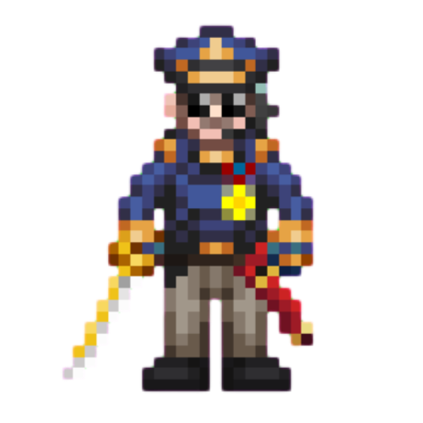
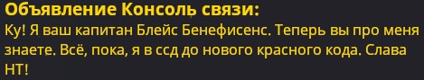

# Капитан

!!! warning "Страница находится в разработке"
    - <a href="#">Редакторы вики</a> уже ведут работу над данной статьёй. 
    - При желании, вы можете подать заявку на редактора в нашем <a href="">Discord</a> и тоже принять участие в улучшении статьи.
    - Данный этап: **В активной разработке**

<!-- Табличка роли -->

<table style="border-radius: .5rem;">
<thead>
<tr colspan="2" style="background-color: #4e6aff3d;"> <!-- Цвет заголовка, менять первые 6 символов HEX-кода -->
<th class="ss220-roles-23726"><strong>Капитан</strong></th> <!-- Текст заголовка -->
<th></th>
</tr>
</thead>
<tbody>
<tr>
<td class="ss220-roles-23736 ss220-roles-23726" style="border: 0rem;"></td>
<td class="ss220-roles-23739 ss220-roles-23726" style="border: 0rem;"><strong>Сложность:</strong> Высокая 
<strong>Обязанности:</strong> Глава объекта. Занимается его полным руководством, решает задачи, поставленные Центральным Командованием. 
<strong>Руководители:</strong> Центральное Командование 
Необходимое время: 1 минута клоун 
<strong>Руководства:</strong> <a href="http://127.0.0.1:8000/cop/command/#_8">Ваши СРП</a> • <a href="../../../Spacelaw/">Корпоративный Закон</a></td>
</tr>
</tbody>
</table>

<!-- Конец таблички роли -->

 *Здравия станция! Цель на сегодняшнюю смену — добиться признания цели невыполнимой.*

Вы — Капитан, верхушка в цепочке командования в рамках cтанции, обладатель практически абсолютной власти на ней. Ваша непосредственная обязанность — обеспечивать стабильность и эффективность работы объекта, а также выполнять распоряжения ЦК.

Требуется иметь опыт работы на всех управленческих должностях. В начале вашей смены, убедитесь, что забрали из шкафа Диск Ядерной Аутентификации. По желанию проведите краткий брифинг по радиосвязи с Главами и периодически следите за тем, чтобы все работало правильно.

Минимальные обязательства: Обеспечьте безопасность диска и сохранность своего неограниченного доступа. Возлагайте на себя ответственность только по мере необходимости — руководители отделов не просто так занимают свои должности.

## Ваши обязанности

!!! note "Статус и отвественность"
    Капитан обладает *особым статусом* и даже по сравнению с другими Главами определенной важностью для Центрального Командования, включая рядовые отряды Департамента Специальных Операций.

    Именно ему ЦК доверяет сохранность Диска Ядерной Аутентификации и полное руководство объектом, и даже может в особых случаях доверить Коды Ядерной Аутентификации. Капитан имеет право делать практически все что угодно, если это в рамках инетересов НТ.

    При этом, Капитан обладает и огромной ответственностью напрямую перед ЦК. В случае даже малейшего прокола его стороны с легкостью настигнут **ужасные последствия**.

Клише, но с вашей большой властью приходит и большая ответственность. Убедитесь, что знаете и выполняете свои [**Стандартные Рабочие Процедуры**](C:\Users\User\Desktop\wiki\wiki-14\docs\cop\command.md). В частности обратите внимание на то, что ядерный диск должен находиться в пределах станции. Можете его хранить при себе, можете отдать ГСБ — это не так важно. Важно то, что за этот диск вы всё равно своей шкурой отвечаете, так что не смейте его потерять! В случае грубого нарушения СРП/КЗ, ваше увольнение настигнет вас быстрее, чем шальная банановая кожурка настигнет ноги зевнувшего офицера СБ. И это в лучшем случае!

В отличие от остальных глав, капитану не положено выполнять никакую работу руками. Только организация, общение с экипажем, бумажная работа. Значит ли минимум работы то, что капитан это лёгкая роль? Отнюдь нет. Вам надо знать и следовать Стандартным Рабочим Процедурам и Корпоративному Закону, в противном случае качество вашего отыгрыша будет снижено, что негативно скажется на игровом опыте всего раунда в целом. И в принципе ваше поведение должно быть “капитанское”: грамотная и чистая речь, умение убеждать, стоять на своём и так далее. 

## Показываем свои сильные стороны

На капитане лежит огромная ответственность. Трудно сказать как именно нужно вести дела, у разных людей разные способы управления.

Вот несколько советов:  
- **Выполняйте работу других сотрудников только тогда, когда её больше некому выполнить.** Если вы разбираетесь с каждым преступником, когда на станции итак достаточно сотрудников службы безопасности, то вам нужно подумать о скорой смене работы.  
- **Поручайте сотрудникам выполнять их работу.** Если кто-то говорит: *«КАПИТАН, У НАС ПЛАЗМА В МЕДБЕЕ ГОРИТ»*, тогда позовите старшего инженера, чтобы он решил эту проблему, а не бегите откачивать плазму самостоятельно. Однако, жёлтый код поставить вам всё же надо.  
- **Следуйте цепи командования.** Вы командуете главами. Главы командуют отделами. Старайтесь следовать этому правилу, кроме случаев крайней **необходимости**. Это те люди, которые должны знать, как управлять своим отделом.  
- **Будьте спокойны и рассудительны.** В качестве капитана вам возможно придётся столкнуться со множеством напастей: некомпетентность или отсутствие глав, агенты Cиндиката, люди, пытающиеся попасть в бриг, сломанные борги, метеориты, карпы, поломанная электроника, образовавшаяся благодаря вышеперечисленным личностям. Ваша работа — решить все эти проблемы. Удачи.  

**Эти советы невероятно важны, особенно в отношении делегирования полномочий и цепи командования.**

## Оставайтесь на связи

!!! ss220 outline end "Пример плохого капитана"
    
Самое важное, что должен сделать капитан: знать, что люди знают, что вы их капитан, знать, что они могут вас благодарить и давать советы, а так же знать, что их капитан не зазнавшийся глупый зануда - это главное, что требуется для нормального функционирования станции.  

1. У вас есть доступ ко всем радиоканалам, представьтесь в них. Спрашивайте о состоянии дел. Старайтесь чаще говорить более точно(*«Что по производству роботов?»*), и чаще спрашивать простое *«Отчет по состоянию»* в канал отдела.
2. Узнайте каждого члена командного состава, убедитесь, что они знают, кто вы такой. Узнайте, нужна ли им помощь или задача.
3. Анонсируйте важные вещи, где это необходимо. Это могут быть распоряжения экипажу на день, вместе с соответственным распределением персонала; Это может быть предупреждение персонала, почему на станции красный код (ГСБ всегда слишком занят для этого. Но убедитесь, что вы знаете все факты); Это может быть объявление заметного достижения определенного члена персонала, что нас приводит к следующему пункту…
4. Увольняйте тех, кто не соответствует стандартам — Сделайте так, чтобы это было настолько понятным, что у вас была причина для этого. Если люди делают вещи слишком хорошо, проследите, чтобы они получили медаль и/или повышение с премией.
5. Ведите близкий контакт с Библиотекарем и Репортёром. Проследите, что у них новостная лента и новые хитовые книги заполнены пропагандой НТ, поощряя истории успеха экипажа.
6. Ведите хороший диалог с ГСБ, ГП и АВД. Принимайте их слова серьезно, за исключением откровенной лжи, но не позволяйте им переступать их должности.

## *«Ты СМЕЕШЬ ставить под сомнение мой авторитет?!»*

Конечно, вас могут одеть в самую дорогую одежду на станции и выдать вам карточку с полным доступом. Но если вы ведёте себя как полоумный, то это лишь вопрос времени, когда вы упадёте в глазах ваших подопечных. Да, у Капитана есть право решающего аргумента по сути на каждый вопрос внутри станции. Если Капитан говорит кому-то что-то сделать, ему лучше сделать это или иметь существенно важную причину этого не делать. Но, в особо тяжёлых случаях главы могут впервые за смену вылезти из своих отделов, чтобы собрать совет глав и отстранить вас от должности. Или вызвать ПЦК, чтоб он лично с вами разобрался. Для поддержания авторитета опять же существует ряд правил:

- Если вы берёте капитана исключительно из жажды власти - не берите. Вы должны сделать из станции слаженный механизм по выполнению цели станции, защиты всех, кто на ней находится и так далее. Станция ни в коем случае не должна быть машиной по раскрутке вашего эго.
- Не выполняйте работу СБ. Серьёзно. Если вы носитесь с наручниками и дубинкой, то может надо было взять офицера, а не капитана? (Наказывается правилами)
- Старайтесь все вопросы урегулировать словесно, а не с помощью вашей власти или силы. Опять же. Это РП игра, а не очередная стрелялка или стратежка. Тут в основе лежит именно коммуникация. Вы правда удивитесь когда увидите насколько охотно вас слушают члены экипажа, если вы грамотно и точно изъясняетесь.
- Относитесь к другим на станции с уважением. Они тоже люди. И вы, как капитан, должны вести себя достойно. На хорошее отношение вам ответят тоже хорошим отношением.

## Ваша станция

Вы капитан и от вас ждут, что вы поставите вашу станцию и ваш экипаж вперед себя. Это ваша работа, чтобы сохранить станцию с наименьшим количеством смертей. Позволить станции умереть в обмен на вашу жизнь это очень плохой выбор и может последовать к вашей казни. Капитан не может быть Капитаном, если у него нет команды. Но имейте в виду, что мертвый Капитан может нанести больше вреда выжившим от <s>нападений</s> **несчастных случаев**, чем живой. Не продавайте вашу станцию, но при этом не продавайте себя (фигурально).

## Взаимодействие с ЦК

Важный аспект вашей работы. Но не очень сложный. Связь с ЦК происходит только одним способом и это — Факс Дальнего Действия.

При общении с ЦК, придерживайтесь простых советов:  
- Цель готова - даёте объявление для ЦК, вызываете шаттл, если у них нет возражений  
- Держите ЦК в курсе нестандартных событий. Прибытие неизвестного шаттла, странные существа на станции, и так далее. Даже если ЦК не обратит внимание, то экипажу будет интересно и полезно узнать о происходящем.  \
- Станция погружается в разруху, хаос? Люди гибнут? СБ перестало подчиняться? Не спешите звать шаттл! В первую очередь, объясняете ситуацию ЦК и просите прислать вам отряд РХБЗЗ (Радиационной, Химической, Биологической и Зомби Защиты) или ОБР (Отряд Быстрого Реагирования) по ситуации.

## Советы по отыгрышу

1. В плане отыгрывания вы абсолютно свободны; Вы должны знать кое-какие основы из каждой отрасли работы на станции, но особо не углубляясь. Вы можете играть с предысторией в определенной сфере деятельности, но вы **НЕ МОЖЕТЕ** делать абсолютно все (исключение: экипаж < 40 членов). Запомните, очень некомпетентный Капитан не заведет достаточно друзей.  
2. Оставьте дела обеспечения безопасности — службе безопасности; Не нужно влезать в каждое криминальное дело. Вы стоите в звании выше ГСБ, но все же не стоит отбирать у него всю работу.
3. Не думайте что просто потому что вы Капитан, то вам дозволено все. Это просто наихудшая вещь, которую вы можете сделать. Вы здесь для того, чтобы убедиться, что все остальные делают свою работу, а не делать ее за них.
4. Ваш скафандр достаточно сильно защищает вас, заодно и пригодный для космоса. Он не предназначена для хождения в нём все время, и может быть от экстремально некомфортным до просто очень изнуряющим, в зависимости от физической силы и выносливости вашего персонажа. Имейте в виду, что вы находитесь на научной станции, и экипаж не ожидает видеть вас в броне в большинстве случаев.
