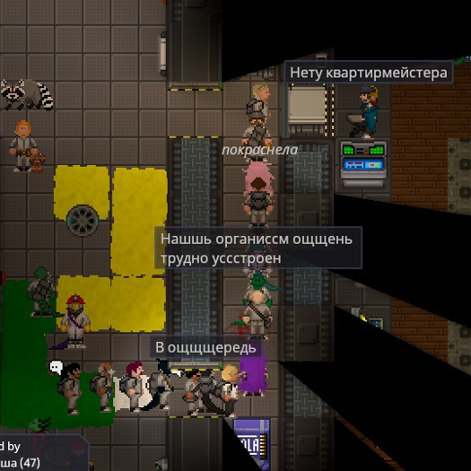

# Глава Персонала

!!! warning "Страница находится в разработке"
    - <a href="#">Редакторы вики</a> уже ведут работу над данной статьёй. 
    - При желании, вы можете подать заявку на редактора в нашем <a href="">Discord</a> и тоже принять участие в улучшении статьи.
    - Данный этап: **В активной разработке**

<!-- Табличка роли -->

<table style="border-radius: .5rem;">
<thead>
<tr colspan="2" style="background-color: #4e6aff3d;"> <!-- Цвет заголовка, менять первые 6 символов HEX-кода -->
<th class="ss220-roles-23726"><strong>Капитан</strong></th> <!-- Текст заголовка -->
<th></th>
</tr>
</thead>
<tbody>
<tr>
<td class="ss220-roles-23736 ss220-roles-23726" style="border: 0rem;"></td>
<td class="ss220-roles-23739 ss220-roles-23726" style="border: 0rem;">Сложность: Средняя 
Обязанности: Управлять, выдавать доступ, контролировать численность персонала, следить за станцией, когда капитан решит отлучиться в бар 
Руководители: Капитан 
Необходимое время: 1 минута клоун 
Руководства: Ваши СРП • <a href="../../../Spacelaw/">Корпоративный Закон</a></td>
</tr>
</tbody>
</table>

<!-- Конец таблички роли -->

 *Здесь вот дата неправильная, здесь строку пропустили, а здесь вообще имя с маленькой... В общем, мистер Яша Ла.... тьфу! Проваливайте!*

Глава Персонала возглавляет отдел Сервиса и отвечает за перераспределение кадров, а так же выдачу удостоверений личности и запасных КПК. Вы являетесь правой рукой капитана, и если капитан вдруг пропадет, вы должны будете занять его место.

Вы — глава персонала. У вас есть доступ почти ко всему, включая базовый доступ в каждый отдел станции. Ваша главная задача — управлять персоналом, чтобы каждый отдел был полностью экипирован и работал эффективно.

Как глава персонала, у вас есть свой департамент, за которым требуется следить. Вы находитесь во главе сервисного персонала. Чтобы облегчить свою работу, вы можете оставить на самотёк простые должности по типу бармена или библиотекаря. Они технически под вашим командованием, но их работа проста и не критическая для функционирования станции. <s>(если только в баре не объявится толпа разъяренных работяг, которые будут требовать выпивки)</s>

## Необходимые навыки

**Терпение это сила.** Часто, в процессе своей службы вы будете сталкиваться со многими вопросами - будь то отвечать на них, или же задавать. Большинство новоприбывших на станцию проследуют в сторону вашего кабинета, чтобы найти того, кто предоставит им должность и, возможно, научит азам. В данном случае будет хорошей идеей спросить, какие предпочтения в работе есть у прибывшего, а затем найти кого-то, кто желает взять новичка под свою опеку. Чтобы ускорить процесс рекомендуется использовать радиосвязь.  

**Базовые знания отделов.** Настоятельно рекомендуется, чтобы у вас были хотя бы базовые знания о работе каждого отдела, а также какие у них должны быть доступы. Это сделает вашу работу гораздо легче.  

**Базовая бюрократия.** Не скорее как рекомендация, а скорее, как стиль игры. Иногда вы встречаете такого главу персонала, который будет требовать, чтобы ты заполнил все необходимые формы и получил штампы, необходимые для перевода. Иногда люди приходят даже для получения разрешений на различные вещи. Это может добавить много погружения в профессию в большинстве случаев, поэтому вы можете воспользоваться руководством по бумажной работе и примерами форм, как базу для написания ваших собственных форм. Если же не хотите осваивать бюрократию, в принтере вашего офиса достаточно уже готовых форм для всевозможных ситуаций. Рекомендуем вам как минимум пройтись по этим гайдам, или знать, где их искать. Если вы все же захотите погрузиться в мир бюрократии.

## Ваш инструментарий

Вам выписана **телескопическая дубинка и Вспышка**, для самозащиты и защиты вашего офиса. Вы не офицер службы безопасности и никогда не должны выполнять работу СБ. Всё же вы, в конце концов, официальное гражданское лицо на исследовательской станции. Поскольку ваша работа требует разбираться с массами раздражённых безработных и особенно теми, кто скоро таковыми станет, лучше всегда носить мини-вооружение с собой

У вас также есть коробка с запасными КПК. Также у вас есть запасные ID-карты, которые обычно должны использоваться при краже или утере основной ID-карты сотрудника. Чтобы записать кого-либо в список экипажа (Crew Manifest), введите в консоль его имя и должность (последнее лучше выбирать из уже готовых вариантов). Больше информации о введении нового члена экипажа описано ниже.

У вас также есть доступ ко всемогущей консоли изменения ID-карт, которая может делать три вещи: менять доступы (для изменения ID), должности и имена в Манифесте и на самой карте.

### Полный отдел — счастливый отдел
Если отделу не хватает рабочих рук, от вас ожидается инициатива нанять туда больше персонала. Вы можете предложить поднятие зарплат, возмещение расходов или простую рекомендацию для этого отдела, чтобы привлечь туда сотрудников. Отказываясь («настоятельно не рекомендуя») назначать сотрудников в заполненные отделы, вы упростите комплектацию штатного состава пустующих отделов. Если на станции война — вряд ли стоит нанимать второго клоуна.

### Счастливый отдел — эффективный отдел
Теперь, когда отдел полностью укомплектован, он попадает под юрисдикцию АВД и главы отдела, чтобы всё работало как часы.

## Переназначение как смысл жизни
!!! ss220 outline end "Типичная стойка ГП"
    
Ваша вторая обязанность заключается в переназначении сотрудников, которые приходят к вам с запросами на смену доступа. Убедитесь в том, что кандидат имеет вескую причину для смены профессии. Повар который внезапно захотел стать робототехником — яркий пример того, кого следует проверить должным образом.

Спокойно отказывайте тем, кто предоставил вам плохое объяснение того, как они внезапно стали понимать структуру работы отдела: (*Мой дядька воевал/Просто прочитал в книге/Я просто знаю* — достаточно плохие причины). Альтернативно, поставьте их на должность ассистента, пока они не докажут, что могут корректно исполнять обязанности (вы для этого можете назначить собственную должность, например «Медсестра-стажёр»).

### Вы наняты, добро пожаловать на борт
Если чей-то запрос на перевод не звучит совсем по-идиотски, то наступает время для ваших проверок. Убедитесь, что данный сотрудник знает, что ему (или ей) предстоит делать на новом месте. Как только вы убедились, что это подходящий кандидат, то самое время взять на руки одну из копий формы о запросе на перевод из принтера и попросить её заполнить. Если вы будете вести записи всех изменений доступа, то это даст понять капитану, что вы хоть что-то делаете, и делаете это законно.

А вот и сложная часть. Теперь, когда у вас есть заполненный бланк, вы должны поставить на него подпись и печать соответствующего главы. Для этого нужно так или иначе привлечь внимание главы отдела, будь то разговор по радиосвязи или отправка кандидата в сам отдел. Опять же, вы можете получить устное разрешение, но лучшим способом доказать, что ваше изменение доступа не было полностью незаконным рекомендуется получить подпись и печать главы отдела.

Наконец, когда всё будет подписано, заверено печатью и заполнено, вы можете подписать форму самостоятельно. Попросите у кандидата его ID-карту, чтобы вы могли официально выдать ему требуемую должность и доступ. Если кто-то не хочет получить банальное название должности, всё равно используйте общие названия работ в верхней части экрана консоли, чтобы служба безопасности могла гораздо легче идентифицировать этого человека с помощью списка экипажа и охранных заметок.

#### Карма — это сука
Некоторые профессии ограничены в связи с тем, что центральное командование хочет видеть на них только проверенный персонал. Это АВД, офицер «Синий щит», и магистрат. Переводы на данные должности никогда не должны производиться, поскольку существует потенциальная угроза компроментации независимого надзора, который эти должности призваны обеспечить, за счет найма членов экипажа, лояльных нынешнему капитану. Если кого-то из перечисленных выше сотрудников требуется уволить, то для этого необходимо разрешение центрального командования, если ответа не поступает, то советом глав.

### Вы уволены
Наряду с выдачей разрешений на перевод, Вы также можете понижать сотрудников в должности и освобождать их рабочие места.  
Если кто-то спит на работе или что-то портит, Вы имеете право понизить его в должности после консультации с главой соответствующего отдела. Однако **понижение в должности главы отдела** — это то, что не следует делать без письменного согласия капитана.

Иногда руководитель отдела просит понизить члена экипажа в должности по разным причинам. Все главы отделов имеют право понижать в должности сотрудников своего отдела, оформив приказ об изменении доступа для этого сотрудника. Как глава сервисного отдела, вы можете понижать его сотрудников по своему усмотрению. Глава персонала не имеет права полностью расторгать контракты с сотрудниками.

## Пять пунктов управления человеческими ресурсами
ГП может быть довольно интересной ролью. Он может наслаждаться престижем или чувствовать себя прикованным к консоли с удостоверением личности. Если вы обнаружили, что носите хлеб и чай, извлеките из них максимум пользы, правильно выполняя свою работу.  

1. **Поддержите капитана.**  
 Убедитесь, что работаете в команде, чтобы руководить экипажем. Заработайте это доверие, часто используя командный канал (:к) и обсуждая важные вопросы, такие как назначение новых руководителей или вызов шаттла. Вы не выше других глав, но у вас есть уникальная возможность назначать людей. Вы тот, кто возьмет на себя обязанности Капитана, если тот решит уйти в отставку, так что было бы неплохо, показать себя хорошим лидером перед коллегами.
2. **Соблюдайте права членов экипажа.**  
 Охрана часто превышает свои полномочия, а капитан либо мёртв, либо лично занят важными делами. Не редко вы будете вынуждены делать импровизированную работу псевдо-капитана и принимать трудные решения о судьбе сотрудников, если капитан пропал без вести, умер или лично вовлечен в дело. В таких ситуациях не забудьте рассмотреть каждую сторону истории, прежде чем принимать решение, и постарайтесь следовать космическому праву и в то же время вынести справедливый приговор. Почти всегда, слабый капитан и начальник штаба приведут к плохой безопасности на станции.
3. **Следуйте принципу крайней привилегии.**  
 При выдаче новых уровней доступа, спросите себя, какой объем доступа необходим для выполнения задачи. Если трудолюбивый инженер хочет получить доступ в ЕВУ, подумайте, нужен ли ему доступ, или просто откройте для него дверь, пока он получает костюм. Если консультант проявляет инициативу в поиске тел, но часто ждёт сотрудников, чтобы те открыли двери, возможно, риск предоставления ему большего доступа меньше, чем выгода от повышения его эффективности. Подобные решения делают станцию более безопасной и сокращают количество случайных арестов, производимых службой безопасности за предполагаемое нарушение границ департаментов. Не забудьте написать их увеличенный доступ или привилегированные предметы на листе бумаги и хорошенько проштамповать, чтобы уборщик смог показать, почему он моет полы в бриге.
4. **Говорите с экипажем.**  
 Капитан часто слишком занят, чтобы опускаться до проблем работяг, глава службы безопасности обычно сосредоточен на контроле своего отдела. НР буквально горит, Главный Врач по локоть в трупах, а СИ пытается дышать в вакууме. Вы единственный руководитель, способный уделить время и выслушать экипаж. Приглашайте членов экипажа поговорить с вами, когда возникают конфликты. Разрядите межличностные и междепартаментные проблемы, которые вы обнаруживаете во время этих разговоров, чтобы недовольство не переросло в беду. Защищайте права сотрудников от произвола охраны, и в целом снижайте частоту и интенсивность мятежей.
5. **Управляй своим департаментом в первую очередь.**  
 В то время как технически вы можете понизить удостоверение личности каждого до уровня помощника, управление сервисными сотрудниками, у которых не имеется другого главы, кроме вас, является вашей непосредственной обязанностью. Следить, чтобы уборщики убирали, шеф-повара готовили, а заметки о персонале находились в актуальном состоянии, это первое, что нужно сделать после назначения кого-то на работу или при изменении у кого-то доступа. Увольнение плохих офицеров службы безопасности и вмешательство в работу департамента, не имеющего главу также падает на ваши плечи. Всегда согласуйте увольнение с главой сотрудника, или донесите до всех глав, что они могут послать проблемных сотрудников к вам, чтобы затем те отправились на шахты. Это позволит вам сосредоточиться на ваших непосредственных подчиненных и избежать проблем.

## Иан  
!!! ss220 inline end "Прекрасный Иан"
      
**Иан**, который находится в твоем офисе — **это корги**, который составит тебе компанию. Ты можешь погладить его или просто провести ему экскурсию по станции ради забавы. Не относитесь к нему, как к вещи.

У вас есть возможность надеть на Иана различные головные уборы, благодаря чему, <s>в месте его расчленения будет главная улика!</s> корги получит новый вид