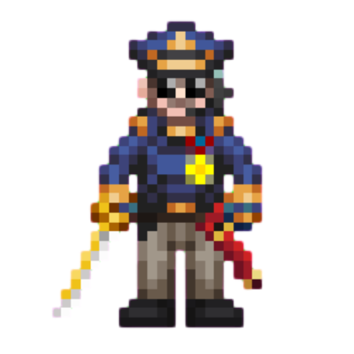
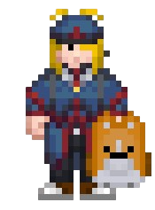
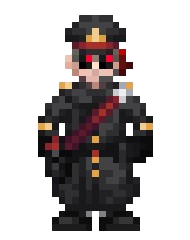
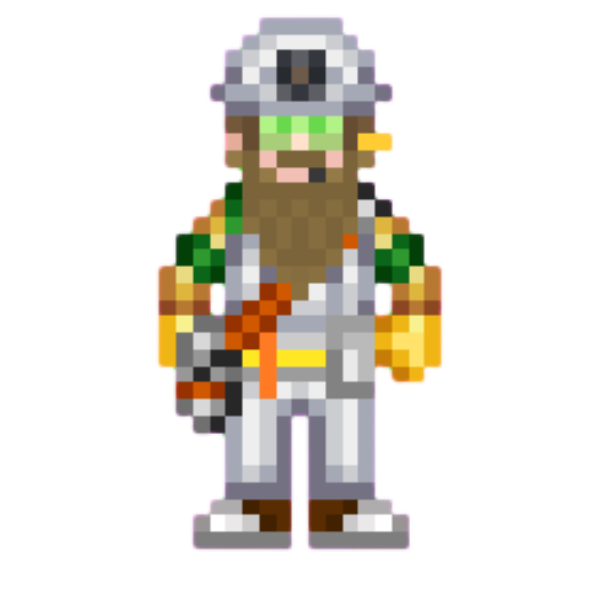
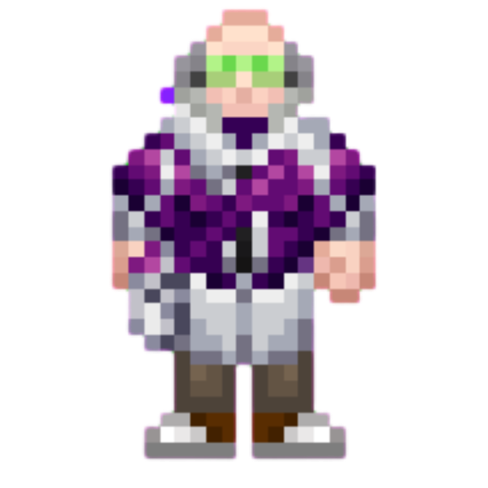
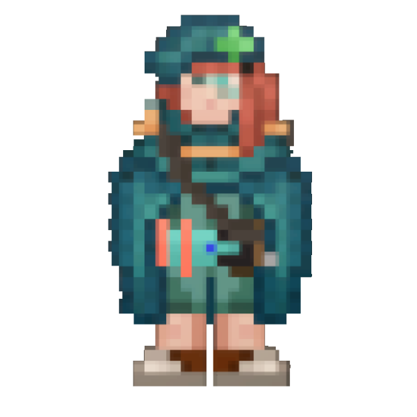
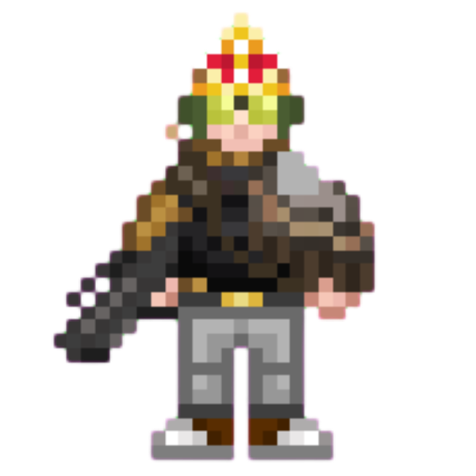

# Командование

!!! warning "Страница находится в разработке"
    - <a href="#">Редакторы вики</a> уже ведут работу над данной статьёй. 
    - При желании, вы можете подать заявку на редактора в нашем <a href="">Discord</a> и тоже принять участие в улучшении статьи.
    - Данный этап: **В активной разработке**

<!-- Блок ролей -->

##  Командование станцией

Глава отдела: [**Капитан**](command/captain)   
Канал отдела: *:к*

Иерархия отдела

<table class="ss220-roles-23723" style="text-align: center">
<thead>
<tr>
<th>
</th>
</thead>
<tbody>
    <tr>
        <td class="ss220-roles-23723">
        <strong><a href="command/captain">Капитан</a></strong>  
        </td>
    </tr>
</tbody>
<thead>
<tr>
<th></th>
<th></th>
<th></th>
<th></th>
<th></th>
<th></th>
</tr>
</thead>
<tbody>
<tr>
<td class="ss220-roles-23723"><strong>Глава Персонала</strong></td>
<td class="ss220-roles-23723"><strong>Глава Службы Безопасности</strong></td>
<td class="ss220-roles-23723"><strong>Старший Инженер</strong></td>
<td class="ss220-roles-23723"><strong>Научный Руководитель</strong></td>
<td class="ss220-roles-23723"><strong>Главный Врач</strong></td>
<td class="ss220-roles-23723"><strong>Квартирмейстр</strong></td>
</tr>
</tbody>
</table>

<!-- КОнец блока ролей -->

## Отдел командования

К отделу командования относятся все Главы отделов и Капитан, основная задача Командования Станции — управление сотрудниками отделов, обеспечение продуктивности при выполнении отделом должностных обязанностей, а так же приказов Центрального Командования. 